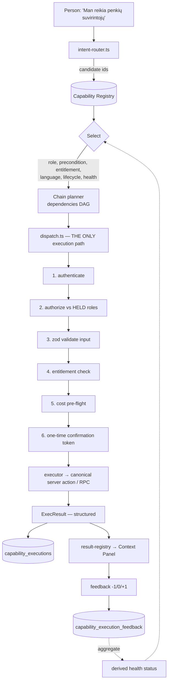

# LABOURMARKET.AI — CAPABILITY PLATFORM v1

> **Owner directive, 2026-07-31**: turn Labourmarket.ai into a Skills-first AI
> platform. Every AI capability is a reusable Skill, not isolated code. It must
> serve BOTH companies and people. Not a plugin list — a complete platform.
>
> **This document is Phase 9 (audit) and Phase 1 (registry design).** The
> directive orders the audit first, and the audit changed the plan — which is
> the point of ordering it first. Phases 2–4 (the catalogues), 7 (Skill Store)
> and the remaining Phase 10 deliverables build on the decisions here and are
> scoped at the end. Nothing below is a mockup: every "exists" claim names the
> file, and every gap is named as a gap.

---

## ⛔ STATUS: DESIGNED, PARKED. DO NOT START.

**Owner ruling, 2026-07-31 — W3 finishes completely first.** This document is
the plan of record; **no part of it may be implemented yet.** Specifically:
do not add `capability_registry`, do not add `capability_executions`, do not
add `CapabilityDescriptor`.

Required order, no interleaving of one W3 row with one Capability slice:

```text
1. Finish the remaining W3 Employee Journey rows.
2. Finish the Employer, Company and Admin ABSORB rows.
3. Collapse the second MarketMap chain (row 28).
4. Prove EVERY /dashboard/advanced capability is absorbed, obsolete-proven, or
   moved to a legitimate non-dashboard detail route.
5. Delete /dashboard/advanced.
6. Remove its obsolete components, mounts, routes, guards and nav references.
7. Full desktop + mobile browser proof.
8. Merge, deploy, production-prove W3.
9. ONLY THEN start the Capability Platform.
```

**The one permitted exception**, deliberately narrow: if a remaining W3 row
demonstrably cannot be completed without a foundation primitive from this
document, implement **only the minimum primitive**, do not begin the platform,
and return immediately to W3.

Rationale, in the owner's terms: W3 is launch-critical and already in flight.
`/dashboard/advanced` is still a second dashboard with 13 ABSORB rows left.
Starting a new registry and execution programme while the canonical Context
Panel architecture is still being consolidated would be a second unfinished
architecture running beside an unfinished one — which is the failure mode W3
exists to end.

---

## 0. THE HEADLINE — THE REGISTRY ALREADY EXISTS

**Do not build a Capability Registry from scratch. Extend the one that is already in production.**

`lib/conversation/action-registry.ts` is a declarative, pure, guard-tested
catalogue of 30 capabilities with stable ids, permissions, i18n labels,
preconditions, telemetry and a handler reference that never contains logic. Its
own header states the contract the directive asks for, in almost the
directive's words:

> "the LLM may only PROPOSE an `id` + partial input from this registry; it can
> never execute and can never invent an action that is not here."

That is Phase 6 written down eighteen months early. Around it there is already
a full execution chain:

```text
lib/conversation/
  action-registry.ts     30 capability descriptors — THE REGISTRY
  worker-schemas.ts      zod INPUT SCHEMAS (worker)
  company-schemas.ts     zod INPUT SCHEMAS (company/agency)
  executor-contract.ts   ExecResult — THE OUTPUT SCHEMA + code normalisation
  worker-executors.ts    executor map → canonical server actions
  company-executors.ts   executor map → canonical server actions
  dispatch-core.ts       PURE authorization (held roles) + confirmation tiering
  dispatch.ts            THE ONLY execution path: auth → role → zod → token → run
  confirmation-token.ts  one-time HMAC consent tokens, fail-closed
  intent-router.ts       natural language → candidate capability
  result-registry.ts     capability → the component that renders its answer
  no-direct-write.test.ts guard: nothing bypasses the contract
```

**Building a second registry beside this one is the exact failure this codebase
is currently spending an entire wave (W3) undoing.** `/dashboard/advanced` is a
916-line parallel dashboard that exists because someone added a second surface
instead of extending the first; three rows of it have been dismantled this week
at real cost. A second capability registry that duplicates the Action Registry would
recreate that mistake one layer deeper, where it is far more expensive: two
places that decide what an AI is allowed to do, which is a security boundary,
not a convenience.

So the plan is **promotion, not creation**: the Action Registry becomes the
Capability Registry by gaining the fields it lacks.

---

## 1. NAMING — DECIDED. THIS IS NOW THE REPOSITORY RULE

**Owner ruling, 2026-07-31.** Product vocabulary and implementation vocabulary
are **intentionally different**, and the difference is not cosmetic — it
protects the canonical business domain.

| Domain | Word |
|---|---|
| Worker occupational domain — user-facing | **Skill**, Skills, Skill Store, Skill Library |
| AI / system behaviour — implementation | **Capability** — `CapabilityRegistry`, `CapabilityDescriptor`, `CapabilityExecution`, `CapabilityManifest`, `CapabilityProvider`, `CapabilityResult` |

The programme is the **Capability Platform**, never the "Skills Platform".
**A second meaning of "Skill" may never enter the codebase.**

The reason, in the owner's terms: `Skill` is a node in the core domain chain —

```text
Worker → Work Journal → Evidence → Confirmation → Skill → Reputation → Matching
```

That is the patented path, and it is the product. Overloading its central noun
would make `skills` ambiguous between "welding" and "an AI that assesses
welding". Where this directive says "Skill" about AI behaviour, it is
translated to `Capability` at the code boundary and stays "Skill" in the copy.

### What the collision would have cost

⚠️ **`skill` is already the most loaded noun in this product**, and it does not
mean what the directive means by it.

| Existing meaning | Where |
|---|---|
| a worker's occupational skill | `journal_entry_skills`, `profile skills`, ESCO taxonomy, `lib/journal/entry-skill-source.ts`, `lib/journal/confidence.ts` |
| the patented Work Journal → skill evidence → confirmation chain | `lib/journal/skill-pipeline.ts` |
| "Skill Verification", "Skill Extraction" | Phase 3 of this very directive — as *worker* skills |

The directive's Phase 3 asks for a Skill called "Skill Verification". In code
that reads as `skill.skill-verification`, and a table named `skills` would be
ambiguous between "welding" and "an AI capability that assesses welding".

Concretely: `capability_registry`, `capability_executions`,
`CapabilityDescriptor` — surfaced to people as "Skills". Settled before any
catalogue work precisely because renaming after Phases 2–4 ship would touch
every entry.

---

## 2. PHASE 9 AUDIT — FIELD BY FIELD

The directive requires 13 fields per skill. Here is the honest state of each.

| # | Required field | Exists today? | Where / what is missing |
|---|---|---|---|
| 1 | unique id | ✅ **yes** | `ConversationActionDescriptor.id`, stable kebab, namespaced by subject (`worker.log-work`). Guard-pinned. |
| 2 | version | ❌ **missing** | No versioning anywhere. Required before a Skill Store can exist. |
| 3 | owner | ⚠️ **partial** | `subject` is the *user* role, not the *publisher*. First-party is implicit. |
| 4 | permissions | ✅ **yes, strongest part** | `allowedRoles` + `precondition`, re-checked server-side against HELD roles in `dispatch-core.authorizeDispatch`, plus RLS and SECURITY DEFINER RPCs beneath. |
| 5 | description | ✅ **yes** | `descriptionKey` — i18n key, never inline copy. |
| 6 | input schema | ✅ **yes** | zod, in `worker-schemas.ts` / `company-schemas.ts`, validated *before* the handler runs. Not yet ON the descriptor. |
| 7 | output schema | ⚠️ **partial** | `ExecResult` is one shape for all: `{ok:true, data?: Record<string,unknown>}`. Honest, but untyped per capability. |
| 8 | dependencies | ❌ **missing** | No declared graph. `precondition` is the closest thing and is a *user-state* check, not a capability dependency. |
| 9 | supported languages | ⚠️ **implicit** | 11 locales exist and every label is a key; nothing declares which a capability actually supports. |
| 10 | required subscription | ❌ **missing on the descriptor** | The machinery exists — `lib/billing/plans.ts` (`FeatureKey`, `Entitlement`), `entitlements-v1.ts` (`resolveEntitlements`, `entitlementAllows`). Nothing binds a capability to a `FeatureKey`. |
| 11 | execution cost | ❌ **missing** | Not modelled at all. |
| 12 | audit log | ⚠️ **partial** | `audit_logs` is written by canonical RPCs (e.g. `accept_company_worker_invitation`), and `telemetryEvent` fires per action. There is **no per-execution record of the dispatch itself**. |
| 13 | metrics | ❌ **missing** | Funnel events exist; success rate / latency / cost per capability do not. |
| — | health status | ⚠️ **partial, and better than expected** | Two real signals already: `migrationSensitive` (the RPC may be unapplied → degrade honestly) and `ResultDataReadiness: "real" \| "unverified"` in the result registry, which already **refuses to render a capability whose data source has not been verified**. |

**Score: 4 of 13 fully present, 5 partial, 4 absent.** That is a far better
starting position than a greenfield build, and it is the reason the answer is
"extend", not "create".

### What else the audit found that must be reused, not reinvented

| Directive phase | Already exists | File |
|---|---|---|
| 6.1 search registry | intent → candidate action, deterministic | `lib/conversation/intent-router.ts` (437 lines) |
| 6.3 execute | the single execution path, fail-closed | `lib/conversation/dispatch.ts` |
| 6.4 structured result | `ExecResult` + `mapKind` normalisation | `lib/conversation/executor-contract.ts` |
| 8 users never see complexity | the conversation IS the interface; `/dashboard` renders `<ConversationChat>` with a Context Panel that renders answers inline | `components/app/conversation/chat/`, `lib/conversation/result-registry.ts` |
| 5 Work Journal primary | journal → recognised skill → provenance → manager confirmation → confidence score | `lib/journal/skill-pipeline.ts`, `entry-skill-source.ts`, `confidence.ts` |
| registration ≠ core edit | the resolver registry pattern, already guard-proven ("a new entity type is a REGISTRATION, not an edit to the panel") | `lib/world-state/resolvers.ts` |
| declaration + gating | every surface declares itself and is gated | `lib/product-gate/surface-registry.ts` |

### The seven true gaps

1. **No versioning.** Nothing can be published, deprecated or rolled back.
2. **No execution record.** `dispatch.ts` returns a result and forgets it.
   Phases 6.5 (history) and 6.6 (learn from feedback) both stand on this, and
   so do metrics, cost and health.
3. **No cost model.** Nothing counts tokens, time or money per execution.
4. **No entitlement binding.** Billing exists; capabilities do not consult it.
5. **No dependency graph.** Phase 8's "AI chains the Skills automatically"
   needs one — "I need five welders" is *create demand → search candidates →
   rank → propose* and nothing declares that chain.
6. **No third-party surface.** No publisher identity, no sandbox, no review, no
   revenue share (Phase 7 in full).
7. **Peer validation does not exist.** Phase 5 orders four tiers; the codebase
   has three (see §5).

---

## 3. PHASE 1 — THE SKILL (CAPABILITY) REGISTRY SCHEMA

The descriptor gains the missing fields. Existing fields keep their names and
their guards, so all 30 entries stay valid and every existing test keeps
passing — that is the backward compatibility the directive's Phase 9 requires.

```ts
// lib/capabilities/capability-registry.ts — PURE. No server-only, no supabase,
// no fetch: same purity contract the action registry already holds and a guard
// already pins.

export interface CapabilityDescriptor extends ConversationActionDescriptor {
  // ── identity ────────────────────────────────────────────────────────────
  /** SemVer. Breaking input/output change ⇒ major. */
  readonly version: `${number}.${number}.${number}`;
  /** Publisher. `"labourmarket"` for first-party; a real org id for a Skill
   *  Store publisher. NOT the user role — that stays `subject`. */
  readonly owner: CapabilityOwner;
  /** Lifecycle. `deprecated` still executes and warns; `withdrawn` refuses. */
  readonly lifecycle: "draft" | "published" | "deprecated" | "withdrawn";

  // ── contract ────────────────────────────────────────────────────────────
  /** The zod schema id, resolved from the schema map. Named rather than
   *  embedded so the registry stays pure and tree-shakeable. */
  readonly inputSchema: SchemaRef;
  /** Per-capability output shape, narrowing today's untyped `data`. */
  readonly outputSchema: SchemaRef;
  /** Capabilities this one may chain into. A DAG — a guard rejects cycles.
   *  This is what makes "I need five welders" one sentence and four skills. */
  readonly dependencies: readonly CapabilityId[];
  /** Locales whose copy AND model behaviour have been verified. Absent locale
   *  ⇒ the capability is not offered there, rather than answering badly. */
  readonly languages: readonly Locale[];

  // ── commercial ──────────────────────────────────────────────────────────
  /** Binds to the EXISTING entitlement model. `null` = free for everyone. */
  readonly requiredFeature: FeatureKey | null;
  /** Declared upper bound per execution, for pre-flight refusal and billing. */
  readonly cost: {
    readonly tier: "free" | "cheap" | "standard" | "expensive";
    readonly maxTokens: number | null;
    readonly maxSeconds: number;
  };

  // ── operations ──────────────────────────────────────────────────────────
  /** Health is DERIVED, never declared — see §4. Declared health is a lie
   *  waiting to happen; this field is the input to the derivation only. */
  readonly dataReadiness: ResultDataReadiness; // reuses the result registry's
}
```

### Database — three new tables, no change to existing ones

```sql
-- 1. Execution history. Append-only. The spine of metrics, cost, health and
--    Phase 6.6 (learning from feedback).
create table public.capability_executions (
  id             uuid primary key default gen_random_uuid(),
  capability_id  text        not null,
  version        text        not null,
  actor_id       uuid        not null references public.profiles(id),
  organization_id uuid       references public.companies(id),   -- null = personal
  input_hash     text        not null,   -- canonical hash, NEVER the input
  outcome        text        not null,   -- ok | invalid | not_authorized | …
  error_code     text,
  duration_ms    integer     not null,
  tokens_used    integer,
  cost_micros    integer,
  created_at     timestamptz not null default now()
);
-- RLS: a person reads their OWN executions; an org admin reads the org's;
-- nobody updates or deletes. Append-only is what makes it an audit log.

-- 2. Feedback on an execution (Phase 6.6). Separate table: feedback arrives
--    later than the execution and must not make the log mutable.
create table public.capability_execution_feedback (
  execution_id  uuid primary key references public.capability_executions(id) on delete cascade,
  rating        smallint not null check (rating between -1 and 1),
  note          text,
  created_at    timestamptz not null default now()
);

-- 3. Third-party publishers (Phase 7). Empty until the Store opens.
create table public.capability_publishers (
  id            uuid primary key default gen_random_uuid(),
  slug          text unique not null,
  display_name  text not null,
  status        text not null default 'pending'
                  check (status in ('pending','approved','suspended')),
  revenue_share_bps integer not null default 0,
  created_at    timestamptz not null default now()
);
```

**`input_hash`, never the input.** Executions carry salary expectations, health
context, employment disputes. The hash proves "the same input ran twice" for
idempotency and metrics without building a second copy of the platform's most
sensitive data outside its RLS. `confirmation-token.ts` already computes
exactly this hash (`canonicalInputHash`) — reused, not rewritten.

---

## 4. PHASE 6 — AGENT EXECUTION FLOW



Steps 1, 2, 3 and 6 **already exist in `dispatch.ts` today**. Steps 4, 5 and the
two log writes are the new ones. The chain planner is new and is the only piece
that is genuinely novel work.

### Health is derived, never declared

```ts
health(capability) =
  "unavailable"  if lifecycle === "withdrawn"
                 or dataReadiness === "unverified"
                 or (migrationSensitive && the RPC is absent)
  "degraded"     if success rate over the last 100 executions < 80%
                 or p95 duration > cost.maxSeconds
  "healthy"      otherwise
```

A declared health field would be a claim nobody re-checks — the same class of
untruth as a card that renders nothing and reads as "you have no matches". The
platform already refuses that pattern (`ResultDataReadiness`, the honest
`needs_migration` degradation, the W3 "no fabricated state" rule); health
follows it.

---

## 5. PHASE 5 — VERIFIED SKILLS: THREE TIERS EXIST, ONE DOES NOT

The directive's ladder against reality:

| Tier | Directive | Reality |
|---|---|---|
| 1 | Work Journal — primary | ✅ **built and patented-path**: `skill-pipeline.ts` recognises skills from entry text, writes `journal_entry_skills` with `provenance ∈ {recognized, confirmed, manual}` and append-only `journal_entry_metrics` |
| 2 | Certificates | ⚠️ **partial**: `kind: "declared_certificate"` exists on worker achievements — **declared, not verified**, and the code is explicit that a journal-derived skill is "never verified, never the" primary claim |
| 3 | Employer validation | ✅ **built**: manager confirmation drives `lib/journal/confidence.ts` — `managerConfirmedEntries`, `uniqueConfirmers`, recency boost, red/green/yellow bins |
| 4 | Peer validation | ❌ **does not exist** |

**"Skills must NEVER rely only on CV" is already enforced**, and more strictly
than the directive asks: the pipeline's own honesty rules (guarded by
`lib/guards/journal-pipeline-canonical.test.ts`) forbid presenting a
self-declared skill as verified. CV import produces *claims*; only journal
evidence plus confirmation produces confidence.

So Phase 5 is **not a build — it is a binding plus one addition**: expose the
existing confidence ladder as capability *inputs* (so `Candidate Ranking` ranks
on confirmed evidence rather than CV text), and add peer validation as a fourth,
lowest-weight signal. Peer validation needs an anti-collusion rule before it
ships — reciprocal confirmations between two accounts must not manufacture
confidence — and that is a design task, not a schema task.

---

## 6. SECURITY MODEL

The existing boundaries are kept and made explicit for third parties:

1. **The LLM proposes, never executes.** Already true and already the registry's
   stated contract.
2. **`dispatch.ts` is the only execution path**, guarded by
   `no-direct-write.test.ts`. Third-party capabilities get no exception.
3. **Roles are re-checked server-side against HELD roles** — never the client's
   claim. RLS and SECURITY DEFINER RPCs remain the floor.
4. **Confirmation tokens are one-time, HMAC-signed and fail-closed** — the key
   fallback to a published literal was already removed under a security audit.
5. **Third-party capabilities may not touch the database.** A Store capability
   declares `dependencies` on first-party capabilities and receives only their
   structured outputs. It never gets a Supabase client. This makes the sandbox
   a *consequence of the architecture* rather than a runtime to be secured.
6. **Personal data never leaves the boundary.** `capability_executions` stores
   an input hash. Any third-party capability that would receive PII requires an
   explicit, per-execution consent tier — reusing the existing
   `strong_irreversible` confirmation machinery.

**Owner-gated, per CLAUDE.md §3/§4** — these are hard stops for this agent, and
none of them is proposed here: new secrets or credentials, billing activation,
destructive migrations, any live third-party outreach.

---

## 7. SUBSCRIPTION MODEL

No new billing system. `requiredFeature: FeatureKey | null` binds a capability
to the entitlements that already exist (`lib/billing/plans.ts`,
`entitlements-v1.ts`). `PAYMENTS_ENABLED = false` today, so every capability
resolves as entitled until the owner turns payments on — the gate is written
now and dormant, which is the safe order.

Cost tiers exist for two reasons that are not billing: refusing an expensive
capability to a free plan *before* spending the tokens, and giving the chain
planner a reason to prefer a cheap capability when two would answer.

---

## 8. ROADMAP

| Slice | What | Risk | Depends on |
|---|---|---|---|
| **S1** | Registry promotion: the 8 new descriptor fields, all 30 entries filled in, guards extended. No behaviour change. | low | — |
| **S2** | `capability_executions` + append-only RLS + `dispatch.ts` writes one row per execution. | low | S1 |
| **S3** | Entitlement + cost pre-flight in `dispatch.ts`. Dormant while `PAYMENTS_ENABLED = false`. | low | S1, S2 |
| **S4** | Derived health + metrics read model; the selector skips unhealthy capabilities. | medium | S2 |
| **S5** | Dependency DAG + chain planner. "I need five welders" → 4 chained capabilities. **The novel work.** | **high** | S1, S4 |
| **S6** | Phase 2/3/4 catalogues — but see §9: most are NOT new skills. | medium | S1, S5 |
| **S7** | Phase 5 binding: confidence ladder as ranking input; peer validation + anti-collusion. | medium | S6 |
| **S8** | Phase 7 Skill Store: publishers, versions, review, revenue share. Owner-gated (billing). | **high** | S1–S7 |

---

## 9. THE HONEST READING OF PHASES 2–4

The directive lists 55 skills. **They are not 55 new builds, and treating them
as such would be the most expensive mistake available here.** A first pass
against the codebase:

- **~18 already exist as capabilities or canonical flows** and need a descriptor,
  not an implementation — CV Import, Work Journal, Skill Extraction, Job
  Creation (`company.create-demand`), Candidate Search / Ranking
  (`company.review-candidates`, `shortlist-candidate`), Job Matching
  (`find-work.ts`), Company Onboarding, Company Verification, Worker
  Onboarding, Availability, Scheduling, Salary Benchmark (the intelligence
  layer), Market Intelligence, Translation (11 locales), Interview scheduling
  via bookings, Reputation (gated `unverified`), Invoice.
- **~20 are real new work** — AI Recruiter, Interview Generator / Evaluation /
  Coach, Offer Generator, Contract Assistant, Compliance Check, Workforce
  Planning, Competitor Analysis, Risk Detection, Career Planner, Learning
  Recommendations, Negotiation Assistant, Dispute Resolution, and the rest.
- **~8 are owner-gated business decisions, not engineering** — Escrow, Payment
  Assistant, Invoice/payment rails and revenue share all touch money. CLAUDE.md
  §4 makes billing activation a hard stop.
- **~9 need a data source that does not exist yet** — Competitor Analysis and
  Market Intelligence beyond the current signals, Team Analytics on thin org
  data, Reputation while `reputation` is still `dataReadiness: "unverified"`.

The per-skill inventory with this classification is S6's first task, and it is
deliberately not guessed here.

---

## 10. WHAT THIS DOCUMENT DOES NOT YET DELIVER

Stated rather than implied, because the directive says no placeholders:

- **UI/UX flows** — deferred on purpose. Phase 8 says users must never see the
  complexity, and the surface that satisfies it (conversation + Context Panel)
  already exists and is mid-consolidation in W3. Designing new Skill UI now
  would add surfaces to a product actively removing them. The correct UX
  deliverable is "no new surface", and it needs W3's Player Card row to land
  first.
- **The 55-entry catalogue** — S6, after the classification above is done
  properly rather than estimated.
- **Performance analysis** — needs S2's execution log to produce real numbers.
  A performance section written before any measurement would be fiction; the
  one measurable claim today is that `dispatch.ts` adds one HMAC verify and one
  zod parse to an existing server action.
- **Skill Store commercials** — owner-gated (revenue share is a business
  decision, and billing activation is a §4 hard stop).

## 11. RISK ASSESSMENT

| Risk | Severity | Mitigation |
|---|---|---|
| A second registry is built beside the Action Registry | **critical** | §0. One registry, extended. A guard should fail the build if a second capability catalogue appears. |
| `skill` collides with the worker-skill domain noun | ~~high~~ **CLOSED** | §1 — owner ruled 2026-07-31: `Capability` in code, "Skill" in product copy. Now the repository rule. |
| This programme starts before W3 finishes, leaving two unfinished architectures | **critical** | The ⛔ block above — owner-ordered sequencing, no interleaving. |
| Third-party code reaches the database | **critical** | §6.5 — Store capabilities receive structured outputs only and never a DB client. |
| Execution log becomes a PII copy outside RLS | **high** | Input hash only; append-only; RLS per actor/org. |
| Chain planner invents a chain that spends money or contacts people | **critical** | Chains may only compose declared `dependencies`; any `strong_irreversible` step keeps its own confirmation token — a chain cannot pre-approve them. |
| The catalogue is treated as 55 greenfield builds | **high** | §9 — classify before building. |
| W3 stalls while this runs | medium | W3 is paused, not abandoned: 13 ABSORB rows and `/dashboard/advanced` remain, Player Card next. |
| Peer validation manufactures confidence | medium | Anti-collusion rule required before Phase 5 tier 4 ships. |

---

## 12. NEXT EXACT ACTION — **NOT THIS DOCUMENT**

```text
The next action is W3, not S1. See the ⛔ block at the top.

W3 order:
  rows 1 / 21 / 24  Player Card      ← NEXT
  rows 11 / 12      Calendar
  row  16           Profile
  rows 19 / 14      return to chat
  rows 7 / 8 / 25   Employer
  rows 2 / 9 / 10   Company
  rows 22 / 23      Admin
  row  28           collapse the second MarketMap chain
  then              delete /dashboard/advanced + prove it

Only after W3 is merged, deployed and production-proven:
  S1 — promote the Action Registry to the Capability Registry: 8 new fields,
       30 entries filled, guards extended, zero behaviour change.
  S2 — capability_executions + append-only RLS + one row per dispatch.
```

Everything above stands on files that exist today. The single most valuable
outcome of this audit is negative: **the largest piece of the requested
platform is already built, and the main risk to the project is building it a
second time.**
