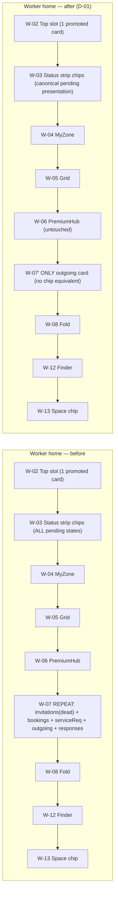
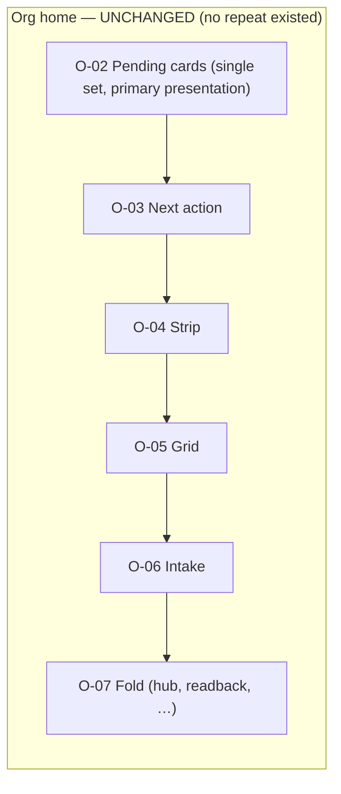
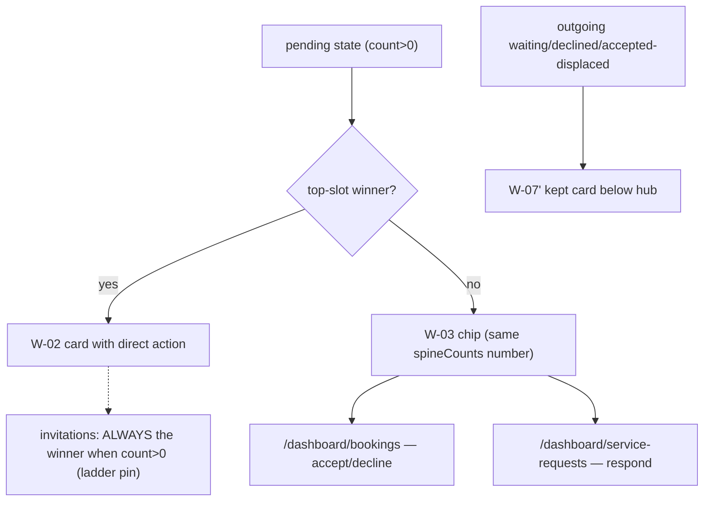

# Dashboard Duplicate Removal v1

**Wave:** 3 of the Timeline Architecture First programme (owner signal 2026-07-17).
**Branch:** `feat/cc/dashboard-duplicate-removal-v1` (from verified `main` ef3ab92a — PR #781 merged + deployed + smoke green).
**Type:** Draft PR — NOT merged, NOT deployed without owner review.
**Scope:** confirmed duplication only (D-01 / D-02 / D-03 from the Surface
Reality Audit). No PremiumHub change, no top-slot change, no role-value copy,
no Timeline/Planning change, no schema/API/permission change.

---

## 1. Duplicate evidence matrix

### D-01 — worker home repeated pending-card block → REMOVED (partially)

The worker home rendered every non-promoted pending card a SECOND time below
the hub (`page.tsx` former lines 787–794), while the status strip above
already showed the same states as chips. Evidence per owner criteria:

| Proof | Evidence |
|---|---|
| Same underlying objects | The cards' numbers ARE the chips' numbers — the page assigns `pendingServiceRequests = spineCounts.pendingIncomingServiceRequests`, `pendingBookings = spineCounts.pendingIncomingBookings`, `bookingResponsesNew = spineCounts.bookingResponsesNew` (equivalence **by construction**, now guard-pinned) |
| Counts/statuses equivalent | same variables; chips render count>0 only, cards were count-gated on the same values |
| Same role | both worker-branch only |
| Action entry retained | promoted state → top-slot card; every other state → chip linking its clearing surface: `pending-bookings → /dashboard/bookings`, `incoming-service-requests → /dashboard/service-requests`, `booking-responses → /dashboard/bookings` (real action surfaces) |
| Mobile access retained | the status strip renders immediately after the top slot — HIGHER than the removed block was |
| Empty/error honesty | chips hide at 0 (unchanged); cards were equally count-gated; no empty state changed |
| No analytics/notification/onboarding loss | spine untouched; bell + nav badges unchanged; MyZone untouched |

Per-card verdicts:

| Card (repeat instance) | Verdict | Reason |
|---|---|---|
| `WorkerInvitationsCard` repeat | REMOVED — **provably dead code** | `decideTopSlot` returns `"invitation"` whenever `pendingInvitations > 0` (highest rung), so the repeat gate `topSlot !== "invitation"` only passed when the list was empty — and the card `return null`s on an empty list. It could never render content. Guard now pins the ladder position. |
| `bookingsPendingNextAction` repeat | REMOVED | chip `pending-bookings` = same count, links the bookings page where accept/decline lives |
| `serviceRequestsNextAction` repeat | REMOVED | chip `incoming-service-requests` = same count, links the service-requests page |
| `bookingResponsesNextAction` repeat | REMOVED | chip `booking-responses` = same count, links the bookings page |
| `outgoingRequestsNextAction` repeat | **KEPT** — not a confirmed duplicate | its `waiting` / `declined` states have **no chip equivalent** (the spine's `service-request-responses` counts *new-since-seen responses*, a different thing), and its `accepted` state renders here whenever an invitation outranks it in the slot. Removing it would delete the only dashboard presentation of those states. |

**Org branch: NO change.** Its cards render once (no repeat block exists);
they are the branch's primary pending presentation (no top slot there), and
`outgoingRequestsNextAction` carries non-chip states — fails the duplication
criteria. Documented, untouched.

### D-02 — intelligence provenance in two places → NOT CONFIRMED, kept

| Owner criterion | Finding |
|---|---|
| Both show same provenance | yes — same `ExplainabilityDrawer` component |
| One location canonical | `/dashboard/intelligence` is canonical |
| Removal doesn't hide trust-required info | **FAILS** — the drawer is the trust card's own explainability; a trust card on the home without its provenance would violate the intelligence trust doctrine (every insight must carry its evidence). Removing the whole home trust card is an information-architecture change, not duplicate removal — explicitly out of Wave 3 scope ("Išsami apžvalga" protected). |

**Verdict: no removal.** The drawer is per-insight evidence (like the
journal's per-entry decision timeline), not a competing history surface.
Guard pins the canonical intelligence surface stays reachable.

### D-03 — journal feed vs reports counts → compact count KEPT

| Owner criterion | Finding |
|---|---|
| Same activity set | yes (journal entries/photos) |
| Counts serve distinct purpose | **YES** — report altitude (client/owner summary with BASIS labels), not a competing feed |
| Journal access preserved | counts link back to `/dashboard/journal` (guard-pinned) |
| Dependent workflows | profile/skills/matching read the journal itself — untouched |

**Verdict: the compact count remains** (owner rule: "a compact count may
remain if it provides a distinct summary and does not compete with the
primary action"). No code change.

## 2. Preserved-entry-point register (removed elements)

| Field | WorkerInvitationsCard repeat | bookings repeat | serviceRequests repeat | bookingResponses repeat |
|---|---|---|---|---|
| Surface ID | W-07a | W-07b | W-07c | W-07d |
| Component | `components/app/worker-invitations-card.tsx` (component KEPT) | inline `bookingsPendingNextAction` (definition KEPT) | inline `serviceRequestsNextAction` (definition KEPT) | inline `bookingResponsesNextAction` (definition KEPT) |
| Source data | `listMyPendingWorkerInvitations()` (KEPT) | `spineCounts.pendingIncomingBookings` (KEPT) | `spineCounts.pendingIncomingServiceRequests` (KEPT) | `spineCounts.bookingResponsesNew` (KEPT) |
| Related route | `/dashboard` top slot | `/dashboard/bookings` | `/dashboard/service-requests` | `/dashboard/bookings` |
| Sole entry? | no — top slot always shows it when count>0 | no — chip + bookings page + module badge | no — chip + service-requests page + module badge | no — chip + bookings page |
| Surviving canonical entry | top-slot card (always wins ladder) | status-strip chip → bookings page | status-strip chip → service-requests page | status-strip chip → bookings page |
| Roles affected | worker | worker | worker | worker |
| Mobile effect | none (slot is first) | chip is HIGHER on screen than removed card was | same | same |
| Rollback | restore 5-line block (single revert) | same | same | same |

**Nothing underlying was deleted**: no service, query, model, route page,
permission rule, event source or analytics contract was removed. Only four
JSX render lines + one comment block left `page.tsx`.

## 3. Before / after plans (stable Surface IDs from the audit)

### Worker dashboard

### Company dashboard

### D-01 group — where the action lives now

### Mobile order (after)

Top slot → status strip (chips, all pending states) → MyZone → grid →
hub → outgoing card → fold. The primary action is never buried — the strip
moved effectively UP relative to the removed cards.

## 4. Validation

| Check | Result |
|---|---|
| `dashboard-duplicate-removal.test.ts` (new, 10 tests) | ✅ |
| `dashboard-hierarchy.test.ts` (re-pinned to the new contract) | ✅ |
| `marketplace-dashboard-next-action` + `status-next-action` (re-pinned: worker branch = top slot OR chip, both from the same spineCounts; org branch card untouched) | ✅ |
| `canonical-timeline-protection` / `timeline-source-expansion` / `planning` | ✅ (Timeline untouched) |
| Full suite | ✅ 10 303 / 10 303 (660 files) |
| typecheck / lint / production build / `check:i18n-debt` | ✅ all green |
| Post-#781 production smoke (pre-wave baseline) | ✅ /lt+/en 200, auth gates 307 with preserved `next`, mobile login OK |

**Environmental limitation (honest):** authenticated worker/company dashboard
rendering cannot be exercised live (no E2E credentials; account creation out
of bounds). Coverage comes from the role/hierarchy/route guard suite and the
production build.

## 5. Rollback

Single squash revert restores the five-line repeat block and the previous
guard pins. App-layer only; no data, schema or service changes to unwind.
