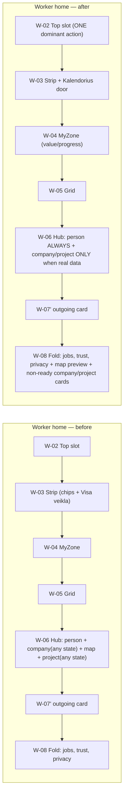
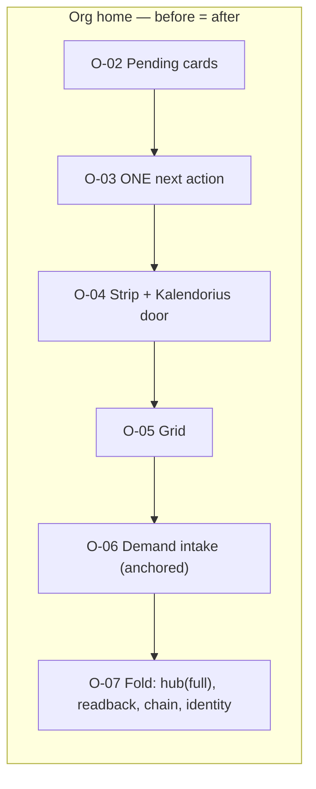
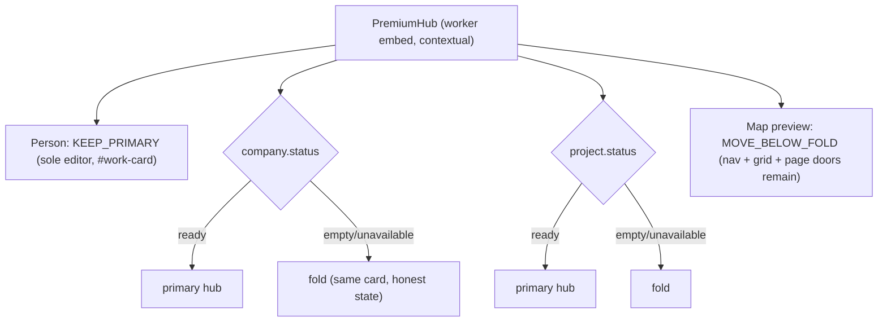

# Dashboard Primary Action Hierarchy v1

**Wave:** 4 of the Timeline Architecture First programme (owner signal 2026-07-17).
**Branch:** `feat/cc/dashboard-primary-action-hierarchy-v1` (from verified `main` 1072fce8 — PR #782 merged + deployed + smoke green).
**Type:** Draft PR — NOT merged, NOT deployed without owner review.

Goal: priority unmistakable in the first seconds — one dominant state-driven
action, compact secondary signals, one clear calendar door, secondary hub
content disclosed by REAL state. Nothing deleted; canonical architecture
unchanged.

---

## 1. Primary-action state matrix (worker — unchanged ladder, now behaviorally tested)

| Real state (highest first) | Primary action shown in the top slot |
|---|---|
| pending invitation(s) | invitations card with inline accept/decline |
| provider accepted my request | accepted-request card |
| incoming service request | respond card |
| incoming booking proposal | booking card |
| new booking responses | responses card |
| first-use (no profession / no entries) | activation (MyZone leads; no slot banner) |
| nothing urgent | **no banner** — no fake urgency (`decideTopSlot → null`) |

Org branch: one data-driven `DashboardNextAction` (review entries / invite /
open need) — unchanged, now pinned as the single next-action region.

## 2. PremiumHub card decision register (element IDs from the audit, W-06 sub-cards)

| Field | Person card (W-06a) | Company card (W-06b) | Market map preview (W-06c) | Project card (W-06d) |
|---|---|---|---|---|
| Title | Asmens kortelė | Įmonės kortelė | Žemėlapio peržiūra | Projekto kortelė |
| Role | worker | worker/org | worker/org | worker (managers) |
| User problem | availability/pay/profile readiness | team & invitations overview | own map locations | project ops door |
| Real data source | profile + journal counts (`loadPerson`) | company row + members/projects/invitations | preferred/demand locations | managed project + handover/photos |
| Primary or secondary | PRIMARY | primary only with real data | secondary (3 other doors: nav Žemėlapis, grid tile, map page) | primary only with real data |
| Actionable? | YES — the ONE canonical availability/location/pay editor + `#work-card` anchor | links | link | links |
| Sole entry point? | YES (editor) | its empty state is a create-company door (kept, moved) | no | no |
| Duplicates another element? | no | partially (company page) | yes (nav + grid + page) | partially (projects page) |
| Contextually relevant? | always | only when a company exists | informational | only when a project exists |
| End-to-end outcome? | yes | yes | yes | yes |
| Mobile viewport cost | ~1 screen | ~0.5 screen when empty | ~0.5 screen | ~0.7 screen when empty |
| **Treatment** | **KEEP_PRIMARY** | **CONTEXTUAL_RENDER** (`status === "ready"` → primary hub; else fold) | **MOVE_BELOW_FOLD** (always in fold) | **CONTEXTUAL_RENDER** (same rule as company) |
| Rollback | n/a | remove `contextual` prop usage | remove fold render + prop | same as company |

**No card was removed.** The fold renders the SAME components under the exact
inverse gate (guard-pinned: each card renders exactly once, placement decided
by real `BlockStatus`).

## 3. What changed (all changes, with preserved entry points)

| # | Change | Previous location | New location | Reason | Function preserved | Roles | Rollback |
|---|---|---|---|---|---|---|---|
| 1 | Status strip gains ONE calendar door ("Kalendorius →" → `/dashboard/planning`) | none (grid tile only, buried among ~8 tiles) | strip header, next to "Visa veikla" | owner rule: one clear Planning entry; dashboard shows NO time projection of its own | planning page unchanged | all | remove link + key |
| 2 | Hub company card (worker, no real company) | primary hub | fold ("Išsami apžvalga") | empty-state card is secondary until a company exists | create-company door + honest empty state intact | worker | drop `contextual` |
| 3 | Hub project card (worker, no real project) | primary hub | fold | same rule | projects door + empty state intact | worker | same |
| 4 | Hub market-map preview (worker) | primary hub | fold | 3 other doors exist (nav, grid tile, page) | component + data unchanged | worker | same |
| 5 | i18n `auth.dashboard.statusStrip.calendar` | — | 5 active locales | label resolves everywhere | — | — | remove keys |

Org branch: **zero structural change** (hub already inside its fold; single
next-action region; demand intake anchored). Agency: shares the org branch —
no separate architecture invented (owner rule honoured).

## 4. Before / after (stable Surface IDs)

### Worker — desktop & mobile vertical order

For a fresh worker (no company, no projects) the primary screen shrinks from
four full-strength hub cards to ONE (the person card with the editor) — the
activation path (MyZone → journal/profile) and the dominant action stay on
the first screens; nothing is deleted, the remaining cards sit one tap away
in the fold.

### Company — unchanged

(The strip door is the only visible org change — the same single component.)

### PremiumHub decision map

## 5. "Išsami apžvalga" evaluation (owner rule)

| Question | Finding |
|---|---|
| Unique data | job recommendations, trust card, privacy status — unique |
| Duplicates PremiumHub | now intentionally HOSTS the hub's secondary cards (not duplication — single render, moved) |
| Duplicates Planning | no dated projection inside |
| Different role | worker fold ≠ org fold contents |
| Needed every visit | no — review content |
| **Decision** | KEEP, collapsed by default (unchanged native `
`, keyboard-accessible — guard-pinned) |

## 6. Validation

| Check | Result |
|---|---|
| New guard `dashboard-primary-action-hierarchy.test.ts` (behavioral ladder matrix, one dominant region per branch, calendar door + locale resolution, exact-inverse contextual gates, native disclosure) | ✅ |
| `dashboard-hierarchy` / `dashboard-duplicate-removal` / `premium-hub-interactivity` / `hub-real-data-only` | ✅ |
| Timeline guards (`canonical-timeline-protection`, `timeline-source-expansion`, `planning`) | ✅ (untouched) |
| typecheck / lint / full suite / build / i18n | see PR description |

**Mobile evidence:** ordering is source-order (single column stack on all
listed widths — 360/375/390/412/tablet); the primary action (top slot) is
first, the strip second, and the removed-from-primary hub cards can no longer
push content down. No fixed widths, no horizontal scroll, no hover-only
behavior introduced; touch targets unchanged (`min-h-11` chips). Live
authenticated viewport screenshots remain owner-only (no E2E credentials;
account creation out of bounds) — honest environmental limitation.

## 7. Rollback

Single squash revert. App-layer only: one prop + conditional rendering in the
hub screen, one link in the strip, fold additions in `page.tsx`, i18n keys,
tests, this doc. No schema, services, permissions, Timeline or navigation
changes.
