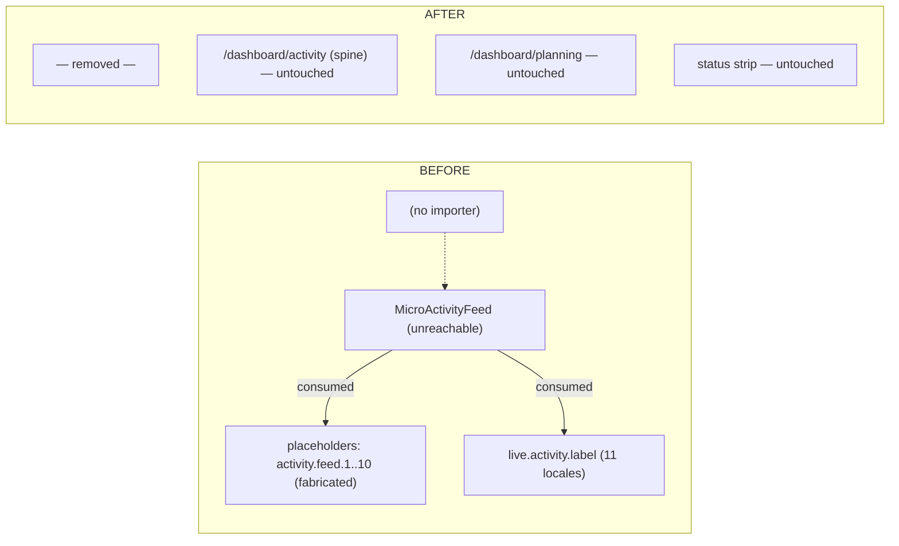

# Dead Surface Code Removal v1

**Wave:** 6 of the Timeline Architecture First programme (owner signal 2026-07-17, OD-6 approved).
**Branch:** `feat/cc/dead-surface-code-removal-v1` (from verified `main` 9042e2b4 — PR #784 merged + deployed + smoke green).
**Type:** Draft PR — NOT merged, NOT deployed without owner review.

Scope: ONLY the independently re-confirmed dead fabricated surface. No broad
cleanup, no active-architecture refactor.

---

## 1. Original finding + independent re-verification

Original (Surface Reality Audit v1, PR #780): `MicroActivityFeed` — a
placeholder-fed "live activity" ticker — rendered nowhere; fabricated data
contained; deletion deferred to this wave per owner correction §6.

**Re-verified on merged `main` 9042e2b4 (this branch's base), recorded searches:**

| # | Condition | Search (scope: `apps/web/{app,components,lib,content,tests,scripts}`, `*.ts/tsx/mjs/json`, node_modules/.next excluded) | Result |
|---|---|---|---|
| 1 | zero static importers | `grep -rn "micro-activity-feed\|MicroActivityFeed"` | only its own definition + the containment guard (which this PR transitions) |
| 2 | zero dynamic importers | `grep -rn "import("` ∩ micro/activity-feed | 0 |
| 3 | no barrel export | `components/app/index.*` | no barrel files exist |
| 4 | no route composition ref | grep over `app/`, `lib/dashboard`, `lib/config`, `lib/navigation` | 0 |
| 5 | no active-behaviour tests | guards referencing it | only the containment guard (by design) |
| 6 | no Storybook/visual dep | `find . -name "*.stories.*"`, `__snapshots__` dirs | none exist repo-wide |
| 7 | no feature flag | `lib/config/feature-availability.ts` + repo grep `microActivity\|micro_activity` | 0 |
| 8 | no registry conditional load | dashboard-module-registry / command registry / navigation | 0 |
| 9 | test IDs / CSS selectors external | component has NO `data-testid`; repo grep `micro-activity` in css/ts/tsx | 0 external |
| 10 | `activity.feed.*` exclusive ownership | code grep: only `content/placeholders.ts` (the pool) + the guard; locale grep: the string match in da/et/lv/no/pl/sv was the `live.activity.label` **value** text, NOT keys — `activity.feed.*` never existed in any locale file | exclusive |
| 11 | no effect on activity/strip/spine/planning/journal/provenance/analytics/empty-states | zero inbound references (above) — removal cannot affect them; guards re-run green | confirmed |
| 12 | no owner-approved future task needs it | `docs/design/premium-design-next-slices-v1.md:49` ("Do NOT remove … defer de-densification") is a **stale 5b-era landing-density note** — the component has since been removed from the landing (git: `eec530a5 feat(landing): live skin`; current landing uses `RecentMatchesFeed`); OD-6 and today's Wave 6 owner signal explicitly supersede it. Cited here for full honesty. | superseded |

## 2. DEAD-ID register (full CSV: `dead-surface-code-register-v1.csv`)

```text
DEAD-MICRO-FEED-001
File: apps/web/components/app/micro-activity-feed.tsx
Static imports: 0 · Dynamic imports: 0 · Registry references: 0
Visible production route: none · Stories/snapshots: none · Flag: none
Decision: CONFIRMED_DEAD_REMOVE
Rollback: revert Wave 6 squash commit

DEAD-MICRO-FEED-002
Key block: content/placeholders.ts → activity.feed.1..10 pool (10 fabricated
"metric" placeholders, sole consumer was DEAD-001)
Decision: CONFIRMED_DEAD_REMOVE (exclusive ownership proven)

DEAD-MICRO-FEED-003
i18n key: live.activity (single "label" leaf) in all 11 locale FILES —
sole consumer was DEAD-001 (`useTranslations("live.activity")`); other
live.* consumers use live.ticker / live.counters / live.chip
Decision: CONFIRMED_DEAD_REMOVE (keys only; locale FILES kept)
```

Kept (explicitly NOT touched):

| Candidate | Classification | Reason |
|---|---|---|
| `LiveTicker`, `MarketCounters` | ACTIVE_KEEP | rendered on marketing landing |
| `RecentMatchesFeed`, `JourneyTimeline` | ACTIVE_KEEP | marketing surfaces |
| `live.ticker` / `live.counters` / `live.chip` i18n | ACTIVE_KEEP | active consumers |
| remaining `content/placeholders.ts` pools | ACTIVE_KEEP | other consumers / governed placeholder registry |
| inactive locale files (da/et/lv/no/pl/sv) | ACTIVE_KEEP | owner rule — files stay; only the dead key removed |
| `framer-motion` dependency | ACTIVE_KEEP | used by other components (not exclusively owned) |

## 3. Guard transition (containment → absence)

`canonical-timeline-protection.test.ts` §3–4 replaced, new contract proves:
the component file does not exist; no source references the symbol or
kebab-case name; no source references `activity.feed.` (including
placeholders.ts itself); `live.activity` absent from every locale file;
`/dashboard/activity` survives as the spine-driven canonical attention
surface; the single-calendar and no-calendar/timeline-route pins stay.

## 4. Before / after dependency graph



## 5. Files changed

| File | Change |
|---|---|
| `apps/web/components/app/micro-activity-feed.tsx` | DELETED |
| `apps/web/content/placeholders.ts` | activity.feed pool block removed (1 206 chars; boundary-asserted) |
| `apps/web/messages/{11 locales}.json` | `live.activity` key removed (files kept) |
| `apps/web/lib/guards/canonical-timeline-protection.test.ts` | containment → absence contract |
| this doc + CSV | evidence |

## 5.1 Landing-freeze baseline regeneration (transparent note)

`content/placeholders.ts` and the `live` i18n namespace sit inside the frozen
landing tree, so the deletion drifted two baseline hashes and
`landing-freeze.test.ts` failed (branch-introduced, expected). Resolution:
baseline regenerated via the sanctioned script
(`scripts/generate-landing-freeze-baseline.ts`, 4-line diff). Justification:
the Wave 6 owner signal explicitly names exactly this data for removal, and
the change is **render-neutral for the landing** — the deleted pool and key
had zero landing consumers, so what users see is byte-identical; only file
hashes moved. The freeze guard itself is untouched and keeps enforcing the
new baseline.

## 6. Validation

| Check | Result |
|---|---|
| `canonical-timeline-protection` (absence contract, 7 tests) | ✅ |
| Residual reference sweep after deletion | 0 hits outside the guard itself |
| dashboard activity / spine / hierarchy / duplicate-removal / primary-action / role-value / planning / expansion guards | see PR description |
| typecheck / lint / full suite / build / i18n | see PR description |

## 7. Rollback

Single squash revert restores the component, the placeholder block, the i18n
keys and the containment guard. No schema, services, permissions or active
surfaces involved.
