# Role Value-to-Action Alignment v1

**Wave:** 5 of the Timeline Architecture First programme (owner signal 2026-07-17).
**Branch:** `feat/cc/role-value-to-action-alignment-v1` (from verified `main` a272fb84 — PR #783 merged + deployed + smoke green).
**Type:** Draft PR — NOT merged, NOT deployed without owner review.

Product-truth alignment, not marketing: six value statements, each bound to a
real action with full traceability. Register:
[`role-value-to-action-register-v1.csv`](role-value-to-action-register-v1.csv).
No new feature, role, schema, service or dashboard structure.

---

## 1. What changed (6 statements × 5 active locales)

| VALUE-ID | Surface | Statement (LT) | Promise level |
|---|---|---|---|
| VALUE-WORKER-PROFILE-001 | MyZone missing-item hint (first-use) | "…Užpildytas profilis leidžia darbdaviams jus rasti **pagal jūsų privatumo nustatymus**." | SUPPORTED — discovery follows consent; default NOT visible, hence the qualifier |
| VALUE-WORKER-JOURNAL-001 | MyZone first-entry hint | "…Įrašai **pildo jūsų profilį ir CV**." | SUPPORTED — journal → capabilities → profile/CV counters (hub person card) |
| VALUE-WORKER-JOURNAL-002 | MyZone recordWork card line | "Įrašai pildo profilį ir CV" | SUPPORTED (same chain) |
| VALUE-PROVIDER-SERVICES-001 | services grid tile description | "Aktyvuotą paslaugą randa prisijungę nariai ir gali siųsti užklausą" | SUPPORTED — `service_offerings` activate → `listDiscoverableOfferings` → request loop |
| VALUE-COMPANY-NEED-001 | demand-intake body | "Užklausa išsaugoma, **nėra viešai skelbiama**, o jos **būseną matysite savo erdvėje**." | SUPPORTED — `customer_requests` + status readback; NO candidate-supply promise |
| VALUE-ALL-PLANNING-001 | planning tile description | "Vienas kalendorius: rezervacijos, projektai, užduotys, žurnalo įrašai, **kvietimai ir mokėjimų terminai**." | SUPPORTED — matches EXACTLY the six projected sources (guard checks both directions) |

## 2. Doctrine catch during implementation (honest note)

The first draft of the journal lines said "įrašai tampa patirties
**įrodymais**" — the pre-existing `worker-facing-copy-exhaustive` guard
correctly rejected it: worker-facing copy may not call unconfirmed entries
"evidence/proof" (plain-language + honesty doctrine). Rewritten to the
precedent-approved "pildo profilį ir CV" formulation. This is the system
working as designed — the wave's own rules ("text may not promise more than
the function does") enforced by an existing guard.

## 3. Value chains (traceability)

```text
VALUE-WORKER-JOURNAL-001
Role: Worker → Need: show recent real work
→ Action: write journal entry (/dashboard/journal#journal-composer — the
  MyZone hint deep-links THIS action)
→ System: journal_entries row (+ journal_entry_skills claims)
→ State: entry stored, day-grouped feed
→ Counterpart: visibility scopes worker controls; team review where granted
→ Next: review/continue journal; MyZone item clears (state-aware)
→ Planning: entry appears as a fact on /dashboard/planning (journal source)
→ Result: profile/CV capability counters grow (hub person card stats)
Promise level: SUPPORTED
```

```text
VALUE-PROVIDER-SERVICES-001
Provider identity decision: NOT a role — a worker/company CAPABILITY
(service_offerings owned by the provider profile). No new identity created.
→ Action: create + activate offering (/dashboard/services)
→ System: service_offerings row (draft/paused visible only to owner — the
  existing page copy already states this honestly)
→ Counterpart: signed-in members see ACTIVE offerings (listDiscoverableOfferings)
→ Next: requests arrive on /dashboard/service-requests (chip + card when pending)
→ Planning: accepted engagements surface via the booking source; direct
  service_offering_requests projection remains a wave-2 §2 expansion candidate
→ Result: offering findable; requests received
Promise level: SUPPORTED (copy stays inside the loop that exists)
```

```text
VALUE-COMPANY-NEED-001
Role: Company/Agency → Need: get workers/team for real work
→ Action: demand intake (#demand-intake stepper)
→ System: customer_requests row
→ Counterpart: platform review queue — NOT public, NOT other users
→ Next: status readback in own space (DemandRequestsReadback)
→ Result: tracked request. NO promise of immediate candidates (supply-side
  honesty per the pre-ads readiness audit).
Promise level: SUPPORTED
```

## 4. Role maps

```mermaid
flowchart TD
  subgraph WORKER["Worker value-to-action"]
    W1["Need: better access to work"] --> W2["Action: profession + availability (profile)"]
    W2 --> W3["Discoverable per PRIVACY SETTINGS (default off — honest qualifier)"]
    W1 --> W4["Action: daily journal entry"]
    W4 --> W5["Profile + CV grow (capability counters)"]
    W5 --> W6["Next: matches board / opportunities (no guarantee wording)"]
    W4 --> W7["Fact visible on canonical calendar"]
  end
  subgraph PROVIDER["Provider capability (not a role)"]
    P1["Action: activate service offering"] --> P2["Signed-in members can find it"]
    P2 --> P3["Requests arrive: /dashboard/service-requests"]
    P3 --> P4["Accepted engagement -> booking -> calendar"]
  end
  subgraph COMPANY["Company/agency"]
    C1["Action: demand intake"] --> C2["Stored, not public"]
    C2 --> C3["Status readback in own space"]
    C3 --> C4["Review chain / invitations where implemented"]
    C4 --> C5["Dated commitments on canonical calendar"]
  end
```



### Unsupported-promise map (found → handled)

| Statement | Status | Handling |
|---|---|---|
| "Įrašai tampa patirties įrodymais" (my draft) | UNSUPPORTED_REMOVE (doctrine) | replaced with "pildo profilį ir CV" before commit |
| Old demand body "iškart išsaugoma ir lieka privati" | PARTIALLY_SUPPORTED ("privati" was vague — platform review sees it) | narrowed to "nėra viešai skelbiama" + added status visibility truth |
| Old planning description (4 sources) | STALE (now 6 sources) | updated; guard enforces exact-source match both ways |
| Journal → "better job" broad promise (audit gap) | NOT ADDED — no guarantee wording anywhere; chain stops at what is real (profile/CV growth, opportunities board) | guard bans guarantee vocabulary in the changed namespaces |

### State-aware behaviour (unchanged mechanics, verified)

MyZone missing-item hints render ONLY in the real first-use state (no
profession / no entries) and disappear when completed — no stale completion
CTAs (existing `incomplete`/missingItems logic; pinned by MyZone guards).
Unavailable states unchanged (honest degradation notes).

## 5. Agency & investor (honest boundaries)

- **Agency:** shares the org branch; the changed demand copy applies to its
  real intake ("partner" intent variant untouched). No agency-specific value
  invented; a dedicated agency value pass would need its own capability audit
  — documented gap, future wave.
- **Investor:** no product surface (unchanged) — `REQUIRES_OWNER_DECISION`
  (OD-7), outside this wave.

## 6. Validation

| Check | Result |
|---|---|
| New guard `role-value-to-action.test.ts` (36 tests: per-locale resolution + banned tech/guarantee/availability/narrowing vocabulary, action adjacency, real routes, exact planning-source claim) | ✅ |
| `worker-facing-copy-exhaustive` (doctrine guard that caught the draft) | ✅ after reword |
| MyZone / user-journey / marketplace loop guards | ✅ |
| typecheck / lint / full suite / build / i18n | see PR description |

**Environmental limitation:** live authenticated dashboard screenshots remain
owner-only (no E2E credentials); copy rendering is covered by locale
resolution tests + build.

## 7. Rollback

Single squash revert — i18n values + one guard test + docs only. No schema,
services, routes, components or permissions changed.
