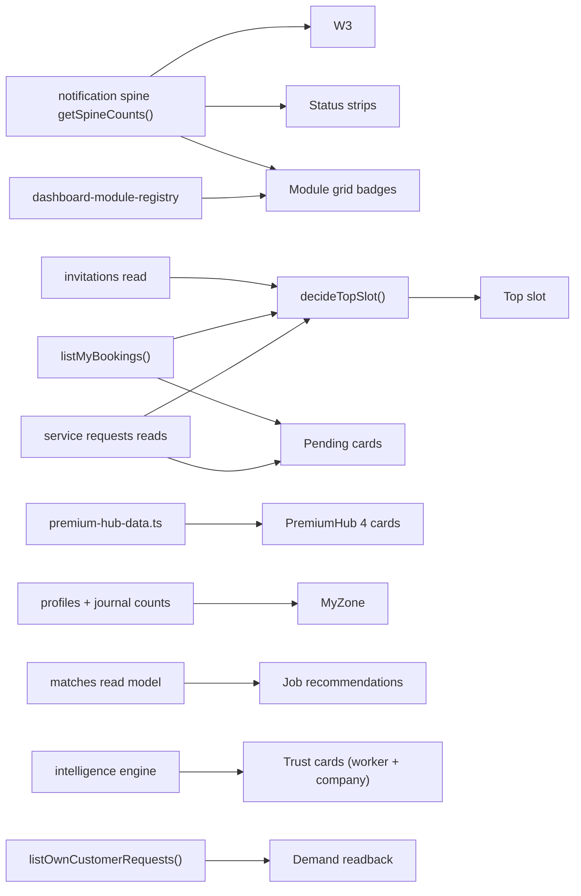
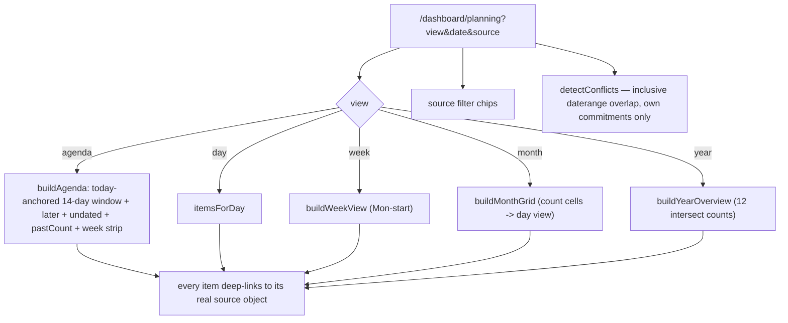
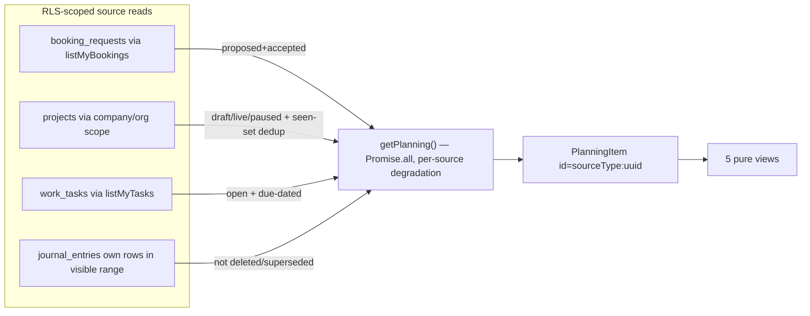
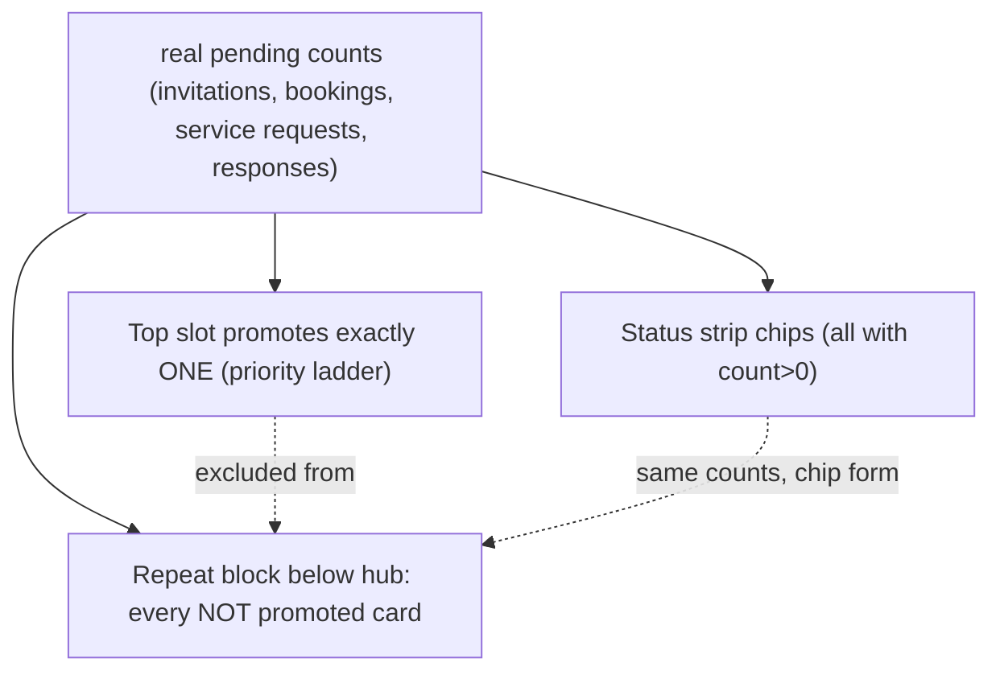
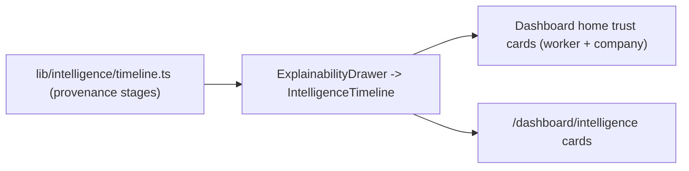
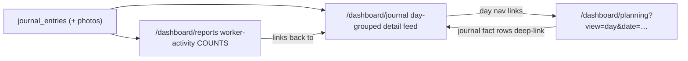
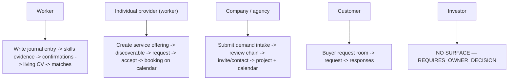
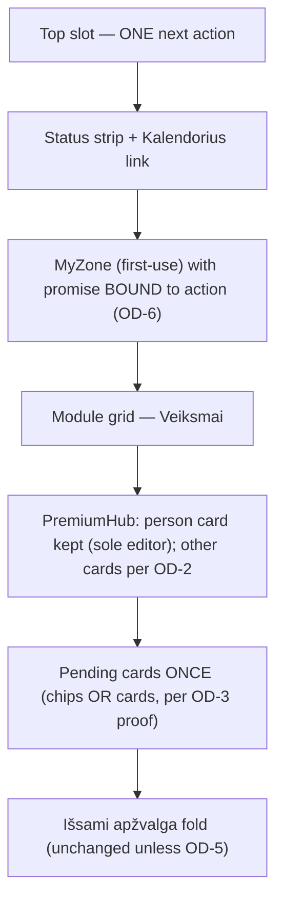
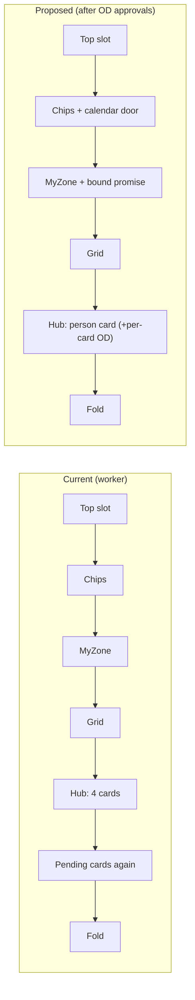

# Surface Reality Audit v1 — Timeline Architecture First

**Type:** `AUDIT_EVIDENCE_ONLY`
**Branch:** `feat/cc/surface-reality-audit-regression-guards-v1`
**Date:** 2026-07-17
**Mandate:** "LabourMarket.ai — Timeline & Calendar Architecture First (Mandatory)" + owner correction "Surface Audit and Timeline Cleanup Execution Boundary" (2026-07-17).

This PR changes **no product behavior**: no adapters, no UI changes, no copy
changes, no deletions. It contains only (a) this audit evidence, (b) an owner
decision register, (c) one behavior-preserving regression guard that freezes
the audited facts (`apps/web/lib/guards/canonical-timeline-protection.test.ts`),
and (d) the proposed small-PR wave sequence.

---

## 1. Canonical timeline — captured architecture

**`/dashboard/planning` ("Kalendorius") is the one canonical time surface.**
Page: `apps/web/app/[locale]/dashboard/planning/page.tsx`. Composition:
`apps/web/lib/planning/planning.ts` (`getPlanning()`). Pure model + all date
math: `apps/web/lib/planning/planning-model.ts`. Guard: `apps/web/lib/guards/planning.test.ts`.

### 1.1 Five views, four real sources

Views (`PLANNING_VIEWS`): `agenda`, `day`, `week`, `month`, `year` — driven
purely by `?view=&date=&source=` search params; no calendar library; server
component.

| Adapter (`planning.ts`) | sourceType | Source table | Date columns | Rows admitted | Role context | Degradation |
|---|---|---|---|---|---|---|
| `readBookingItems()` → `listMyBookings()` | `booking` | `booking_requests` | `start_date` / `expected_end_date` | status ∈ {proposed, accepted} (declined/withdrawn/expired = history, stays on bookings page) | `incoming` / `outgoing` | `needs-migration` → `unavailable`; error → `error` |
| `readProjectItems()` | `project` | `projects` (+ `organizations` owner scope) | `start_date` / `end_date` | status ∈ {draft, live, paused}; closed = history | `managed` | no company & no owned org → `managers-only` (honest note, no invented worker schedule) |
| `readTaskItems()` → `listMyTasks()` | `task` | `work_tasks` | `due_at` | OPEN and DUE-DATED only | `mine` | `needs-migration` → `unavailable` |
| `readJournalItems()` | `journal` | `journal_entries` | `created_at` (fact day) | own entries, `deleted_at IS NULL`, `superseded_by IS NULL`, inside the visible range | `mine` | no `workers` row → `workers-only` |

### 1.2 Projection proof (no duplicated records)

- The planning layer **owns no event rows** — there is no planning/calendar
  table anywhere in `supabase/migrations`. Every row on screen is a live read
  of the source table.
- **Read-only pinned:** `planning.test.ts` asserts `lib/planning` contains no
  `.insert(` / `.rpc(` and that the only direct table read added by the layer
  is the `projects` read (bookings/tasks arrive via their own services).
- **Every item deep-links to its primary object** (`hrefForSource`):
  `booking → /dashboard/bookings`, `project → /dashboard/projects/{id}`,
  `task → /dashboard/tasks`,
  `journal → /dashboard/journal?editing={id}#journal-composer`.
  The calendar never grows a duplicate detail page.

### 1.3 Contract facts required before any expansion (owner correction §3)

| Fact | Current behavior |
|---|---|
| **Dedup principle** | One adapter per source; each row projected at most once. The project read carries an explicit `seen` set (legacy company channel + owned orgs can return the same row). Composed item identity is unique by construction. |
| **ID stability** | `PlanningItem.id = "{sourceType}:{sourceId}"` where `sourceId` is the source row UUID — stable across renders, used for React keys, testids and conflict pairs. |
| **Sorting logic** | `sortItems` key = `"{startDate ?? 9999-99-99}\|{sourceType}\|{sourceId}"` — deterministic: date, then source type, then id; undated rows sort last and render in the honest "no date yet" section. |
| **Role filtering** | Reads are caller-scoped, then labeled with `roleContext` (`incoming`/`outgoing`/`managed`/`assigned`/`mine`) — display context only, never a security mechanism. Workers get `managers-only` note for projects instead of an invented schedule; non-workers get `workers-only` for journal facts. |
| **Permission bounds** | Every read is an existing RLS-scoped read (`listMyBookings`, `listMyTasks`, `projects` RLS, own `journal_entries`). Never the admin client, never a write, never an RPC (guard-pinned). |
| **Timezone behavior** | All date math is UTC calendar-day strings (`YYYY-MM-DD`); `toIsoDay()` converts timestamps to UTC days. Consequence: a journal entry recorded late evening local time may bucket to the neighbouring UTC day. Documented as a known trade-off — consistent, deterministic, no DST bugs; any change is an owner product decision, not a side effect. |
| **Link to primary object** | `hrefForSource` (see 1.2). Pinned by `planning.test.ts` ("REAL LINKS ONLY"). |
| **Source object removed / unreachable** | Per-source honest state (`ok`/`unavailable`/`managers-only`/`workers-only`/`error`) renders a per-source note — never a crash, never fake rows. Deleted/superseded journal entries are excluded at read time. A deep-link target that has since closed renders that surface's own honest empty state (the destination owns the empty state, guard-pinned across hub/planning). |
| **Conflict semantics** | Inclusive `daterange '[]' &&` overlap, mirroring the booking-accept guard: only the caller's own accepted incoming bookings and own assigned projects compete. Proposals and other people's rows never conflict. |

### 1.4 Regression guard added by this PR (behavior-preserving)

`apps/web/lib/guards/canonical-timeline-protection.test.ts` freezes:

1. the calendar view builders have exactly one consumer (the planning page);
2. no dashboard route directory named `calendar` or `timeline` exists;
3. `MicroActivityFeed` is imported by nothing (fabricated data contained);
4. nothing else consumes the fabricated `activity.feed.*` placeholder pool.

`planning.test.ts` (pre-existing, 46 tests) already freezes the source-type
registry, read-only composition, real links, conflict math and view math.

---

## 2. Missing sources inventory (Timeline expansion candidates)

Existing sequencing doc: `docs/launch/calendar-missing-sources-inventory-v1.md`.
Real tables with meaningful time columns, **not yet projected**:

| Priority | Table | Time columns | Notes for the expansion PR |
|---|---|---|---|
| 1 | `finance_records` | `due_date`, `paid_at`, `created_at` | No schema change needed. RLS: creator / admin / company owner (`listMyFinanceRecords`). **Pre-checks required:** meaningful date presence, cross-role sensitivity (amounts must never appear to a role the finance surface itself would not show them to). |
| 1 | `invitations` | `created_at`, `expires_at`, `accepted_at`, `declined_at`, `revoked_at` | No schema change needed. **Pre-checks:** event time/state clarity; declined/expired/accepted render as past facts; future expiry never reads as an already-taken action. |
| 2 | `matches` | `computed_at` | recommendations as dated events |
| 2 | `service_offering_requests` | `created_at`, `responded_at` | service loop events |
| 2 | `project_handover_entries` | `created_at` | handover milestones |
| 3 | `worker_documents` | `valid_from`, `valid_until` | expiry reminders (compliance) |
| 3 | `market_intelligence_observations` | `captured_at`, `valid_from/to` | intelligence freshness |
| gated | worker absences, availability windows, shifts, appointments, holidays | — | need owner-gated additive migrations (already sequenced in the launch doc) |

Mandate coverage note: the mandate's category list (User Activity, Company
Activity, Matching, Communication, Projects, AI Activity, Business Operations,
Administration) maps onto per-domain append-only event tables that already
exist (`booking_request_events`, `worker_document_events`, `audit_logs`,
`pilot_events`, …). Those are **fact history**, not forward plan; projecting
them is wave 2+ work and must go through the same adapter pattern — **no new
universal event table** (owner correction §3, and the projection doctrine in
`docs/launch/canonical-calendar-contract-v1.md`).

---

## 3. Dashboard overload — Surface ID inventory

Home page `apps/web/app/[locale]/dashboard/page.tsx` renders two branches.
Current state is "Compact home v1" (PR #773, owner directive 2026-07-16):
informational surfaces already fold into ONE `DashboardMoreSection`; source
order frozen by `lib/guards/dashboard-hierarchy.test.ts`.

**Column key:** Sole entry? = is this the only door to the function. Proposed
action is a *proposal for later PRs*, executed only per the owner decision
register (`timeline-cleanup-owner-decision-register-v1.md`).

### 3.1 Worker branch (top → bottom)

| Surface ID | Element | Purpose | Data source | Related function | Sole entry? | Proposed action | Risk | Rollback |
|---|---|---|---|---|---|---|---|---|
| W-01 | RoleNoticeBanner | explain role-gate bounce | `?notice=` param | routing honesty | yes (for this state) | KEEP | — | — |
| W-02 | Top slot (`dashboard-top-slot`) | THE one most important real next action | `decideTopSlot()` over real counts | invitations / requests / bookings | no (each has own page) | KEEP | — | — |
| W-03 | DashboardStatusStrip | spine chips (count>0 only) + "Visa veikla" | `getSpineCounts()` | attention routing | no | KEEP | — | — |
| W-04 | MyZone | first-use readiness (missing profession / first entry) | profile + journal counts | activation | yes (as guided path) | KEEP | — | — |
| W-05 | DashboardModuleGrid ("Veiksmai") | configurable action grid | module registry + spine badges | all module doors | no (nav + command finder) | KEEP | — | — |
| W-06 | PremiumHubScreen embedded (4 cards, `#work-card` anchor) | person/company/map/project snapshot + inline work editor | `premium-hub-data.ts` | availability/pay editor (person card) | **person card editor: YES** — the one canonical editor | EVALUATE per card (OD-2); do NOT auto-collapse | hiding the sole editor breaks profile deep-link | restore embed |
| W-07 | Repeated pending cards (invitations / bookings / service req / outgoing / responses) | pending states the top slot did not promote | same count-gated reads as W-02 | action queues | no (top slot + own pages + spine chips) | DEDUP per OD-3 proof conditions | removing may hide a pending action path | re-render block |
| W-08 | DashboardMoreSection ("Išsami apžvalga") | collapsed informational fold | container | — | — | KEEP (already the fold) | — | — |
| W-09 | └ JobRecommendationsCard | top-3 matches | matches read model | opportunities | no (opportunities page) | KEEP in fold | — | — |
| W-10 | └ HubWorkerIntelligence → TrustInsightCard | salary-vs-benchmark trust card | intelligence engine | intelligence | no (intelligence page) | KEEP in fold; provenance drawer dup handled in D-02 | — | — |
| W-11 | └ PrivacyStatusCard | visibility-to-employers status | consent read | privacy | no (privacy page) | KEEP in fold | — | — |
| W-12 | CommandFinder | universal search | command registry | navigation | no | KEEP | — | — |
| W-13 | CurrentSpaceHeader | active workspace chip | session profile | context | yes (as passive label) | KEEP | — | — |

### 3.2 Org / customer branch (top → bottom)

| Surface ID | Element | Purpose | Data source | Related function | Sole entry? | Proposed action | Risk | Rollback |
|---|---|---|---|---|---|---|---|---|
| O-01 | RoleNoticeBanner | role-gate explainer | `?notice=` | routing honesty | yes | KEEP | — | — |
| O-02 | Pending cards (service req / outgoing / responses) | real pending states | count-gated reads | request loops | no | DEDUP per OD-3 | same as W-07 | re-render |
| O-03 | DashboardNextAction | single data-driven next action | `managerNextAction()` / `customerNextAction()` | review / invite | no | KEEP | — | — |
| O-04 | DashboardStatusStrip | spine chips | `getSpineCounts()` | attention routing | no | KEEP | — | — |
| O-05 | DashboardModuleGrid | org module grid | registry | module doors | no | KEEP | — | — |
| O-06 | Demand-intake section (`#demand-intake`) | create structured hiring/partner need | `DemandRequestButton` stepper | demand pipeline | **YES on home** (also company page form) | KEEP (anchored outside fold by design) | — | — |
| O-07 | DashboardMoreSection | collapsed fold | container | — | — | KEEP | — | — |
| O-08 | └ PremiumHubScreen embedded | 4-card snapshot | hub data | company/project doors | no | EVALUATE per card (OD-2) | — | restore |
| O-09 | └ DemandRequestsReadback | readback of submitted demand requests + statuses | `listOwnCustomerRequests()` | demand follow-up | **yes for status readback** | OD-4: split "open loop" (action) vs "closed history" (timeline candidate) | history vs action mix | keep readback |
| O-10 | └ HubCompanyIntelligence | own-demand trust card | intelligence | intelligence | no | KEEP in fold | — | — |
| O-11 | └ DashboardChainActions | review-chain entry points | role signals | review chain | no | KEEP in fold | — | — |
| O-12 | └ IdentityActions | company vs create-company CTAs | profile/company state | identity | no (company page) | KEEP in fold | — | — |
| O-13 | └ WorkerInvitationsCard | pending invites | invitations read | invitations | no | KEEP (count-gated) | — | — |
| O-14 | CommandFinder / CurrentSpaceHeader | search / workspace chip | registries | navigation | no | KEEP | — | — |

**Overload conclusion (documented, not changed here):** the remaining visual
load on the worker home comes from (1) the full 4-card PremiumHub rendered
outside the fold (needed: its person card carries the ONE canonical
availability/pay editor + `#work-card` anchor), and (2) the pending-state
cards appearing both via the top slot and again below the hub. Both have
guarded reasons; changing either requires the OD-2/OD-3 proofs first.

---

## 4. Duplicates — documented

| Dup ID | What | Place 1 | Place 2 | Same object? | Notes |
|---|---|---|---|---|---|
| D-01 | Pending-state cards double-render | Top slot W-02 (the promoted one) | W-07 repeat block (all not-promoted) | The promoted card is excluded from the repeat (`topSlot !== …`), so **no literal double render of the same card** — but the same *category* can appear as spine chip (W-03) AND card (W-07) simultaneously | Removal allowed only under OD-3 proof conditions (owner correction §5) |
| D-02 | Intelligence provenance timeline | Dashboard home trust cards (W-10/O-10 → `ExplainabilityDrawer` → `IntelligenceTimeline`) | `/dashboard/intelligence` (same drawer) | Yes — same component, same insight | Per-insight provenance belongs with the insight (like per-entry `EvidenceDecisionTimeline`); it is NOT a standalone history block. Proposal: keep drawer, never promote to a standalone dashboard feed |
| D-03 | Journal activity | `/dashboard/journal` detailed day-grouped feed (`#journal-entries`) | `/dashboard/reports` "worker activity" **counts** linking back to the journal | Same underlying rows, different altitude (detail vs count) | Mandate-compatible: dashboard/report = summary + link; journal = detail. Proposal: no removal; pin "counts link to the canonical feed" |

Dead/near-dead surfaces (documented for the Dead Surface Code Removal PR):

| Item | Evidence |
|---|---|
| `MicroActivityFeed` (`apps/web/components/app/micro-activity-feed.tsx`) | **Zero imports** across `app/`, `components/`, `lib/` (only its own definition, line 22); **no dynamic `import()`**; **no `*.stories.*` files exist in the repo at all**; **no fixture/test references**; **no feature-flag references** (`microActivity`/`micro_activity` — none). Feeds on fabricated `activity.feed.1..10` placeholder pool (`apps/web/content/placeholders.ts:640`) — fabricated data currently **cannot reach any production surface** (unreachable component). Containment now guard-pinned. Deletion itself: separate PR per owner correction §6. |
| Marketing tickers (`JourneyTimeline`, `RecentMatchesFeed`) | Marketing-only surfaces, placeholder-fed by design, out of dashboard scope. No action proposed. |

---

## 5. Mandate feature-requirements mapping

| Mandate requirement | Status today |
|---|---|
| day / week / month / agenda views | ✅ all exist |
| chronological list | ✅ agenda + day view |
| filters (source) | ✅ `?source=` chips |
| company / project / participant filtering | ❌ not yet (wave 5 of mandate; needs adapter metadata first) |
| search | ❌ not on planning (global CommandFinder exists) |
| categories / tags | ⚠️ sourceType = category; free tags don't exist |
| export | ❌ (journal has export; planning doesn't) |
| notifications / reminders | ⚠️ notification spine covers attention counts; no scheduled reminders |
| event contract (id, type, title, status, priority, owner, timestamp, related entities, attachments, links) | ⚠️ `PlanningItem` covers id/type/label/detail/status/dates/roleContext/href; priority/attachments/related-document not yet — extend the item contract only when a real source provides the field |

---

## 6. Role value-to-action reality (no copy changes in this PR)

Owner correction §7: value lines must bind to real actions, not generic
marketing. The real chains as they exist today:

**Darbuotojas (worker)**
- Primary action: write today's journal entry — `/dashboard/journal#journal-composer` (MyZone deep-links it on first use).
- Real result: entries → skill evidence (`journal_entry_skills`) → manager confirmation (`journal_entry_confirmations`) → living CV (`/cv`, profile capabilities) → job matches (`JobRecommendationsCard`, opportunities board).
- Real data behind it: `journal_entries` + satellites; matches read model.
- Next step visibility: MyZone missing items; spine `new-job-matches` badge.
- **Gap (for Role Value-to-Action Alignment v1):** the payoff line ("journal becomes your CV / path to better work") exists only in onboarding copy + a retired explainer; the promise and the action are separated on the home. Proposal: bind the existing promise copy to the existing first-use action — copy-only, no new claims.

**Individualią veiklą vykdantis asmuo (worker offering services)**
- Offer: `service_offerings` via `/dashboard/services` (RLS provider-owned).
- Who sees it: discoverable via `listDiscoverableOfferings` on the requests loop.
- Order intake: `service_offering_requests` (`sent/accepted/declined/withdrawn`) on `/dashboard/service-requests`; incoming ones surface on home as count-gated cards + spine chips.
- Calendar: an accepted engagement appears via bookings (`booking` adapter); `service_offering_requests` itself is an expansion candidate (§2).
- History: request statuses on the service-requests surface.
- **Gap:** the loop exists end-to-end but is invisible at first login unless a request already exists (grid tile only).

**Įmonė / užsakovas (company / customer)**
- Need intake: `#demand-intake` stepper on home (company/agency) or `/dashboard/buyer` (customer) → `customer_requests`.
- Candidates/offers: matching + review chain (`DashboardNextAction`), readback of own requests (O-09).
- Contact start: invitations / conversations.
- Planning next steps: projects + workforce planning zone; canonical calendar for dated commitments.
- **Gap:** differentiator copy ("clearer request → fewer, better candidates") is body text, not bound to the intake action.

**Investuotojas** — see §7. No product role exists; nothing on the dashboard
addresses investors. `REQUIRES_OWNER_DECISION`.

---

## 7. Investor surface separation — `REQUIRES_OWNER_DECISION`

Owner correction §8 requires separating four different things before any
investor-facing work:

| Class | What exists today |
|---|---|
| Product user surfaces | worker/company/agency/customer dashboards (this audit) |
| Administrative product observation | `/dashboard/admin/launch-readiness`, `/dashboard/admin/telemetry`, `/dashboard/admin/market` (admin-gated) |
| Investor-facing representational info | **none** — no role, no page, no copy |
| Internal business metrics | reports with BASIS labels; intelligence trust engine; pilot telemetry |

Recommendation recorded (not executed): investor material should be a separate
presentation / data-room / owner-analytics surface — **not** a new role in the
product. Quality-standards story can truthfully reference the existing honesty
doctrine (no fake data, BASIS labels, guard suite). Marked
`REQUIRES_OWNER_DECISION` in the decision register (OD-7).

---

## 8. Graphical maps (owner correction §9)

### 8.1 Current dashboard page plan

```mermaid
flowchart TD
  subgraph WORKER["Worker branch (role = worker)"]
    W1["W-01 RoleNoticeBanner (gated)"] --> W2["W-02 Top slot — ONE promoted next action"]
    W2 --> W3["W-03 Status strip (spine chips, count-gated)"]
    W3 --> W4["W-04 MyZone (first-use readiness)"]
    W4 --> W5["W-05 Module grid — Veiksmai"]
    W5 --> W6["W-06 PremiumHub embed (4 cards) #work-card"]
    W6 --> W7["W-07 Repeated pending cards (not promoted by slot)"]
    W7 --> W8["W-08 Išsami apžvalga (collapsed fold)"]
    W8 --> W9["W-09 Job recommendations"]
    W8 --> W10["W-10 Worker intelligence trust card"]
    W8 --> W11["W-11 Privacy status"]
    W8 --> W12["W-12 CommandFinder"]
    W12 --> W13["W-13 CurrentSpaceHeader"]
  end
  subgraph ORG["Org / customer branch"]
    O1["O-01 RoleNoticeBanner"] --> O2["O-02 Pending cards"]
    O2 --> O3["O-03 DashboardNextAction"]
    O3 --> O4["O-04 Status strip"]
    O4 --> O5["O-05 Module grid"]
    O5 --> O6["O-06 Demand intake #demand-intake"]
    O6 --> O7["O-07 Išsami apžvalga (fold)"]
    O7 --> O8["O-08 PremiumHub embed"]
    O7 --> O9["O-09 Demand requests readback"]
    O7 --> O10["O-10 Company intelligence"]
    O7 --> O11["O-11 Chain actions"]
    O7 --> O12["O-12 Identity actions"]
    O7 --> O13["O-13 Invitations"]
  end
```

### 8.2 Dashboard block dependencies (data sources)

### 8.3 /dashboard/planning function plan

### 8.4 Timeline adapters plan (current)

### 8.5 Pending-card duplicate schema (D-01)

### 8.6 Intelligence provenance display places (D-02)

### 8.7 Journal feed ↔ counts relation (D-03)

### 8.8 Per-role primary action plan (as-is)

### 8.9 Proposed cleaned dashboard plan (proposal only — needs OD approvals)

### 8.10 Current vs proposed comparison

---

## 9. Proposed PR wave sequence (owner correction §10)

1. **Surface Reality Audit and Regression Guards v1** — this PR (`AUDIT_EVIDENCE_ONLY`).
2. **Timeline Source Expansion v1** — `finance_records` + `invitations` adapters only; pre-checks from §2; Draft.
3. **Dashboard Duplicate Removal v1** — only items proven under OD-3; Draft.
4. **Dashboard Primary Action Hierarchy v1** — per-card PremiumHub decisions (OD-2); Draft.
5. **Role Value-to-Action Alignment v1** — copy bound to real actions (§6 gaps); Draft.
6. **Dead Surface Code Removal v1** — `MicroActivityFeed` + its placeholder pool + i18n keys (OD-6 evidence already collected); Draft.
7. **Mobile Surface Stabilisation v1** — Draft.
8. **PWA and App Readiness Gate v1** — Draft.

Every PR: small, reversible, before/after evidence, separate regression check,
**Draft**, merged only on owner signal.

**Next PR to execute: Timeline Source Expansion v1** (wave 2).
