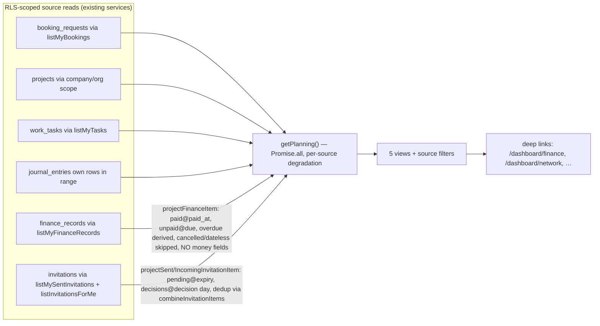
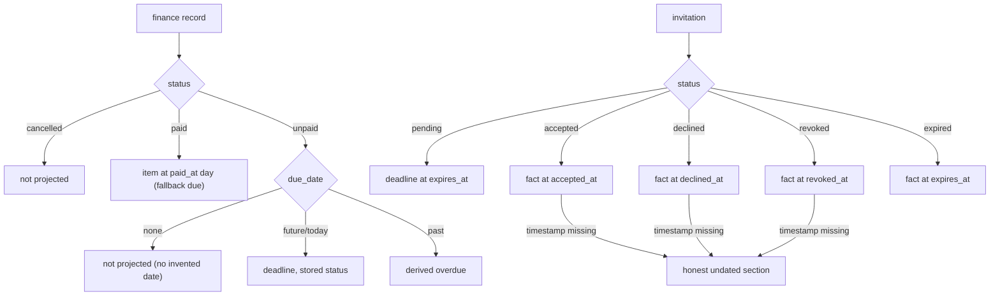

# Timeline Source Expansion v1 — finance_records + invitations

**Wave:** 2 of the Timeline Architecture First programme (owner signal 2026-07-17).
**Branch:** `feat/cc/timeline-source-expansion-v1` (from verified `main` 027a64c7, PR #780 merged + deployed).
**Type:** Draft PR — NOT merged, NOT deployed without owner review.

Two real sources join the ONE canonical calendar `/dashboard/planning` as pure
projections. No schema change, no new table, no Timeline writes, no stored
duplicate rows, no dashboard-home change.

---

## 1. Before / after source inventory

| | Before | After |
|---|---|---|
| Sources | booking, project, task, journal | booking, project, task, journal, **finance**, **invitation** |
| Views | agenda / day / week / month / year | unchanged — new sources appear in all five |
| Storage | none (projection) | none (projection) |
| Writes from planning | none (guard-pinned) | none (guard-pinned) |
| Direct table reads in planning | projects, organizations, workers, journal_entries | **unchanged** — both new adapters reuse existing services |

## 2. Evidence-based semantics (pre-implementation proofs)

### finance_records (`apps/web/lib/finance/`)

- **Authoritative dates:** `due_date` (deadline of an unpaid record), `paid_at`
  (payment fact). `created_at` is bookkeeping — **never projected** (owner
  rule: no automatic timestamp projection).
- **Read/RLS:** `listMyFinanceRecords()` — creator / admin / company owner;
  bounded (`FINANCE_READ_LIMIT`), deterministic order. The calendar reuses
  exactly this read — visibility can never widen.
- **Statuses:** stored `draft | issued | partially_paid | paid | cancelled`;
  `overdue` is DERIVED (unpaid + due day before today), the same rule the
  finance surface applies (`isOverdueRecord`). Representation:
  - `cancelled` → **not projected** (not an operational commitment);
  - `paid` → past FACT at `paid_at` day (falls back to `due_date` for legacy
    rows without `paid_at`);
  - unpaid + future due → deadline with the stored status label;
  - unpaid + past due → `overdue` (label `finance.summary.overdue`);
  - no usable date → **not projected** (honest absence, no invented dates).
- **Milestones:** ONE item per record (`finance:{uuid}`); no `:due`/`:paid`
  fan-out in v1 — separate milestones showed no distinct user value yet, and
  a single item can never double-count. Documented decision; the ID scheme
  leaves room (`finance:{id}:due`) if the owner later wants both.
- **Canonical destination:** `/dashboard/finance`.

### Privacy decision (binding)

The calendar item exposes ONLY: safe title, derived/stored status, day, link.
**Absent by construction:** amount, currency detail, invoice identifiers,
third-party names — the projection input type (`FinancePlanningInput`) has no
such fields, and `timeline-source-expansion.test.ts` statically pins that the
planning layer never references money fields. Money detail stays on
`/dashboard/finance` under its existing permissions.

### invitations (`apps/web/lib/invitations/`)

- **Types:** join_platform / join_organization / join_team / join_as_employee
  / collaborate_partner / join_project / invite_company.
- **Reads (both directions, existing):**
  - sent — `listMySentInvitations()` (RLS inviter-or-admin); stale pending
    already reads as expired upstream (`computeDisplayStatus`);
  - incoming — `listInvitationsForMe()` (existing RPC, pending rows addressed
    to the caller's verified email only).
- **Authoritative dates:** `expires_at` (NOT NULL, default +14d) for
  pending/expired; `accepted_at` / `declined_at` / `revoked_at` for decisions.
  The sent-invitations SELECT was extended by these three existing columns
  (additive, same RLS — the only service change in this PR).
- **Status representation (honest):**
  - `pending` → actionable deadline at the real expiry day (creation time is
    NEVER presented as a scheduled event);
  - `accepted` / `declined` / `revoked` → past facts at their real decision day;
  - `expired` → past fact at the expiry day;
  - missing decision timestamp → the honest "no date yet" section (no
    invented dates).
- **Dedup:** a self-invitation can appear in both scopes → `combineInvitationItems`
  keeps the outgoing projection, drops the duplicate (tested).
- **Role labels:** `incoming` ("Pasiūlyta man") / `outgoing` ("Mūsų pasiūlyta")
  context chips — the same context copy bookings already use.
- **Canonical destination:** `/dashboard/network`.

## 3. Canonical timeline contract — preserved

- Stable IDs `sourceType:uuid`; deterministic sorting (unchanged `sortItems`).
- Caller-scoped reads, existing RLS, **no admin client, no writes, no RPC in
  the planning layer** (planning guard re-pinned and green).
- UTC calendar-day math unchanged (timezone boundary tested).
- Source filter chips + tones render from the registry for all six sources.
- Honest degradation: needs-migration → per-source "unavailable" note; read
  failure → per-source "error" note; the rest of the plan renders.

## 4. Updated adapter map

## 5. Validation results

| Check | Result |
|---|---|
| `timeline-source-expansion.test.ts` (new, 29 tests: integrity/dedup/permissions/status-dates/views) | ✅ |
| `planning.test.ts` (re-pinned: 6 sources, new service imports, new i18n keys) | ✅ |
| `canonical-timeline-protection.test.ts` | ✅ |
| `dashboard-hierarchy.test.ts` (home untouched) | ✅ |
| Full unit/guard suite | ✅ 10 293 tests / 659 files |
| `pnpm -F web typecheck` | ✅ |
| `pnpm -F web lint` | ✅ |
| `pnpm check:i18n-debt` | ✅ within baseline (de/nl/ru = 0 debt) |
| `pnpm -F web build` | see PR description (run on branch) |
| Production smoke (post-#780): `/lt` 200, `/dashboard` + `/dashboard/planning` → 307 auth gate, login renders LT, mobile 375px interactive tree correct | ✅ |

**Environmental limitation (honest):** authenticated production role smoke
(worker/company inside the live dashboard) stays owner-only — no E2E
credentials exist in the environment and account creation is out of bounds.
Role coverage is validated by the role guards inside the full suite.

## 6. Rollback

Single revert of the squash commit restores the previous state: the change is
app-layer only (planning model/composition, one additive SELECT extension in
`lib/invitations/network.ts`, page chips/notes, i18n keys, tests, this doc).
No schema, no data, no stored rows to unwind.
