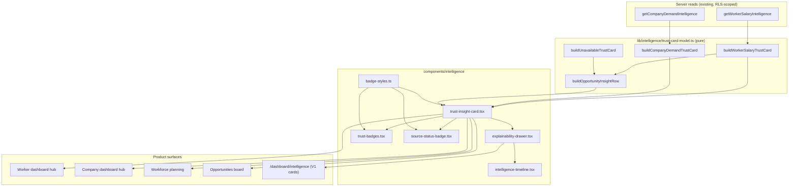

# Contextual Intelligence UI v1 — architecture, rendering rules, honesty audit

Status: implemented on top of the Intelligence layer v1 (PR #755) and the
Trust Layer v1 (PR #756). No external source activated. No migration
applied. No scraping. No AI summaries. No demo observations. Production
behaviour stays deterministic.

Doctrine served:

> Never ask the user to trust AI.
> Always show why the system reached a conclusion.

## 1. UI architecture

ONE card engine renders every contextual intelligence surface. The model
layer builds a `TrustCardV1` from existing deterministic reads; the
component layer only renders it.

## 2. Component hierarchy

| Component | Role |
|---|---|
| `trust-insight-card.tsx` | The ONE card engine: title, status chip, headline, confidence + origin + freshness badges, conflict block, explainability drawer, unavailable state, optional workspace link. |
| `explainability-drawer.tsx` | The ONE disclosure: meaning, why visible, data basis, window/geo/sample, origin + sources, confidence, freshness, observation references, limitations, next action, derivation timeline. Used by trust cards AND the V1 workspace cards. |
| `trust-badges.tsx` | ConfidenceBadge, FreshnessNote, OriginBadge, ConflictBadge. |
| `source-status-badge.tsx` | Governance-derived lifecycle chip (proposed … blocked). |
| `intelligence-timeline.tsx` | Validated source→…→visible timeline renderer. |
| `badge-styles.ts` | The ONE badge design language: chip base class + every tone map. Guard-pinned single definition. |
| `intelligence-card.tsx` | V1 workspace card — now consumes badge-styles + the shared drawer instead of private copies. |

Removed: `contextual-intelligence-card.tsx` (#755's compact presenter) —
replaced by the trust-card engine everywhere it was used; no duplicate UI.

## 3. Rendering rules

1. A card renders a figure ONLY when a deterministic read produced one
   (`status: "ready"` with a full `InsightTrustReportV1`).
2. A conflict reported by the trust layer renders as `status: "conflict"`:
   the "Conflict detected" badge plus BOTH values with their sources and the
   divergence percent. No code path computes an average (guard-pinned).
3. Everything else renders `status: "unavailable"` with the four honest
   answers: WHY there is no data, WHAT is required, WHICH sources are not
   active (with their real lifecycle badges), WHAT happens after
   activation. "Coming soon" is guard-banned in every locale.
4. The model layer refuses inconsistent cards at build time (ready without
   report, unavailable with report, conflict without conflict).
5. Timelines render only when `buildTimeline` validated REAL timestamps
   (benchmark entry date, render request time); otherwise the drawer shows
   an honest "timeline appears after activation" line.
6. Confidence is never guessed: curated benchmarks carry no sample size and
   no provenance chain, so today's salary card honestly shows "Unknown".
   Demand aggregates show "Medium" only when the exact (cohort-passed)
   counts reach the platform sample floor.

## 4. Where the cards live

| Surface | Card(s) | Degrades to |
|---|---|---|
| Worker dashboard hub | salary benchmark | unavailable (why/requirement/sources/after) |
| Company/agency dashboard hub | own-demand aggregate | unavailable |
| Workforce planning (`/dashboard/company/planning`) | own-demand aggregate | unavailable |
| Opportunities board (`/dashboard/opportunities`) | market-context row: salary benchmark + demand + supply + skill gap + market trend | salary from real read; the other four are honest placeholders by design until activation |
| `/dashboard/intelligence` | V1 cards, now with the shared drawer | existing honest states (unchanged semantics) |

## 5. Honesty rules (enforced)

- No invented numbers: every figure originates in `market_rate_averages`
  (admin-curated) or the org's own `customer_requests` aggregates — both
  existing, RLS-scoped, deterministic reads.
- No averaging of conflicting values (guard `intelligence-ui-consistency`
  (c) + model tests).
- No vague promises (guard (b): "coming soon" and its LT/RU/NL/DE/PL/DA/
  NO/SV/ET/LV equivalents banned across the intelligence namespace).
- One badge language (guard (a): chip class defined once).
- All external sources stay proposed-only and OFF (existing boundary guard
  (c) — untouched).

## 6. Accessibility

- The drawer is a native `
/
` — keyboard-operable and
  server-rendered with no client JS.
- Status is never conveyed by colour alone: every chip carries its text
  label; conflict adds a text block with both values.
- Sections carry `aria-label`s (`opportunities-market-context`), lists are
  real `<ul>/<dl>` semantics, links keep the repo's `focus-visible` ring
  pattern.
- Timeline rail decoration is `aria-hidden`; the facts are in text.

## 7. Honest degradation audit (2026-07-14)

Reviewed every intelligence surface in this branch for pretended knowledge,
guessed values, fake averages, fake trends, or placeholder numbers:

| Screen | Verdict | Notes |
|---|---|---|
| Worker hub card | HONEST | Figure only from curated benchmark comparison; otherwise the four-answer unavailable state. Confidence honestly "Unknown" (no sample/provenance on curated source). |
| Company hub card | HONEST | Own-rows aggregate only; small-sample bands never surface exact counts; empty → own-rows reason (add requests), not a source excuse. |
| Workforce planning card | HONEST | Same demand card; previous version's insufficient state upgraded to the four-answer state. |
| Opportunities market-context row | HONEST | 1 real card + 4 placeholders that each name their disabled sources and the activation path. No trend is drawn (a trend needs history — stated in copy). |
| `/dashboard/intelligence` workspace | HONEST | Unchanged V1 semantics; drawer now additionally shows honest unknown confidence/freshness rows instead of hiding them. |
| Admin observation inspector | HONEST | Read-only; flag-gated; degrades on the unapplied store. (Unchanged from #756.) |
| Findings requiring fix | none found | The pre-existing `company-time-to-fill` card already renders insufficient_data-only (never a number) — verified still true. |

## 8. Future activation plan

1. Owner applies the gated observations migration → observation refs and
   the inspector fill; drawers start listing real refs.
2. Owner confirms + activates a source → the named "disabled sources" on
   unavailable cards flip to approved/active badges; demand/supply cards
   can be composed from published aggregates.
3. Only then do the demand/supply/skill-gap/market-trend placeholders gain
   builder functions that read real observations — the card engine and its
   honesty guards need no changes.

## 9. Known limitations

- Salary card confidence stays "Unknown" until a source with sample size +
  provenance exists — correct but visually modest.
- The demand card's freshness anchors on the window end (today), so it
  always reads "updated today"; a persisted observation would carry a real
  capture date instead.
- No conflict can actually occur yet (single internal source per metric) —
  the conflict UI is exercised by tests, not production data.
- Screenshots require an authenticated session against production; not
  captured in this environment — render states are pinned by tests.
