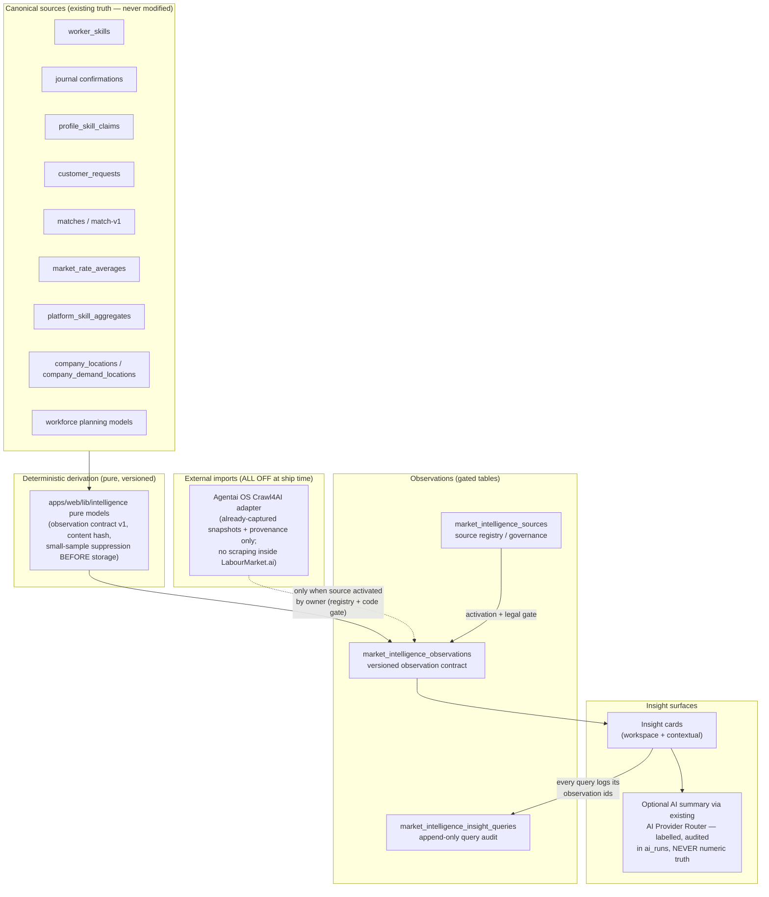
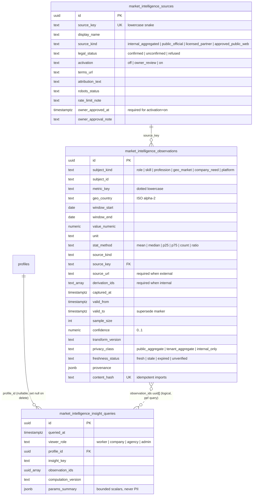

# Labour Market Intelligence Layer v1 — architecture

**Status: DRAFT layer — migration GATED (not applied), all external sources
OFF.** This document is the single reference for what the intelligence layer
is, what it may never do, and how every number in it can be traced back to its
source.

Migration: `supabase/migrations/20260714230000_market_intelligence_observations_v1.sql`
Rollback:  `supabase/rollbacks/20260714230000_market_intelligence_observations_v1.down.sql`
Runbook:   `docs/intelligence/activation-runbook-v1.md`
Honest status: `docs/intelligence/honest-status-v1.md`

## 1. Purpose

One auditable **read/analysis layer over existing truth**:

- It is **never a new truth source**. Canonical tables (journal entries,
  worker skills, customer requests, admin-entered market rates, …) remain the
  only system of record.
- It **never overwrites user-entered or human-confirmed facts**. Observations
  are stored in their own tables and displayed separately — an intelligence
  number can sit *next to* a user's fact, never *instead of* it.
- Every number it produces is **explainable end-to-end**: source, window,
  unit, method, sample, version — or the number does not exist
  (PLATFORM_DOCTRINE §18: no fake data; §7: AI never lies).
- Privacy is structural, not cosmetic: aggregates only, small-sample
  suppression before storage, and a query audit log (§20).

## 2. Architecture

Key structural facts:

- **Derivation is deterministic and pure.** The models in
  `apps/web/lib/intelligence/` (observation contract
  `INTELLIGENCE_CONTRACT_VERSION`, content hash) take canonical rows in and
  produce observation rows out. Same inputs → same outputs → same
  `content_hash` → idempotent import (the DB `unique` on `content_hash`
  enforces this).
- **AI never produces a number.** The optional AI summary step runs through
  the existing AI Provider Router, is labelled as AI text, is audited in
  `ai_runs`, and may only *describe* observations that already exist. If the
  deterministic layer says `insufficient_data`, the AI summary says so too.
- **Writes are service-role only.** No authenticated session can insert,
  update or delete anything in the three intelligence tables.

## 3. Entity model

## 4. The observation contract (field by field)

An observation is a single derived or imported aggregate data point.
Observations are **not user facts** — they live apart from canonical tables by
design and are always labelled as intelligence when displayed.

| Field | Meaning | Honesty rule |
|---|---|---|
| `subject_kind` / `subject_id` | What the observation describes — a role, skill, profession, geographic market, a company need, or the platform itself. | `subject_id` is a stable key (e.g. ESCO URI, country code), never a person. |
| `metric_key` | Dotted lowercase metric name, e.g. `salary.monthly_eur.declared_midpoint`. | CHECK-constrained to `^[a-z0-9_.]+$`; a metric without a registered derivation cannot appear. |
| `geo_country` / `geo_region` / `geo_city` | Geography the value covers. | Country is ISO-3166-1 alpha-2, same convention as `company_locations` and `market_rate_averages`. |
| `window_start` / `window_end` | The time window the value describes. | `window_end >= window_start` (CHECK). A benchmark without a date window is invalid. |
| `value_numeric` + `unit` | The value and its explicit unit. | A number without a unit cannot exist (both NOT NULL). |
| `stat_method` | How the value was computed: mean, median, p25, p75, count, ratio. | Displayed with the value — a "salary average" that is actually a median must say so. |
| `source_kind` / `source_key` | Which registered source produced the value. | FK into `market_intelligence_sources` — an unregistered source cannot write. |
| `source_url` | Where an external value was captured from. | **Required for every external observation** (CHECK) — no untraceable external numbers. |
| `derivation_ids` | The canonical row ids an internal value was derived from. | **Required for every internal observation** (CHECK) — no unexplainable internal numbers. |
| `captured_at` / `valid_from` / `valid_to` | Versioning. Corrections are new rows; the old row is superseded via `valid_to`. | History is never rewritten (service-role UPDATE is intended for `valid_to` only; DELETE is revoked at grant level). |
| `sample_size` | Cohort size behind an aggregate. | NULL when unknown, never guessed. Drives small-sample display states (§8). |
| `confidence` | Optional 0..1 derivation confidence. | NULL when the deriving model does not produce one. |
| `transform_version` | Version of the deterministic transform that produced the row. | Recompute with a new version ⇒ new rows, old rows superseded. |
| `privacy_class` | `public_aggregate` (readable by authenticated), `tenant_aggregate`, `internal_only`. | RLS enforces: sessions read `public_aggregate` only. |
| `freshness_status` | fresh / stale / expired / unverified. | Defaults to `unverified`; freshness SLAs are a P1 (planned) item. |
| `provenance` | Ordered JSON steps from raw capture to final value. | Every hop is recorded (snapshot ref, transform, suppression applied). |
| `content_hash` | Hash over the observation's identity fields. | `UNIQUE` — importing the same captured fact twice is a no-op. |

## 5. Source governance

Every possible origin of an intelligence number is a row in
`market_intelligence_sources`. Ship-time registry state:

| source_key | kind | legal_status | activation |
|---|---|---|---|
| `internal_platform_aggregates` | internal_aggregated | confirmed | **on** (internal derivation — no external access) |
| `admin_market_rate_averages` | internal_aggregated | confirmed | **on** (admin-entered, sourced rows — `market_rate_averages`) |
| `stat_gov_lt` | public_official | unconfirmed | **off** |
| `eurostat` | public_official | unconfirmed | **off** |
| `cvbankas_salary` | approved_public_web | unconfirmed | **off** — PROPOSED ONLY external benchmark; **never labelled as a LabourMarket.ai average**; access/usage permission unconfirmed |

Rules:

- **Owner allowlisting flow** — a source moves `off → owner_review → on` only
  via the runbook (`docs/intelligence/activation-runbook-v1.md`). The DB CHECK
  `market_intelligence_sources_activation_requires_approval` makes
  `activation='on'` impossible without `owner_approved_at` **and**
  `legal_status='confirmed'`. The code side
  (`apps/web/lib/intelligence` source governance, `isExternalSourceActive()`)
  is a second, independent gate — both must agree (dual gate: DB + code).
- **Agentai OS Crawl4AI import boundary** — LabourMarket.ai contains **no
  scraping code**. External data may arrive only as **already-captured
  snapshots** from the Agentai OS Crawl4AI adapter, each carrying a snapshot
  reference, `source_url` and `captured_at` in `provenance`. The import
  boundary refuses every snapshot whose source is not activated in the
  registry.
- **All external sources ship OFF.** Nothing external is fetched, imported or
  displayed until the owner completes the per-source checklist.
- **CVbankas** is a *proposed-only* external benchmark: if ever activated, its
  values display as "external benchmark (CVbankas, date, URL)" with the
  registry's `attribution_text`, never mixed into or labelled as a
  LabourMarket.ai average.

## 6. Salary intelligence v1 (comparison semantics)

- **Gross/net is never converted.** The platform has no tax model; a
  gross-basis figure compared against a net-basis figure returns
  `not_comparable` (basis mismatch), never a converted guess.
- **"Within market" band is ±10%** of the comparison benchmark. Outside the
  band the state is `above_band` / `below_band`, always shown with the
  benchmark's source + window + unit + geography.
- **`insufficient_data` states are real states**, not hidden: cohort below
  threshold, missing benchmark, missing window — each renders its honest
  reason (the existing thermometer `insufficient_data` pattern from
  `market_rate_averages`).
- **External vs internal are always displayed separately.** An internal
  declared-salary aggregate and an external benchmark never merge into one
  number.
- **No benchmark without** source + capture date + unit + geography +
  (sample size or confidence). A benchmark missing any of these cannot be
  rendered as a comparison.

## 7. Skills & demand intelligence

- Every skill/demand value carries a **value class**: `user_entered`,
  `system_suggestion`, `confirmed`, `available_capacity`, or
  `calculated_gap`. A calculated gap can never masquerade as a confirmed
  fact (mirrors §19 confirmed-vs-declared separation).
- **Gap math** is deterministic: demand (from `customer_requests` /
  company demand) minus supply (from `worker_skills` confirmations +
  capacity), per skill/profession per geography per window — each term
  traceable via `derivation_ids`.
- **Emerging-skills rule**: a skill may be labelled "emerging" only when two
  complete comparison windows exist; with one window the state is honest
  `insufficient_history`.
- **Match reuse**: missing-skills-per-need reuses the match-v1 `FitBasis`
  `missingUris` (`apps/web/lib/market/match-v1.ts`) — the intelligence layer
  does not reinvent fit math, it aggregates the existing per-context basis
  (never a global person score, §19).

## 8. Privacy & aggregation (§20)

- **n < 3** — the bucket is suppressed entirely (never stored, never shown).
- **3 ≤ n < 5** — shown only as a small-sample band ("<5"), no exact count.
- **n ≥ 5** — exact aggregate may be shown.
  These thresholds align with the market-map constants
  `DEFAULT_MIN_BUCKET` (3) and `PERSON_PRESENCE_MIN_N` (5) in
  `apps/web/lib/market-map/spatial-entities.ts` — one platform-wide rule.
- **Suppression happens in the derivation layer, before a row exists** — a
  sub-threshold aggregate is never persisted, so no read path can leak it.
- **Filter-dimension bound**: insight queries cap the number of combinable
  filter dimensions so intersecting narrow filters cannot reconstruct an
  individual (dossier reconstruction is a §20.3 violation).
- **Export**: only `privacy_class='public_aggregate'` observations are ever
  exportable; a public-aggregate export endpoint is PLANNED, not shipped.
- **Every insight query is logged** in `market_intelligence_insight_queries`
  with viewer role, insight key, the exact `observation_ids` used, and the
  computation version — bounded scalar params only, never PII.

## 9. Explainability — the six questions

Every rendered insight must be able to answer, from stored data alone:

1. **What** is this number? (`metric_key`, `unit`, `stat_method`)
2. **Where does it come from?** (`source_key` → registry row, `source_url` or
   `derivation_ids`, `provenance`)
3. **When is it about, and when was it captured?** (`window_start/end`,
   `captured_at`, `freshness_status`)
4. **How solid is it?** (`sample_size` / `confidence`, small-sample band)
5. **How was it computed?** (`transform_version`, `computation_version` of the
   insight)
6. **Who was it shown to and from which observations?** (the
   `market_intelligence_insight_queries` row)

If any answer is missing, the surface shows an honest degraded state instead
of the number.

## 10. P1 API / computation notes (planned, not shipped)

- **Versioned read models**: insight endpoints expose
  `computation_version`; a version bump is a new contract, old cached
  responses are invalid by key.
- **Deterministic functions are authoritative** — AI is optional
  summarization through the AI Provider Router only, over already-computed
  observations.
- **Cache invalidation** keyed by (source registry version, transform/
  computation version, time window) — planned; v1 computes on demand.
- **Freshness SLAs**: per-metric SLA drives `freshness_status`
  (fresh/stale/expired); until refresh jobs exist (none are installed —
  see runbook), imported observations default to `unverified` and internal
  observations are computed at read/recompute time.
