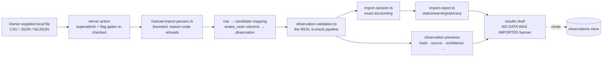

# Manual Import Sandbox v1 — isolated dry-run for the first source

Status: built on the intelligence stack (#755 → #756 → #757 → #758).
**Nothing is activated, nothing is imported, nothing is persisted,
nothing is downloaded.** The sandbox lets the owner validate one future
data source from a LOCAL file, through the REAL validation contracts,
before any production activation decision.

## 1. Architecture

- Surface: `/dashboard/admin/import-sandbox` — superadmin (admin layout +
  per-page) + `INTELLIGENCE_SANDBOX_ENABLED` flag (off by default). The
  server action re-checks BOTH gates internally (endpoints must not trust
  their page).
- The engine (`lib/intelligence/manual-import-sandbox.ts`) is pure; its
  result type declares `persisted: false` as a LITERAL, so a persisted
  sandbox run is unrepresentable. A guard
  (`lib/guards/manual-import-sandbox.test.ts`) pins: no supabase import,
  no mutation call, no fetch, no URL literal anywhere in the chain.
- Display-only until the owner explicitly starts a validation session via
  the one form (file + format + mode).

## 2. Validation flow

1. Parse (CSV / JSON / NDJSON adapters): hard bounds — 1 MB, 500 rows —
   refused with a stable reason code (`file_too_large`, `too_many_rows`,
   `csv_row_column_mismatch` + row number, …), never silently truncated.
2. Map each row (snake_case columns mirroring the gated observations
   table) to an observation candidate; a missing `content_hash` is
   computed exactly as an importer would; a present one is verified, not
   trusted.
3. Run the REAL nine-check pipeline per row (schema, required fields,
   source approval, dates, country, language, salary structure, hash
   integrity, in-file duplicate detection). All failures reported.
4. Counts + issue breakdown: rows detected, valid, invalid, duplicates,
   missing fields, unknown countries/languages, salary format issues,
   unsupported schema, date issues, hash mismatches.

Readiness is NOT bypassed: rows from a non-active source fail
`source_approved` in the sandbox too. The run additionally reports
`validAfterActivation` — how many rows are blocked ONLY by the inactive
source — which is a calculation about the future, not an override.

## 3. Preview flow

Preview mode renders up to 20 future observations exactly as they would
appear after validation: content hash, source, capture timestamp,
country, language, salary basis (gross/net/unknown), DERIVED confidence
(same rules as everywhere), validation verdict with deterministic
`check:reason` codes, and the provenance reference
(`<file>#row-<n>`). Validate-only mode returns counts with no previews.

## 4. Dry-run behaviour

- Two modes: **validate only** and **validate + preview**. Neither can
  persist — there is no third mode and no persistence code path.
- Every completed run displays the unconditional banner **"NO DATA WAS
  IMPORTED"** (guard-pinned testid) — success, failure, or refusal.
- The session/report preview uses the real builders with a rollback
  reference explicitly marked `sandbox-simulated:<file>` and the report
  always carries the `sandbox_simulated_run` warning code.
- Diagnostics are deterministic reason codes only — no stack traces, no
  internals, no secrets (parse exceptions are swallowed into codes).

## 5. Future activation path

1. Owner prepares a real export of the candidate source as a local file
   and runs it through the sandbox until the issue breakdown is clean
   (`validAfterActivation` = rows detected − true rejects).
2. Owner completes the ten-item activation checklist
   (source-activation-playbook-v1 §3) — the sandbox result is evidence
   for the technical-approval item.
3. Owner applies the gated observations migration, confirms legal
   status, flips activation (two-key). Only THEN can a real import run —
   and it must reuse these same parsers, pipeline, session and report
   contracts.

## 6. Example files

`docs/intelligence/sandbox-examples/` contains SYNTHETIC example files
(clearly fake figures, `example` subject ids) for exercising the sandbox
UI: a clean internal-source file, a CVbankas-shaped file (every row
correctly blocked by `source_approved` today), and a broken file mixing
duplicates, bad countries, bad units and missing fields. They are
documentation fixtures — nothing reads them at runtime.

## 7. Limitations

- The sandbox validates FILES, not live sources — it says nothing about
  a source's terms, rate behaviour or reachability (those are checklist
  items, reviewed by humans).
- Country/language allowlists default to LT / lt until a real import
  policy exists for a source; the engine accepts overrides but the UI
  deliberately does not expose them yet.
- Preview confidence uses the documented 90-day sandbox SLA; a stored
  observation would carry its own persisted freshness.
- Bounded to 1 MB / 500 rows / 20 previews per run — a validation tool,
  not a bulk-processing surface.
- No screenshots in this environment: the surface is superadmin- and
  flag-gated against production; render states are pinned by unit +
  guard tests instead.
