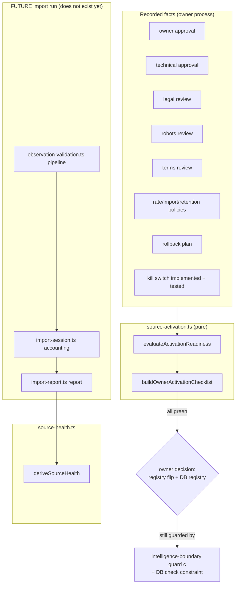
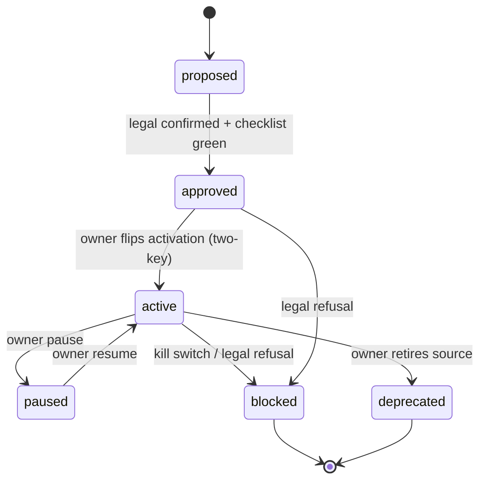

# Source Activation Playbook v1 — the complete pre-activation path

Status: prepared on top of Intelligence layer v1 (PR #755), Trust Layer v1
(PR #756) and Contextual UI v1 (PR #757). **No source is activated by this
work. No scraping, no schedulers, no Crawl4AI, no observations, no
migrations applied, no demo data.** Every mechanism below is contract +
test + documentation — the owner holds every switch.

## 1. Architecture

Everything on the left is a RECORDED fact — nothing is probed live. The
framework only evaluates; activation remains a two-key owner action
(code registry in `source-governance.ts` — guard-pinned OFF — plus the
gated DB source registry whose CHECK constraint refuses `activation='on'`
without `owner_approved_at` and `legal_status='confirmed'`).

## 2. Source lifecycle

Health states ride on top of the lifecycle (`source-health.ts`):
offline · waiting_approval · paused · healthy · error · blocked ·
maintenance · unknown. Example lifecycle for the first source:
proposed → (checklist all green) → approved → owner activates → first
sessions run → `healthy`; three consecutive failed sessions → `error`;
owner engages the kill switch → `blocked`; owner repairs and resumes →
`healthy`. An active source with no recorded sessions is honestly
`unknown`, never assumed healthy.

## 3. Approval process (the ten-item checklist)

`buildOwnerActivationChecklist` — nothing activates until EVERY item is
green, and even then activation is a separate owner action:

1. **Owner approval** — recorded decision (timestamp + note).
2. **Technical approval** — engineer sign-off on the adapter design.
3. **Legal approval** — `legalStatus: "confirmed"` in the registry.
4. **Robots check** — recorded review result; `disallows` is a permanent
   veto that other approvals can never override; `not_applicable` only
   for official statistics APIs.
5. **Terms review** — usage terms read and recorded.
6. **Rate limits** — max requests/hour, bytes/fetch, items/session.
7. **Import policy** — closed metric-key, country and language lists +
   max sessions/day.
8. **Retention policy** — TTL days + expired handling (mark, never
   silent rewrite).
9. **Rollback plan** — written pointer (see §5).
10. **Kill switch** — implemented AND tested (untested = red).

Vetoes outrank green items: engaged kill switch, robots disallow, legal
refusal, blocked lifecycle, internal source (internal data never takes
this path).

Where to see it: `/dashboard/admin/intelligence-observations` renders the
checklist per external source — today all forty items (4 sources × 10)
are red, which is the truthful state.

## 4. Failure handling (future imports)

- Every candidate runs the full validation pipeline
  (`observation-validation.ts`): schema, required fields, source
  approval (fail-closed — a non-active source's rows can NEVER validate),
  date validity, country + language allowlists (fail-closed on empty
  policy / undeclared language), salary structure, recomputed content
  hash, duplicate detection. All failures are reported together.
- Every run produces exactly one `ImportSessionV1` with EXACT accounting
  (accepted + rejected + duplicated = scanned; a session without a
  rollback reference is refused) and one `ImportReportV1`.
- Report status precedence: any privacy issue → **blocked**; errors with
  nothing accepted → **failed**; errors or rejections → **partial**;
  otherwise **success** (an all-duplicate re-run is a success —
  idempotent by content hash).
- Health reacts to recorded outcomes: `failed` last session or ≥3
  consecutive failures → `error`.

## 5. Rollback — how to disable an approved source (no ambiguity)

Ordered, each step sufficient on its own; do them all for a full rollback:

1. **Kill switch (instant, no deploy):** in the DB source registry set
   `activation = 'off'` for the source row
   (`market_intelligence_sources.source_key = '<key>'`, once that gated
   migration exists). Every future import run MUST re-check activation
   before each session — off means no session starts.
2. **Code registry (deploy):** set the profile's `activation: "off"` in
   `apps/web/lib/intelligence/source-governance.ts`. The boundary guard
   (c) and `isExternalSourceActive()` make "on" without legal
   confirmation impossible anyway; "off" always wins.
3. **Remove imported rows (data rollback):** every session recorded a
   `rollbackRef`; delete/mark the observations whose provenance carries
   that session reference (`import_session` step in the provenance
   chain). Reports keep the refs, so the set is exact.
4. **Verify:** the source's badges read `paused`/`blocked`/`offline`, no
   new observations appear, `/dashboard/intelligence` shows the source as
   not active, and trust cards fall back to their honest unavailable
   states automatically (no UI change needed — designed behaviour).

There is no partial-disable state: a source is either fully active
(all ten items green + owner flip) or it is off.

## 6. Recovery

After a rollback or error state: fix the cause, re-run the checklist
(facts may have changed — e.g. terms revised), and re-approve. Readiness
is re-evaluated from scratch; nothing remembers a previous "ready".

## 7. Future scheduler design (design only — nothing installed)

- One scheduler entry per source, created ONLY after the source's first
  MANUAL successful import (repo rule: no scheduler before a proven real
  delivery).
- Each tick: check kill switch → check activation → check
  `maxSessionsPerDay` budget → run one bounded session (rate limits from
  the recorded policy) → write session + report → update health signals.
- Any `blocked` report or engaged kill switch stops the schedule; a
  human re-enables. Schedulers never self-heal past a privacy block.

## 8. Honest limitations

- No import adapter, no fetcher, no scheduler exists — the pipeline has
  never processed a real external row; behaviour is pinned by tests only.
- The activation facts (`SourceActivationFactsV1`) have no storage yet —
  they will live in the gated `market_intelligence_sources` table (plus
  columns) once the owner applies/extends that migration; until then the
  checklist renders the honest zero-state from `EMPTY_ACTIVATION_FACTS`.
- The kill switch requirement is contract-level: the enforcing runtime
  check exists only as the documented rule every future importer must
  implement (and will be guard-pinned when an importer lands).
- Health states other than `waiting_approval`/`unknown` are reachable
  only in tests today — no sessions exist to produce them.
