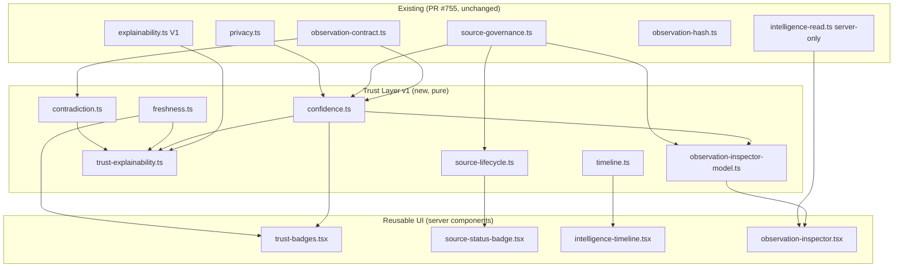
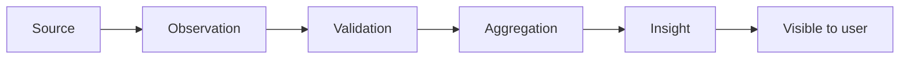
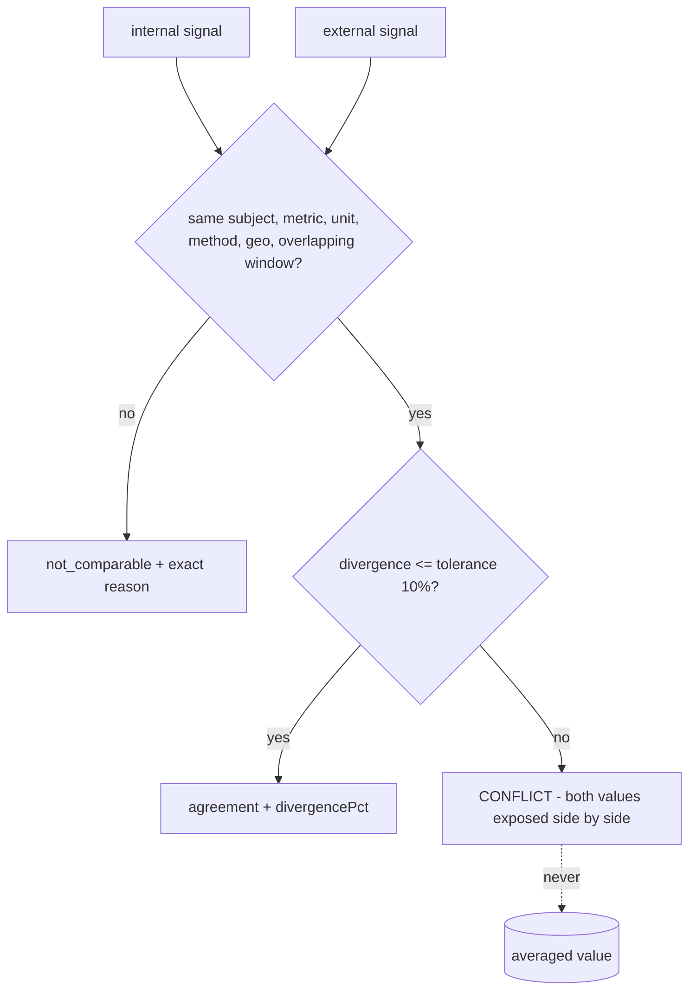

# Intelligence Trust Layer v1 — architecture and models

Status: implemented on top of Labour Market Intelligence layer v1 (PR #755).
No external source activated. No migration applied. No scraping. No AI
summaries. Production behaviour unchanged.

Doctrine this layer serves:

> Never ask the user to trust AI.
> Always show why the system reached a conclusion.

## 1. Architecture

The trust layer is a set of PURE modules under `apps/web/lib/intelligence/`
plus reusable server-rendered components under
`apps/web/components/intelligence/`. Nothing in this layer fetches, guesses,
averages, or activates anything — every value is either carried verbatim,
derived deterministically, or honestly reported as unknown.

Boundaries (guard-pinned by `lib/guards/intelligence-boundary.test.ts`):
no `fetch`, no URL literals, no LLM SDK, no provider import anywhere in
`lib/intelligence`; `intelligence-read.ts` stays the ONLY server module;
every external source profile stays `activation: "off"`, `legalStatus:
"unconfirmed"`, `proposedOnly: true`.

## 2. Timeline model

Every future insight can show its full derivation:

Each stage (`TimelineStageV1`) carries the four audit facts — **timestamp**,
**actor** (i18n code), **provenance** reference (observation id / content
hash / source key), **explanation** (i18n code). `buildTimeline` refuses
(result type, stable reason codes) an empty flow, an unknown stage,
out-of-order or duplicated stages, unparsable timestamps, time running
backwards, or any missing audit fact. Renderer:
`components/intelligence/intelligence-timeline.tsx`.

## 3. Confidence model

`ConfidenceLevel = low | medium | high | unknown`. Confidence is DERIVED,
never guessed — fixed rule table over four structured inputs (sample size,
freshness status, source legal status, provenance step count), first match
wins:

| # | Condition | Level |
|---|-----------|-------|
| 1 | any required input missing | unknown |
| 2 | freshness `unverified` | unknown |
| 3 | source legal status `refused` | low |
| 4 | freshness `expired` | low |
| 5 | fresh + confirmed + sample ≥ 30 + provenance ≥ 1 | high |
| 6 | (fresh or stale) + confirmed + sample ≥ 5 (cohort floor) | medium |
| 7 | everything else | low |

The medium floor is `INTELLIGENCE_MIN_COHORT_N` — the same §20 privacy base
the whole platform uses. `weakestConfidence` makes a blended insight exactly
as weak as its weakest input (trust is never averaged up).

## 4. Freshness model

Every intelligence object can carry `last_updated`, `observed_at`,
`source_date`, `computed_at` and a derived `age` (`IntelligenceFreshnessV1`).
The age anchor is the first present timestamp in that order; no timestamp →
`ageDays: null` → the label is honestly "unknown", never optimistically
fresh. Deterministic rendering (`freshnessLabel`):

| ageDays | label |
|---------|-------|
| 0 | Updated today |
| 1 | Updated yesterday |
| 2–30 | Updated {days} days ago |
| > 30 | Outdated |
| null | Update time unknown |

`nowMs` is always supplied by the caller — no `Date.now()` in the layer.

## 5. Conflict model

`detectContradiction` compares two `ComparableSignalV1`s. Identity mismatch
is `not_comparable` (a mismatch is not a conflict); divergence beyond the
tolerance is a `conflict` carrying BOTH signals verbatim. The module exports
no averaging/blending function, and a test pins that it never computes one.

## 6. Explainability expansion — the seven questions

`buildTrustReport` (extends the untouched V1 `buildExplanation`) makes every
insight able to answer:

| Question | Field |
|----------|-------|
| What is this? | `explanation.meaningCode` (V1) |
| Why am I seeing it? | `whyVisibleCode` |
| Which observations produced it? | `observationRefs` (ids / hashes) |
| How old is it? | `freshness` + `freshnessLabel` |
| How confident is the system? | `confidence` (derived) |
| Which source produced it? | `sourceKeys` |
| What is not known? | `notKnownCodes` |

Anti-hallucination rules: the builder throws on any structurally invalid
input, and empty `observationRefs` are REFUSED unless a `notKnownCode`
admits the gap — an insight may not silently hide that it cannot point at
its observations.

## 7. Source lifecycle badges

`deriveSourceLifecycleState` maps a governance profile (+ optional runtime
facts) to one of: proposed · approved · active · paused · deprecated ·
blocked · not_available. Fixed precedence (most restrictive wins):
not_available → deprecated → blocked (legal refused) → paused → active
(activation on AND internal-or-confirmed) → approved (confirmed) →
proposed. With today's registry every external source derives **proposed**
and the two internal sources derive **active**. Badge:
`components/intelligence/source-status-badge.tsx`; the
`/dashboard/intelligence` methodology section now renders it per source.

## 8. Observation inspector (developer-only)

`/dashboard/admin/intelligence-observations` — read-only, three fail-closed
gates: superadmin (admin layout + per-page), `INTELLIGENCE_INSPECTOR_ENABLED`
env flag (off by default; when off nothing is even read), and the gated
migration (missing table degrades to an honest "needs migration" note).
Displays id, content hash, source, capture timestamp, derived confidence
(next to the raw stored score), sample size, privacy class and freshness
status. No editing, no actions, no source activation.

## 9. Multi-source contract

`multi-source-contract.test.ts` verifies (without integrating anything) that
the architecture supports simultaneous providers: the registry names
internal aggregates, CVbankas, Eurostat, Statistics Lithuania, EURES and the
Lithuanian Employment Service (all external ones proposed-only and OFF);
one observation schema carries any of them side by side; content hashes keep
same-figure/different-source observations distinct; contradiction detection
compares across providers.

## 10. Future roadmap

1. Owner reviews a source's terms → `legalStatus: "confirmed"` (badge:
   approved). Still nothing is fetched.
2. Owner applies the gated observations migration → inspector and
   observation refs become live.
3. Owner flips one source `activation: "on"` (registry change + guard
   update — deliberately impossible as a code drive-by) → badge: active.
4. Ingest adapters (separate, owner-gated work) write observations with
   full provenance; timelines, confidence, freshness and conflict states
   then light up on real data.
5. Insight surfaces adopt `buildTrustReport` so every card answers the
   seven questions.

## 11. Honest limitations

- There are NO external observations today — every external source is
  proposed-only and OFF; the observations table itself is an unapplied,
  owner-gated migration. Timelines and conflict states therefore render
  nothing in production yet; they are contract + component + test work.
- Confidence thresholds (30 / cohort floor 5) are deterministic policy
  choices, not statistical guarantees; they are documented so the owner can
  revise them consciously.
- The freshness "outdated" cutoff (30 days) is a single global default;
  per-metric SLAs exist separately (`computeFreshness` in the observation
  contract) and are not yet unified with the label helper.
- `buildTrustReport` is available but not yet wired into the existing
  intelligence cards — wiring it in is follow-up UI work.
- The inspector reads at most 50 rows with no pagination — it is a
  developer window, not an analytics surface.
