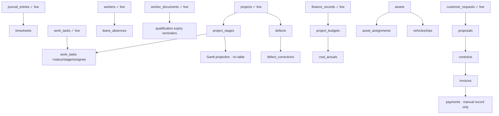

# Real-User Launch + Work & Project Operations Train — v1

> Canonical governance doc for the launch + six-area operations train.
> This is a **governance/architecture** artifact (baseline, audit, canonical
> reuse map, migration order, gates, rollback). It is **not** an owner-acceptance
> file, manual test guide or evening checklist — the product is discovered
> directly through normal role-based navigation.

## Baseline

- **Starting `origin/main` SHA:** `2557c08b17357428828aea6b5ebfd45724b331ac`
- **Production project:** Supabase `gorgitwvdzxbnaxhrsrw`
- **Active locales:** `lt` (default), `en`, `ru` (`apps/web/lib/i18n/config.ts` `activeLocales`)
- **Migration count at baseline:** 115 files in `supabase/migrations/`
- **Migration-safety gate:** `.github/scripts/migration-safety.mjs` — any new table
  needing a `SECURITY DEFINER` RPC or a `GRANT` classifies **RED**, so every
  operations-area migration is human-gated. This train carries the owner's
  explicit written apply-authorization (v2 spec) and applies via Supabase MCP
  `apply_migration`, one wagon at a time, additive + reversible + verified.

## Wagon 0 — Fresh reality audit (classification)

Ground truth from the production table list + code audit. Classifications per the
v2 vocabulary.

### Launch surfaces
| Capability | Status | Canonical home |
|---|---|---|
| Landing / worker + company entry | WORKING_REAL | `app/[locale]/(marketing)/*`, `page-hero.tsx` |
| Signup / login / onboarding | WORKING_REAL | `app/[locale]/auth/*`, `onboarding-wizard.tsx` |
| Worker guided onboarding | WORKING_REAL | `components/app/onboarding-wizard.tsx`, `lib/auth/actions` |
| Company need intake (anon) | WORKING_LIMITED (honest degrade on unapplied RPC) | `submit_company_need_public_v1` → `company_need_public_intakes` |
| Live activity counters | WAS MISLEADING (318K) → **fixed to honest range** | `content/placeholders.ts`, `market-counters.tsx` |
| Honesty/forbidden-term guards | WORKING_REAL | `lib/guards/*` (~410 tests) |
| Waitlist "open to workers only" copy | WAS MISLEADING vs shipped company flow → **fixed** | `messages/*.json` `waitlist` |

### Founder console & spine
| Capability | Status | Canonical home |
|---|---|---|
| Owner control room (single) | WORKING_REAL | `app/[locale]/dashboard/admin/page.tsx` |
| Public intake queue | WORKING_REAL | `dashboard/admin/company-need-intakes` |
| Command finder / primary nav | WORKING_REAL (single registry each) | `lib/navigation/command-registry.ts`, `lib/config/navigation.ts` |
| Telegram owner-alert spine | WORKING_LIMITED (env-gated, 1 event) | `lib/notifications/telegram-owner-alerts.ts` |
| Funnel telemetry | WORKING_REAL | `lib/telemetry/funnel-events.ts` → `pilot_events` |
| UTM / first-touch attribution | MISSING | — |

### Six mandatory operating areas
| Area | Existing canonical | Genuinely MISSING (needs migration) |
|---|---|---|
| 6 Project Operations | `projects`, `job_demands`, `project_worker_assignments`, `work_tasks` (empty, canonical task home), `engagement_contexts` (membership/team spine), `project_handover_entries` | **project_stages + dependencies**; task/kanban fields on `work_tasks`; Gantt = projection (no table) |
| 7 Workforce Operations | `workers.availability_*`, `journal_entries` (+metrics), `worker_documents` (expiry = `valid_until`), `worker_document_verification` | **timesheets/hours**, **shifts/schedules**, **leave/absence** |
| 8 Project Economics | `lib/estimate/estimate.ts` (deterministic engine, stored in `customer_requests.payload`), `finance_records` (empty canonical), `market_rate_averages`, billing test-mode tables | **project budgets**, **actuals ledger**, **invoices** |
| 9 Assets & Logistics | demand-attribute enums only (`worker_demand_transport`, `_required_tools`) | **asset registry**, **asset_assignments**, **vehicles/trips** |
| 10 Commercial CRM | `customer_requests` (canonical demand), `company_need_public_intakes`, `demand_shortlist`, `demand_interest_signals`, `conversations`, `booking_requests` | **proposals**, **contracts**, **invoices**, **payments (manual record only)** |
| 11 Delivery & Quality | `project_handover_entries`, `journal_entry_photos` + private gallery | **defects**, **defect_corrections**, **delivery/acceptance records** |

## Canonical reuse map (do NOT duplicate)

- **Project truth:** `projects` (+`organization_id`, `project_clients`,
  `project_worker_assignments`). Extend with `project_stages`; Kanban rides the
  existing `work_tasks` table; Gantt is a **projection**, never a stored event set.
- **Task truth:** `work_tasks` (already in prod, 0 rows) — the single task model.
- **Team / membership truth:** `engagement_contexts` + `organizations`
  (`organization_type='team'`). No `teams`/`team_members` table.
- **Workforce truth:** `journal_entries` for the daily diary; time extends the
  journal/metric model, not a second diary. Availability on `workers`.
- **Qualification truth:** `worker_documents.valid_until` (expiry) +
  `worker_document_verification`. No second certificate store.
- **Economics truth:** `lib/estimate/estimate.ts` single engine; `finance_records`
  the single finance ledger. No second cost engine.
- **CRM truth:** `customer_requests` canonical demand + `conversations` inbox +
  `demand_shortlist`/`demand_interest_signals`. No detached generic CRM.
- **Evidence truth:** `journal_entry_photos` + private storage bucket. No second
  photo store.
- **Notification spine:** `lib/notifications/telegram-owner-alerts.ts` (+ Agentai
  OS bridge). No second notifier.
- **Console:** `/dashboard/admin`. No second admin dashboard.

## Migration dependency graph (draft, this train)

## PR order (per-wagon, small, isolated worktrees)

`Launch honesty (W1+W2, code-only) ✅ → Premium visual ✅ → W6 Project
Operations (stages ▶ / kanban / gantt) → W7 Workforce → W8 Economics →
W9 Assets → W10 Commercial CRM → W11 Delivery & Quality → W12 integration →
W13 Marketplace → final integration audit`.

## Wagon 13 — European Work & Business Ecosystem Marketplace (MANDATORY, in-train)

**Not backlog.** Wagon 13 is a mandatory implementation wagon of this train.
Initial integrated capability, built over canonical entities (no second
marketplace / search / asset / CRM / messaging / company-profile system):

- **professional service listings** for people and companies (reuse profiles,
  qualifications, `service_offerings`);
- **public business showcase profiles** (over `organizations` + trust layer);
- **work-related sale / rental listings** — accommodation & worker housing,
  commercial premises, vehicles/transport, tools, equipment, machinery, safety
  equipment (bounded to work/projects, never generic consumer classifieds);
- **contact / enquiry flow** via the canonical `conversations` inbox;
- **search** through the canonical command registry — never a second engine;
- **project & asset/logistics linkage** (shares canonical asset entities from
  W9 where appropriate).

Migration surface: additive listing tables + RLS default-closed + SECURITY
DEFINER write RPCs, one bounded wagon, reversible, applied via MCP after
validation. Forbidden: consumer-classifieds scope, unrelated personal items.

## Wagon status (this train)

| Wagon | State |
|---|---|
| W1+W2 Launch honesty | MERGED_DEPLOYED_GREEN (#814, `8cc61f5e`) |
| Premium visual | MERGED_DEPLOYED_GREEN (#816, `df96dc4f`) |
| W6 Project Operations — Project Stages (slice 1) | IN PROGRESS (this PR): additive `project_stages` + RLS + 3 manager RPCs + navigable panel in the project workspace |
| W6 Kanban (`work_tasks.stage_id`) / Gantt projection | queued (next W6 slices) |
| W7–W12, W13 marketplace | queued, bounded order above |

## Owner gates / boundaries (in force under v2)

- **Authorized:** merge green wagons; apply this train's additive, verified
  migrations via Supabase MCP; deploy; production smoke.
- **NOT authorized (blocked):** activate Stripe / live payments; auto-send
  outreach; enable external providers without credentials; claim e-signature;
  irreversible legal actions. Payments area is **manual recording only**.
- **Untouched:** PR #798 (NAV Norway); AI crawler policy.
- **Real external blockers this session:** Telegram credentials absent
  (`*_TELEGRAM_*` / `AGENTAI_OS_ALERT_*` env unset) → per-wagon Telegram cannot
  be sent from this environment; authenticated production smoke needs prod role
  logins not held here (public route smoke only).

## Rollback plan

Every train migration ships a paired `supabase/rollbacks/<name>.down.sql`
(structural requirement of migration-safety). All new tables are additive and
default-closed; rollback = drop the new objects (0-row guarded). No existing
table/column/policy is dropped or loosened by this train.

## Launch readiness scorecard

| Item | Verdict |
|---|---|
| Worker can register tomorrow | READY |
| Company can submit a need tomorrow | READY (honest degrade if RPC unapplied) |
| Honest live activity | FIXED this train (ranges 180–420 / 25–80 / 8–35) |
| Value props / CTAs honest | FIXED this train (free worker profile / submit workforce need) |
| Founder console actionable | READY (existing `/dashboard/admin`) |
| No dead CTA / fake success | Guarded (existing suite) |

## Functionality truth table

Maintained per wagon in each PR description. A capability is **DELIVERED** only
when: merged to `main`, its migration (if any) applied + ledger-recorded, deployed,
production-smoked, and reachable through normal role navigation — never by
documentation or tests alone.
