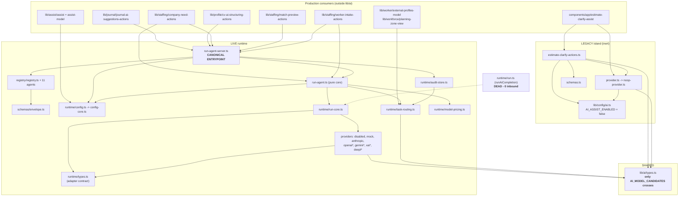

# AI RUNTIME CONSOLIDATION PLAN v1

**Status:** PLAN ONLY — awaiting owner approval. **Nothing was deleted, moved or changed.**
**Baseline:** `main` @ `5eddebac` + PR #910 + PR #911 (`feat/cc/architecture-consolidation-v1`)
**Date:** 2026-07-29
**References:** FULL PROJECT CANONICAL AUDIT v1 §7.2 · `docs/audits/p0-stabilization-verification-v1.md` §3.1 · `docs/audits/architecture-consolidation-v1.md` §2.1

**Constraints honoured:** no behaviour change · live AI stays OFF · no LLM introduced · no deletion · no schema change.

---

## 0. THE FINDING IN ONE PARAGRAPH

There are **two complete AI stacks** in `lib/ai/`. One is live and used by five server actions; the other is a permanently inert island serving exactly one feature. Earlier work concluded they were "not separable in one safe step". **That conclusion was too pessimistic, and this plan corrects it.** Precise import analysis shows the two stacks share exactly **one symbol** — the constant `AI_MODEL_CANDIDATES` in `lib/ai/types.ts`. Moving that one constant into `lib/ai/runtime/` fully severs the island, and it does so in a direction the existing guard (`lib/guards/ai-task-routing.test.ts`) already wants: that guard's allowlist currently has to carry `lib/ai/types.ts` as a special case, and after the move it would not.

Total surface: **54 files, 5,718 LOC** in `lib/ai/`, plus 10 consumer modules outside it.

---

## 1. INVENTORY AND CLASSIFICATION

Every module, one classification each. Evidence is the import graph built from **non-test source only** (`lib/guards/**`, `*.test.*`, `tests/**` excluded as importers).

### 1.1 LIVE — the canonical runtime (reachable from production code)

| Module | LOC | Role | Reached from |
|---|---|---|---|
| `lib/ai/run-agent-server.ts` | — | **canonical entrypoint** `runAiAgent()` | 5 server actions |
| `lib/ai/run-agent.ts` | — | pure core `runAiAgentCore()` | `run-agent-server`, +2 direct |
| `lib/ai/registry/registry.ts` | — | prompt registry lookup | `run-agent-server` |
| `lib/ai/registry/types.ts` | — | `PromptRegistryEntry` contract | registry + all 11 agents |
| `lib/ai/registry/agents/*.ts` (11) | 934 total | per-agent prompt + zod schema | registry; 3 also imported directly by `lib/staffing/*` |
| `lib/ai/schemas/envelope.ts` | — | output envelope contract | all 11 agents |
| `lib/ai/runtime/config.ts` | — | server config wrapper (reads `lib/env`) | `run-agent-server`, `lib/assist/assist.ts` |
| `lib/ai/runtime/config-core.ts` | — | pure config resolution | runtime-wide, `lib/assist/assist-model.ts` |
| `lib/ai/runtime/types.ts` | — | **provider adapter contract** | all providers, 7 consumer modules |
| `lib/ai/runtime/run-core.ts` | — | provider dispatch | `run-agent`, `runtime/run` |
| `lib/ai/runtime/task-routing.ts` | — | task policy + routing + audit record | `run-agent`, `audit-store`, +2 non-AI consumers |
| `lib/ai/runtime/model-pricing.ts` | — | cost computation | `run-agent` |
| `lib/ai/runtime/audit-store.ts` | — | `ai_runs` persistence + daily counter | `run-agent-server` |
| `lib/ai/runtime/providers/disabled.ts` | 20 | inert default | `run-core` |
| `lib/ai/runtime/providers/mock.ts` | — | deterministic test provider | `run-core` |
| `lib/ai/runtime/providers/anthropic.ts` | — | primary live adapter; **only file allowed to import `@anthropic-ai/sdk`** | `run-core` |
| `lib/ai/runtime/providers/extract-json.ts` | — | shared parse helper | 3 adapters |
| `lib/ai/evals/harness.ts` | — | eval harness | eval fixtures |

Runtime subtotal **2,992 LOC**; registry **934**; entrypoints **415**; evals **552**.

### 1.2 SHARED — crosses the boundary between both stacks

| Module | What actually crosses | Evidence |
|---|---|---|
| `lib/ai/types.ts` (177 LOC) | **`AI_MODEL_CANDIDATES` only** | Imported by `runtime/providers/{gemini,openai,xai}.ts` (`import { AI_MODEL_CANDIDATES } from "../../types"`) and `runtime/task-routing.ts:34`. Every other export (`AiProvider`, `AiAssistInput/Result`, `AiLocale`, `isAiDisabled`, `DEFAULT_AI_PROVIDER_ID`, the three assist input/result interfaces) is consumed **only** by the legacy island. |

**This single constant is the entire coupling.** `runtime/providers/anthropic.ts` does not import it at all.

### 1.3 LEGACY — the inert island (535 LOC, one feature)

| Module | LOC | Note |
|---|---|---|
| `lib/config/ai.ts` | 40 | `AI_ASSIST_ENABLED = false` — a **source literal**, not env-driven |
| `lib/ai/provider.ts` | 33 | `getAiProvider()` has **no live branch**; it can only return the no-op |
| `lib/ai/noop-provider.ts` | 45 | duplicate of `runtime/providers/disabled.ts` (20 LOC) — same idea, once per stack |
| `lib/ai/schemas.ts` | 80 | legacy assist result schemas. **Collides by name with the `lib/ai/schemas/` directory** |
| `lib/ai/estimate-clarify-actions.ts` | — | the island's only server action |
| `components/app/estimate-clarify-assist.tsx` | — | renders `null` while the flags are false; mounted by `estimate-builder.tsx:185` |
| most of `lib/ai/types.ts` | ~150 of 177 | see §1.2 |

**Reachability:** the island is reachable from production (the component is mounted), so it is **not dead** — it is *permanently inert*. It cannot activate: no env var can flip `AI_ASSIST_ENABLED`, and `getAiProvider()` has nothing live to return.

### 1.4 OWNER-GATED — complete, correct, waiting on the owner

| Item | Gate | Consequence today |
|---|---|---|
| Runtime state | `AI_PROVIDER_MODE` ∈ {mock, live} + known provider + non-empty key, else `disabled` | AI is off; `disabled` adapter returns an honest sentinel |
| `ai_runs` audit table | draft migration `20260714150000_ai_runs_audit_v1.sql` (`DO NOT APPLY` header) | audit rows are not persisted **and the daily-run budget guard cannot fire** — see §5.1 |
| `runtime/providers/openai.ts` | `AI_OPENAI_ENABLED=true` **and** `OPENAI_API_KEY` | double-gated, never configured |
| `runtime/providers/gemini.ts` | `AI_GEMINI_ENABLED=true` **and** `GEMINI_API_KEY` | double-gated, never configured |
| `runtime/providers/xai.ts` | `AI_XAI_ENABLED=true` **and** `XAI_API_KEY` | double-gated, never configured |
| `runtime/providers/deepl.ts` | `AI_DEEPL_ENABLED=true` **and** `DEEPL_API_KEY`; secondary, tried first only for `translate_message` | double-gated, never configured |

### 1.5 DEAD — zero inbound edges from production

| Module | LOC | Evidence | Why it exists |
|---|---|---|---|
| `lib/ai/runtime/run.ts` (`runAiCompletion`) | 21 | **No inbound edge from any non-test module.** Only `lib/guards/no-direct-llm-client-call.test.ts` names it | A **second, parallel entrypoint** into the same `run-core.ts`. Its docblock calls it *"the single function product code calls"* — but product code calls `runAiAgent` instead |

That is the **only** genuinely dead AI module.

### 1.6 Deliberately NOT classified as dead

| Module | Why not dead |
|---|---|
| `lib/ai/runtime/providers/adapter-contract.ts` | The declarative contract `lib/guards/ai-task-routing.test.ts` and `labour-market-os-human-control.test.ts` verify adapters against. Removing it removes a control |
| `lib/ai/evals/fixtures.ts`, `worker-agents.fixtures.ts` | Test fixtures — test-only **by design** |
| Every gated adapter in §1.4 | Unconfigured ≠ dead |

---

## 2. DEPENDENCY GRAPH

`*` = double-env-gated secondary adapter. The dotted edge is the dead entrypoint.

---

## 3. THE CANONICAL DECISIONS

### 3.1 Canonical entrypoint

**`runAiAgent()` in `lib/ai/run-agent-server.ts`.**

Evidence: it is the only path that resolves env config, looks up the registry prompt, applies the persisted daily-run quota, dispatches through `runAiAgentCore` → `run-core` → provider, and appends the audit record. Five production consumers use it. `runAiCompletion()` in `runtime/run.ts` bypasses the registry, the quota and the audit entirely and has zero consumers.

**Pure core:** `runAiAgentCore()` in `lib/ai/run-agent.ts` — the IO-free half, directly used by two staffing actions that supply their own config.

### 3.2 Canonical interfaces

| Concern | Canonical module | Not this |
|---|---|---|
| Agent declaration | `lib/ai/registry/types.ts` — `PromptRegistryEntry` | — |
| Model output shape | `lib/ai/schemas/envelope.ts` — envelope with `suggestion:true`, coarse confidence, `evidence_refs`, `blocked_claims`, all `.strict()` | `lib/ai/schemas.ts` (legacy) |
| Provider adapter | `lib/ai/runtime/types.ts` — `AiCompletionProvider` / `Request` / `Result` | `lib/ai/types.ts` `AiProvider` (legacy) |
| Task routing / policy | `lib/ai/runtime/task-routing.ts` — `AiTaskPolicy`, `TASK_POLICIES`, `resolveTaskRoute` | — |
| Runtime config | `lib/ai/runtime/config-core.ts` — `AiRuntimeConfig` | `lib/config/ai.ts` flags (legacy) |

### 3.3 Canonical configuration

**`lib/env.ts` → `lib/ai/runtime/config.ts` → `resolveAiRuntimeConfig()` in `config-core.ts`.**

Guarantees already encoded there: OFF by default; `live` impossible without mode + known provider + non-empty key; the key **value** never leaves the module (presence flag only); timeout / retry / output-token / daily-run budgets clamped so a misconfigured env cannot remove the cost guard.

**`lib/config/ai.ts` is NOT canonical configuration.** It is two source literals gating one legacy feature. Keeping both is the actual risk: an operator flipping one has no effect on the other.

### 3.4 Removable adapters

| Adapter | Verdict | Reason |
|---|---|---|
| `disabled.ts` | **KEEP — required** | the default state |
| `mock.ts` | **KEEP — required** | deterministic tests/dev, no key |
| `anthropic.ts` | **KEEP — primary** | the only file permitted to import `@anthropic-ai/sdk` |
| `extract-json.ts` | **KEEP** | shared by 3 adapters |
| `openai.ts`, `gemini.ts`, `xai.ts` | **KEEP for now — archive candidates** | double-gated, never configured; each is guard-pinned by `adapter-contract.ts`. Removing them shrinks the multi-provider story to nothing; that is a product decision, not a consolidation one |
| `deepl.ts` | **KEEP for now — archive candidate** | same, plus it is the only non-LLM translation path |
| `lib/ai/noop-provider.ts` | **REMOVABLE (Phase 4)** | duplicate of `disabled.ts`, 45 LOC vs 20, one per stack |

**No adapter is removable today without an owner decision.** The one true adapter duplication is `noop-provider.ts` ↔ `disabled.ts`.

---

## 4. MIGRATION PLAN

Six phases. Each is independently revertible, behaviour-identical, and does not enable live AI. **Phases 4–6 involve deletion and are hard owner gates.**

### Phase 0 — FREEZE (no code change)
Add one guard: no NEW module may import `lib/ai/provider`, `lib/ai/noop-provider`, `lib/config/ai` or `lib/ai/schemas`. Pins the island at exactly its current 6 files.
*Risk:* none. *Validation:* the guard fails on a deliberate violation (self-test, matching the repo's existing detector convention).

### Phase 1 — SEVER THE SHARED CONSTANT ★ the unblocking step
Move `AI_MODEL_CANDIDATES` (and its type) from `lib/ai/types.ts` to a new `lib/ai/runtime/model-candidates.ts`. Update 4 importers: `runtime/task-routing.ts`, `runtime/providers/{gemini,openai,xai}.ts`. Re-export from `lib/ai/types.ts` **only if** a test needs it, otherwise update the 4 test files too.

Then tighten `lib/guards/ai-task-routing.test.ts`: `MODEL_ALLOWLIST_PREFIXES` drops `"lib/ai/types.ts"` and becomes `["lib/ai/runtime/"]` alone.

*Risk:* very low — a constant move, no logic. *Benefit:* the legacy island becomes **fully separable**, and the model-selection guard becomes strictly stronger. *Validation:* `typecheck`, `vitest run lib/ai lib/guards`.

### Phase 2 — SPLIT `lib/ai/types.ts`
After Phase 1 the remaining ~150 LOC are legacy-only (`AiProvider`, `AiAssist*`, `AiLocale`, `isAiDisabled`, `DEFAULT_AI_PROVIDER_ID`). No move yet — just a docblock stating the file is legacy-only and its canonical replacement is `lib/ai/runtime/types.ts`.
*Risk:* none (comment only).

### Phase 3 — RESOLVE THE NAME COLLISION
`lib/ai/schemas.ts` (file) and `lib/ai/schemas/` (directory) coexist. Rename the file to `lib/ai/legacy-assist-schemas.ts`; one importer (`estimate-clarify-actions.ts`).
*Risk:* very low. *Benefit:* removes a genuine resolution hazard.

### Phase 4 — QUARANTINE THE LEGACY ISLAND ⚠ OWNER GATE
Move the 5 remaining island files under `lib/ai/legacy/`. Behaviour is unchanged: `estimate-clarify-assist.tsx` still renders `null`, `requestEstimateClarify` still returns the disabled result.
*Risk:* low, but it touches a mounted component's import path. *Owner decision:* quarantine, or delete the island outright and remove the estimate-clarify assist surface — **that second option changes the component tree and is a product decision.**

### Phase 5 — RESOLVE THE DEAD ENTRYPOINT ⚠ OWNER GATE
`lib/ai/runtime/run.ts` (21 LOC) is a second entrypoint with zero consumers. Two honest options:
- **(a) Delete it.** `runAiAgent` is the canonical entry; `no-direct-llm-client-call.test.ts` is updated to name `run-agent-server` instead.
- **(b) Keep it and document it** as the deliberate low-level escape hatch for a future non-registry completion.

Recommended: **(a)**. Two entrypoints into one dispatcher is exactly the duplication this mission exists to remove, and (b) preserves an entrypoint that bypasses the registry, the quota and the audit trail.

### Phase 6 — EXTRACT THE NON-AI HELPERS ⚠ OWNER GATE
`lib/worker/external-profiles-model.ts` and `lib/workforce/planning-zone-view.ts` import `buildRoutingAuditRecord`, `resolveTaskRoute` and `AiRoutingAuditRecord` from `runtime/task-routing.ts` — two non-AI modules depending on the AI routing layer. Either that is genuine reuse (document it) or the shared helpers belong in a neutral module.
*Risk:* medium — touches two live non-AI modules. **Investigate before acting; do not move blind.**

### Sequencing
Phases 0 → 1 → 2 → 3 are safe and can ship as one PR. Phases 4, 5, 6 each need an explicit owner decision and should ship separately.

---

## 5. WHAT THIS PLAN DELIBERATELY DOES NOT DO

- **Does not enable live AI.** No phase touches `AI_PROVIDER_MODE`, adds a key, or removes a gate.
- **Does not introduce an LLM.** No new SDK, no new provider, no network call.
- **Does not delete anything.** Every deletion sits behind an owner gate in Phases 4–6.
- **Does not apply migration `20260714150000`.** That is a separate owner decision — see §5.1.
- **Does not touch** Work Journal, Skill Engine, matching, the evidence chain, W3–W8 material, the security model or RLS.

### 5.1 The one thing consolidation cannot fix — restated because it still matters

`lib/ai/run-agent.ts:206` skips the daily-run budget guard when `runsToday === undefined`, and `countAiRunsTodayBestEffort()` returns `null` because `ai_runs` is owner-gated and absent from production. **If `AI_PROVIDER_MODE=live` is ever set before migration `20260714150000` is applied, there is no spend ceiling and no audit trail.** No phase in this plan changes that; it is an owner decision recorded in `docs/audits/p0-stabilization-verification-v1.md` §4.1.

---

## 6. EXPECTED OUTCOME

| Metric | Today | After Phases 0–3 | After Phases 4–5 |
|---|---|---|---|
| AI stacks | 2 | 2 (fully severed) | **1** |
| Symbols crossing the boundary | 1 (`AI_MODEL_CANDIDATES`) | **0** | n/a |
| Entrypoints | 2 (`runAiAgent`, `runAiCompletion`) | 2 | **1** |
| Config sources | 2 (`lib/config/ai.ts` literals, env runtime) | 2 | **1** |
| Provider-disabled implementations | 2 (`noop-provider`, `disabled`) | 2 | **1** |
| `lib/ai` LOC | 5,718 | ~5,718 | ~5,180 |
| Model-selection guard allowlist | `lib/ai/runtime/` + `lib/ai/types.ts` | **`lib/ai/runtime/` only** | unchanged |

The measurable win of Phases 0–3 is not LOC — it is that **zero symbols cross between the stacks** and the model-selection guard gets strictly stronger. The LOC win comes in Phases 4–5, and only with owner approval.

---

## 7. STATUS

**PLAN ONLY. No code changed. Awaiting owner approval to begin Phase 0.**
