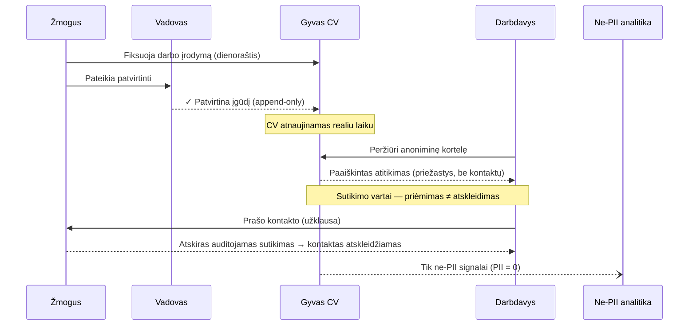

# data-flow — Duomenų srautas su sutikimo vartais ir PII riba

Žmogus fiksuoja veiklą; vadovas patvirtina; CV atsinaujina realiu laiku;
darbdavys mato paaiškintą atitikimą. Kontaktai atskleidžiami tik po atskiro
auditojamo sutikimo (priėmimas ≠ atskleidimas). PII niekada nepatenka į
analitiką (PII = 0).

