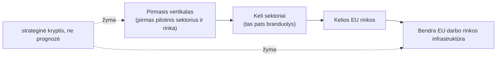

# expansion-roadmap — Plėtros kryptis

**Strateginė kryptis, ne prognozė.** Ta pati platforma plečiasi nuo pirmojo
vertikalo iki bendros Europos darbo rinkos infrastruktūros. Tai planuojama
kryptis, ne patvirtinta prognozė.

