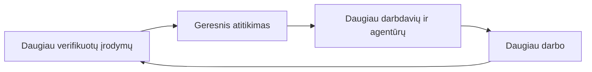

# flywheel — Duomenų ir pasitikėjimo flywheel

Kuo daugiau verifikuotų darbo įrodymų, tuo tikslesnis atitikimas; tikslesnis
atitikimas pritraukia daugiau darbdavių ir agentūrų; jie kuria daugiau darbo;
daugiau darbo generuoja daugiau verifikuotų įrodymų.

