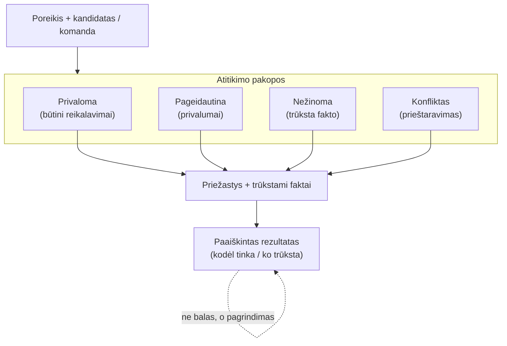

# matching-engine — Paaiškinamas atitikimo variklis

Deterministinis variklis. Jokio „juodos dėžės" balo, jokių diskriminacinių
laukų. Kiekviena pakopa rodo priežastis ir trūkstamus faktus, todėl rezultatas
yra paaiškintas.

