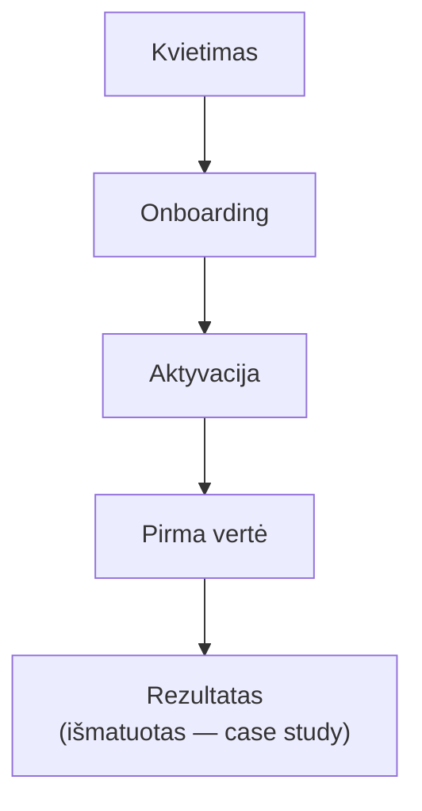

# pilot-funnel — Piloto piltuvas

Kontroliuojamo realių vartotojų piloto kelias (2–5 vartotojai). Kiekvienas
žingsnis matuojamas ne-PII analitika (onboarding įvykiai, konversijos piltuvas,
laikas-iki-vertės).

