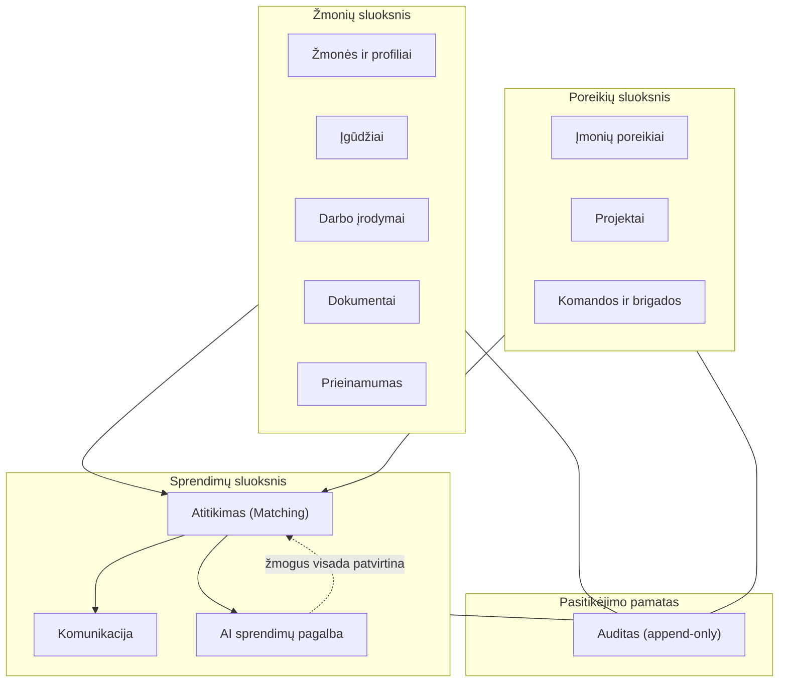

# platform-architecture — Branduolio architektūros sluoksniai

Sektoriams neutrali sluoksniuota architektūra. Tas pats branduolys tinka
bet kuriam sektoriui (statyba yra tik pirmas pilotinis vertikalas).

