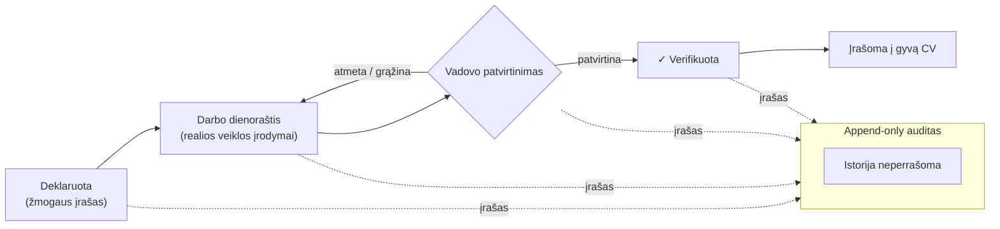

# verification-model — Verifikacijos modelis

Įgūdis nėra savideklaracija ir nėra pirktas reitingas. Kelias nuo deklaravimo
iki patvirtinimo yra append-only ir auditojamas. AI niekada nepatvirtina
žmogaus vardu — patvirtina vadovas.

