# SINGLE WORKSPACE — VISUAL SPECIFICATION V1

| Field | Value |
|---|---|
| Status | **BINDING.** The visual half of `SINGLE_WORKSPACE_SPECIFICATION_V1` |
| Audience | designers · developers · AI agents |
| Rule | If a wireframe here contradicts the canonical spec, the **canonical spec wins** |
| Contains | No code, no UI change, no PR, no implementation |

**Legend used in every wireframe**

```
▓ active/selected   ○ entity   ◎ active entity   ▸ quick action   ▌ text cursor
═ fixed region      ┄ collapsible edge           ⇄ resizable      ● live indicator
```

---

# PART A — WIREFRAMES (20)

## A-1 · Home Workspace (default, ≥1440px)

```
╔══════════════════════════════════════════════════════════════════════════════════════╗
║ ● AI idle · 3 unread            [ ⌘K  Search entities, actions, filters ]   ◑ Avatar ▾║ 48
╠═══════════════════════╦══════════════════════════════════════════════╦═══════════════╣
║ AI CONVERSATION       ║ WORLD MAP                          [layers ▾] ║ CONTEXT PANEL ║
║                       ║                                              ║               ║
║ ┌───────────────────┐ ║        ○        ○                            ║  Nothing      ║
║ │ AI: Good morning. │ ║             ○        ○                       ║  selected     ║
║ │ 3 bookings need   │ ║        ○         ○      ○                    ║               ║
║ │ your answer.      │ ║              ○      ○                        ║  Select an    ║
║ │ ▸ Review them     │ ║         ○         ○        ○                 ║  entity, or   ║
║ │ ▸ Not now         │ ║                                              ║  ask the AI.  ║
║ └───────────────────┘ ║   ┌─ cluster ──┐                             ║               ║
║                       ║   │  ⬢ 24 here │                             ║  ▸ Show my    ║
║                       ║   └────────────┘                             ║    agenda     ║
║ ┌───────────────────┐ ║                                              ║               ║
║ │ ▌ Ask anything    │ ║                                              ║               ║
║ └───────────────────┘ ║                                              ║               ║
║                       ╠══════════════════════════════════════════════╣               ║
║                       ║ TIMELINE  ◀ Jul ─────●──────── Aug ▶   ┄┄┄┄  ║               ║
╚═══════════════════════╩══════════════════════════════════════════════╩═══════════════╝
   420 ⇄                            fluid                                  400 ⇄
```
**Flow:** the AI opens with the agenda. No entity is active, so the panel states that plainly — it never
shows fabricated content. `⌥2` focuses the map; arrow keys move between entities.

## A-2 · Conversation Expanded

```
╔══════════════════════════════════════════════════════════════════════════════════════╗
║ ● AI working: matching 12 workers…                        [ ⌘K ]            Avatar ▾ ║
╠═══════════════════════════════════════════════╦══════════════════════╦═══════════════╣
║ AI CONVERSATION                    560 ⇄      ║ WORLD MAP (narrowed) ║ CONTEXT PANEL ║
║ ┌───────────────────────────────────────────┐ ║                      ║ ◎ Jonas P.    ║
║ │ You: who can start in Vilnius on Monday?  │ ║      ○   ◎▓          ║ available     ║
║ │                                           │ ║   ○        ○         ║               ║
║ │ AI: 4 people can. 2 have done this work   │ ║        ○             ║ ▸ Propose     ║
║ │     for you before.                       │ ║                      ║   booking     ║
║ │     ┌───────────┬───────────┬───────────┐ │ ║                      ║ ▸ Open chat   ║
║ │     │ ◎ Jonas P.│ Rasa K.   │ Tomas V.  │ │ ║                      ║               ║
║ │     │ 4 jobs    │ 1 job     │ new       │ │ ║                      ║ ── timeline ──║
║ │     └───────────┴───────────┴───────────┘ │ ║                      ║ ● 12 entries  ║
║ │  ▸ Propose booking   ▸ Compare   ▸ Filter │ │ ║                      ║               ║
║ └───────────────────────────────────────────┘ ║                      ║               ║
║ ┌───────────────────────────────────────────┐ ║                      ║               ║
║ │ ▌                                         │ ║                      ║               ║
║ └───────────────────────────────────────────┘ ║                      ║               ║
╚═══════════════════════════════════════════════╩══════════════════════╩═══════════════╝
```
**Flow:** result cards inside the conversation are entity chips. Hovering one previews it on the map;
**clicking** performs `SELECT_ENTITY` — the panel and map follow. The user never leaves the thread.

## A-3 · Conversation Collapsed (rail)

```
╔══════════════════════════════════════════════════════════════════════════════════════╗
║ ● AI idle                                                 [ ⌘K ]            Avatar ▾ ║
╠═══╦══════════════════════════════════════════════════════════════════╦═══════════════╣
║ 💬║ WORLD MAP                                             [layers ▾] ║ CONTEXT PANEL ║
║ ▲ ║                                                                  ║ ◎ Vilnius site║
║ 3 ║              ○         ○          ◎▓                             ║               ║
║   ║         ○        ○           ○                                   ║ 12 assigned   ║
║ ▌ ║                                                                  ║ ▸ Add people  ║
║   ║                                                                  ║ ▸ Report      ║
║ ⌘/║                                                                  ║               ║
╠═══╩══════════════════════════════════════════════════════════════════╩═══════════════╣
║ TIMELINE                                                                             ║
╚══════════════════════════════════════════════════════════════════════════════════════╝
  56px rail: unread badge, composer shortcut. NEVER fully hidden.
```
**Flow:** `[` collapses. The rail keeps the AI one keystroke away (`⌘/`) — the invariant is that the operator
is always present.

## A-4 · World Map Focus

```
╔══════════════════════════════════════════════════════════════════════════════════════╗
║ ● AI idle                                                 [ ⌘K ]            Avatar ▾ ║
╠═══╦══════════════════════════════════════════════════════════════════════════════╦═══╣
║ 💬║ WORLD MAP — focused                                              [layers ▾]  ║ ▤ ║
║   ║   filters: Vilnius · welder · ≥2000€            [ 34 shown · 12 filtered ]   ║   ║
║   ║                                                                              ║   ║
║   ║         ○ ─────── works_on ──────▶ ◎▓ Vilnius site                           ║   ║
║   ║         │                            ▲                                       ║   ║
║   ║    employs                       located_at                                  ║   ║
║   ║         │                            │                                       ║   ║
║   ║         ○ UAB Statyba            ⬢ 8 workers                                 ║   ║
║   ║                                                                              ║   ║
║   ║   ░░ faded = filtered out, never hidden ░░                                   ║   ║
╠═══╩══════════════════════════════════════════════════════════════════════════════╩═══╣
║ TIMELINE   ◀ ────────────●━━━━━━━●──────── ▶                                         ║
╚══════════════════════════════════════════════════════════════════════════════════════╝
```
**Flow:** both side regions collapse to rails; the map is never a separate page. Relationship edges are a
layer. Filtered-out entities **fade** so the filter's effect is visible.

## A-5 · Context Panel Expanded

```
╔══════════════════════════════════════════════════════════════════════════════════════╗
║ ● AI idle                                                 [ ⌘K ]            Avatar ▾ ║
╠═══════════════════╦══════════════════════════╦═══════════════════════════════════════╣
║ AI CONVERSATION   ║ WORLD MAP                ║ CONTEXT PANEL              560 ⇄  ┄ ✕ ║
║                   ║                          ║ [Inspector][Agenda][Journal][Chat][⋯] ║
║ AI: here is what  ║        ◎▓                ║ ┌───────────────────────────────────┐ ║
║ I know about UAB  ║     ○      ○             ║ │ 🏢 UAB Statyba          ▓ active  │ ║
║ Statyba.          ║                          ║ │ organization · Vilnius · owner: … │ ║
║                   ║                          ║ ├───────────────────────────────────┤ ║
║                   ║                          ║ │ ▸ Post a need  ▸ Invite  ▸ ⋯      │ ║
║                   ║                          ║ ├─ timeline ────────────────────────┤ ║
║                   ║                          ║ │ ●───●──●────────●  12 events      │ ║
║                   ║                          ║ ├─ related ─────────────────────────┤ ║
║                   ║                          ║ │ employs → 24   owns → 3 projects  │ ║
║                   ║                          ║ │ located_at → 2 worksites          │ ║
║                   ║                          ║ ├─ documents ───────────────────────┤ ║
║                   ║                          ║ │ 📎 contract.pdf  📎 insurance.pdf │ ║
║                   ║                          ║ └───────────────────────────────────┘ ║
╚═══════════════════╩══════════════════════════╩═══════════════════════════════════════╝
```
**Flow:** tabs switch `context_panel.view`; they never route. Clicking a related entity performs
`SELECT_ENTITY` and pushes the panel's **entity back-stack** (`⌘[` returns).

## A-6 · Entity Inspector (the generic contract)

```
┌ CONTEXT PANEL ─ Inspector ────────────────────────────┐
│ [icon] {name}                          {status chip}  │ ← name, status
│ {entity_type} · {location} · owner {owner}            │ ← entity_type, location, owner
├───────────────────────────────────────────────────────┤
│ ▸ {behavior 1}   ▸ {behavior 2}   ▸ ⋯                 │ ← behaviorsFor(type, context)
├─ Timeline ────────────────────────────────────────────┤ ← timeline
│ ●───●──────●───────────●                              │
├─ Related ─────────────────────────────────────────────┤ ← relationships, by predicate
│ {predicate} → N …                                     │
├─ Documents & media ───────────────────────────────────┤ ← documents, media
├─ Activity ────────────────────────────────────────────┤ ← history
├─ Extensions ──────────────────────────────────────────┤ ← extensions (declared, not coded)
└───────────────────────────────────────────────────────┘
   EVERY entity type renders through THIS. Empty attributes do not render.
   A new type adds NO section and NO branch.
```

## A-7 · Person View

```
┌ Inspector ────────────────────────────────────────────┐
│ 👤 Jonas Petraitis                    ▓ available     │
│ person · Vilnius · self-owned                         │
├───────────────────────────────────────────────────────┤
│ ▸ Propose booking  ▸ Open chat  ▸ Add to project  ▸ ⋯ │  as_candidate context
├─ Timeline ────────────────────────────────────────────┤
│ ●──●────●─────●──────●   4 engagements · 38 workdays  │
├─ Related ─────────────────────────────────────────────┤
│ works_on → 1 project    employed_by → UAB Statyba     │
│ has_skill → 6 confirmed                               │
├─ Documents ───────────────────────────────────────────┤
│ 📎 CV.pdf   📎 welding certificate (verified)         │
└───────────────────────────────────────────────────────┘
```
**Note:** roles are shown as *roles on one person* (candidate · employee · team leader), never as separate
profiles. Behaviors change with context; sections do not.

## A-8 · Organization View

```
┌ Inspector ────────────────────────────────────────────┐
│ 🏢 UAB Statyba                        ▓ verified      │
│ organization · Vilnius · owner: A. Kazlauskas         │
├───────────────────────────────────────────────────────┤
│ ▸ Post a need  ▸ Invite worker  ▸ Open projects  ▸ ⋯  │  roles: employer + client
├─ Roles ───────────────────────────────────────────────┤
│ employer · client · training_provider                 │  MANY roles, one entity
├─ Timeline ─ Related ─ Documents ─ Activity ───────────┤
└───────────────────────────────────────────────────────┘
```

## A-9 · Job View

```
┌ Inspector ────────────────────────────────────────────┐
│ 🧰 Welder — Vilnius site              ▓ open · 3 left │
│ job · Vilnius · owner: UAB Statyba                    │
├───────────────────────────────────────────────────────┤
│ ▸ Express interest  ▸ Compare  ▸ Ask AI about fit     │
├─ Match ───────────────────────────────────────────────┤
│ your skills cover 5 of 6 requirements                 │  honest, never a fake %
├─ Timeline ─ Related (located_at → site) ─ Documents ──┤
└───────────────────────────────────────────────────────┘
```

## A-10 · Project View

```
┌ Inspector ────────────────────────────────────────────┐
│ 🏗 Žirmūnų renovation                 ▓ active        │
│ project · Vilnius · owner: UAB Statyba                │
├───────────────────────────────────────────────────────┤
│ ▸ Assign people  ▸ Pause  ▸ Complete  ▸ Report        │  behaviors: while_active
├─ Phases (timeline, expanded) ─────────────────────────┤
│ ▐▀▀▀▀▀▌ prep  ▐▀▀▀▀▀▀▀▀▀▀▀▌ build  ▐▀▀▌ handover     │
├─ Related ─────────────────────────────────────────────┤
│ accepts → 12 people   located_at → Vilnius site       │
└───────────────────────────────────────────────────────┘
```
**Note:** `operations` is a **tab of the timeline**, not a route — this is where the old 5-level chain died.

## A-11 · Timeline View (expanded)

```
╔══════════════════════════════════════════════════════════════════════════════════════╗
║ AI CONVERSATION      ║ WORLD MAP (time-filtered)              ║ CONTEXT PANEL        ║
╠══════════════════════╩════════════════════════════════════════╩══════════════════════╣
║ TIMELINE — Žirmūnų renovation                    [entity ▾][project ▾][AI ▾]    320px ║
║                                                                                      ║
║  people   ▐▀▀▀▀▀▀▀▀▀▀▀▀▀▀▀▀▀▀▀▀▀▀▀▀▀▀▀▀▀▀▀▀▀▀▀▀▀▀▀▀▀▌                                ║
║  phases   ▐prep▌   ▐▀▀▀▀▀▀ build ▀▀▀▀▀▀▌   ▐handover▌                                ║
║  docs        📎        📎              📎                                            ║
║  AI       △        △          △                       △ = AI action (attributable)   ║
║  events   ●    ●      ●   ●        ●                                                 ║
║          ├──────────┼──────────┼──────────┼──────────┤                               ║
║         Jun        Jul        Aug        Sep     ┊ future is visually distinct ┊     ║
╚══════════════════════════════════════════════════════════════════════════════════════╝
```
**Flow:** dragging the range writes `map_state.timeRange`; the map re-filters live. AI actions use a distinct
marker so the user can always see what the AI did.

## A-12 · Document View

```
┌ Inspector ─ Document ─────────────────────────────────┐
│ 📄 welding-certificate.pdf            ▓ verified      │
│ document · owner: Jonas P. · issued 2025-04-11        │
├───────────────────────────────────────────────────────┤
│ ▸ Download  ▸ Share  ▸ Replace  ▸ Revoke              │
├─ Preview (inline, never a new page) ──────────────────┤
│ ┌───────────────────────────────────────────────────┐ │
│ │            [ page 1 of 2 ]                        │ │
│ └───────────────────────────────────────────────────┘ │
├─ Related: belongs_to → Jonas P. · proves → welder ────┤
└───────────────────────────────────────────────────────┘
```

## A-13 · Search Results (⌘K)

```
╔══════════════════════════════════════════════════════════════════════════════════════╗
║  ┌────────────────────────────────────────────────────────────────────────────────┐  ║
║  │ ⌘K  vilnius weld▌                                                              │  ║
║  ├────────────────────────────────────────────────────────────────────────────────┤  ║
║  │ ENTITIES                                                                       │  ║
║  │  👤 Jonas Petraitis        person · welder · Vilnius            ⏎ select       │  ║
║  │  🧰 Welder — Vilnius site  job · 3 open                                        │  ║
║  │  🏗 Žirmūnų renovation     project · active                                    │  ║
║  ├────────────────────────────────────────────────────────────────────────────────┤  ║
║  │ FILTERS                                                                        │  ║
║  │  ⚲ location = Vilnius      applies to the current view                         │  ║
║  │  ⚲ skill = welding                                                             │  ║
║  ├────────────────────────────────────────────────────────────────────────────────┤  ║
║  │ ACTIONS                                                                        │  ║
║  │  ▸ Post a need for a welder in Vilnius                                         │  ║
║  └────────────────────────────────────────────────────────────────────────────────┘  ║
╚══════════════════════════════════════════════════════════════════════════════════════╝
```
**Flow:** search returns **entities, filters and actions — never pages.** Selecting performs
`SELECT_ENTITY` / `SET_FILTER` / proposes the action. This overlay is the one command surface and it writes
state, then vanishes.

## A-14 · AI Recommendation

```
┌ AI CONVERSATION ──────────────────────────────────────────────────────┐
│ AI: Rasa K. matches this need better than the person you selected.    │
│     She has done 3 similar jobs for you and is free from Monday.      │
│     ┌─────────────────────────────────────────────────────────────┐   │
│     │ ◎ Rasa K.   5/6 requirements · 3 past jobs · available      │   │
│     │ why: welding ✓ · Vilnius ✓ · nights ✗ (she declines nights) │   │
│     └─────────────────────────────────────────────────────────────┘   │
│  ▸ Propose booking    ▸ Compare with Jonas    ▸ Not relevant          │
│                                                                       │
│  ⓘ A recommendation, not a decision. You confirm before anything     │
│    is sent.                                                           │
└───────────────────────────────────────────────────────────────────────┘
```
**Rule:** every recommendation states **why**, including what does **not** fit. No score without a reason;
no reason without evidence.

## A-15 · Notifications

```
╔═════════════════════════════════════════════════════════╦════════════════════════════╗
║ ● AI idle · 🔔 3            [ ⌘K ]           Avatar ▾   ║ CONTEXT PANEL              ║
╠═════════════════════════════════════════════════════════╣ [Inspector][…][Notif ▓]    ║
║ (conversation unchanged — nothing was interrupted)      ║ ┌────────────────────────┐ ║
║                                                         ║ │ ● booking accepted     │ ║
║                                                         ║ │   Jonas P. · 2 min     │ ║
║                                                         ║ │   ▸ Open  ▸ Reply      │ ║
║                                                         ║ ├────────────────────────┤ ║
║                                                         ║ │ ○ document verified    │ ║
║                                                         ║ │ ○ new match for need   │ ║
║                                                         ║ └────────────────────────┘ ║
╚═════════════════════════════════════════════════════════╩════════════════════════════╝
```
**Rule:** notifications are a **panel view**, never a popover that steals focus. Clicking one performs
`SELECT_ENTITY` — it never opens a page. Nothing notifies twice.

## A-16 · Mobile Home (<768)

```
┌───────────────────────────────┐
│ ● AI idle · 🔔3    ⌘K   ◑     │ 48
├───────────────────────────────┤
│ AI: 3 bookings need your      │
│     answer.                   │
│  ▸ Review them                │
│  ▸ Not now                    │
│                               │
│                               │
│                               │
├───────────────────────────────┤
│ ▁▁▁▁▁▁ (no entity yet) ▁▁▁▁▁▁ │ peek 88 (hidden when empty)
├───────────────────────────────┤
│ [ 💬 Chat▓ ] [ 🗺 Map ] [ ▤ ] │ 3 MODES, not destinations
└───────────────────────────────┘
```

## A-17 · Mobile Conversation

```
┌───────────────────────────────┐
│ ● AI working…      ⌘K   ◑     │
├───────────────────────────────┤
│ You: who can start Monday?    │
│                               │
│ AI: 4 people can.             │
│ ┌───────┬───────┬───────┐     │
│ │◎Jonas │ Rasa  │ Tomas │ ←── horizontally scrollable entity chips
│ └───────┴───────┴───────┘     │
│ ▸ Propose  ▸ Compare          │
├───────────────────────────────┤
│ ▁▁ ◎ Jonas P. · available ▁▁  │ peek — tap to raise to half/full
├───────────────────────────────┤
│ │ ▌ Ask anything          🎤 │ │ composer above the bar; keyboard resizes
├───────────────────────────────┤
│ [ 💬▓ ] [ 🗺 ] [ ▤ ]          │
└───────────────────────────────┘
```

## A-18 · Mobile Map

```
┌───────────────────────────────┐
│ ● AI idle          ⌘K   ◑     │
├───────────────────────────────┤
│  filters: Vilnius · welder  ⚲ │
│                               │
│        ○      ◎▓              │
│    ○       ○                  │ full-bleed; tap = select
│         ⬢ 12                  │ long-press = multi-select
│                               │ pinch = zoom (never navigates)
├───────────────────────────────┤
│ ▁▁ ◎ Vilnius site · 12 ▁▁▁▁▁  │ peek rises on selection
│    ▸ Add people  ▸ Report     │
├───────────────────────────────┤
│ [ 💬 ] [ 🗺▓ ] [ ▤ ]          │
└───────────────────────────────┘
```

## A-19 · Tablet Layout (768–1023)

```
╔══════════════════════════════════════════════════════════════╗
║ ● AI idle              [ ⌘K ]                     Avatar ▾   ║
╠═══════════════════════════╦══════════════════════════════════╣
║ AI CONVERSATION           ║  MAP ▓ | PANEL      ← ONE toggle  ║
║                           ║                                  ║
║ AI: 3 bookings need…      ║        ○     ◎▓                  ║
║  ▸ Review                 ║    ○       ○                     ║
║                           ║                                  ║
║ ┌───────────────────────┐ ║                                  ║
║ │ ▌                     │ ║                                  ║
║ └───────────────────────┘ ║                                  ║
╠═══════════════════════════╩══════════════════════════════════╣
║ TIMELINE (collapsed to handle)                          ┄┄┄  ║
╚══════════════════════════════════════════════════════════════╝
  Two columns: the conversation stays; map and panel share the second column.
```

## A-20 · Large Desktop (≥1920)

```
╔════════════════════════════════════════════════════════════════════════════════════════════════╗
║ ● AI working: matching 12 workers…              [ ⌘K ]                              Avatar ▾   ║
╠═══════════════════════╦════════════════════════════════════════════════╦═══════════════════════╣
║ AI CONVERSATION 560   ║ WORLD MAP                          [layers ▾]  ║ CONTEXT PANEL   560   ║
║                       ║                                                ║ [Inspector][Agenda]…  ║
║ (fuller history,      ║   ○ ──── employs ────▶ ◎▓ ◀── works_on ── ○    ║ ┌───────────────────┐ ║
║  richer entity        ║                                                ║ │ full inspector    │ ║
║  cards, evidence      ║        ⬢ 24            ○         ○             ║ │ + related graph   │ ║
║  shown inline)        ║                                                ║ │ + documents       │ ║
║                       ║                                                ║ │ + activity        │ ║
║                       ╠════════════════════════════════════════════════╣ └───────────────────┘ ║
║                       ║ TIMELINE expanded (320) with all lanes         ║                       ║
╚═══════════════════════╩════════════════════════════════════════════════╩═══════════════════════╝
   Extra width buys DENSITY (more lanes, more evidence) — never a fourth region.
```

---

# PART B — USER FLOWS (13)

Every flow ends in the **same workspace**. No flow contains the word "navigate".

## B-1 · Candidate onboarding
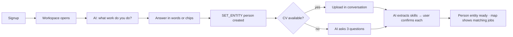

## B-2 · Employer onboarding
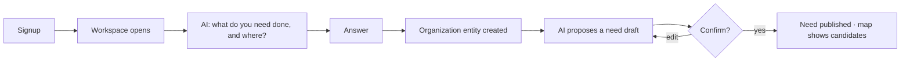

## B-3 · Finding a job
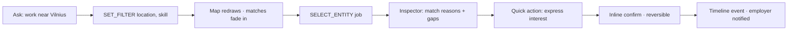

## B-4 · Hiring a person
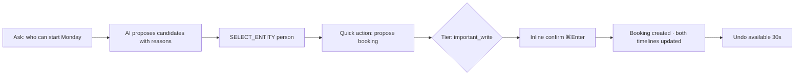

## B-5 · Creating a project
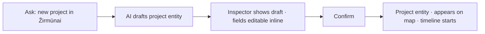

## B-6 · Managing an organization
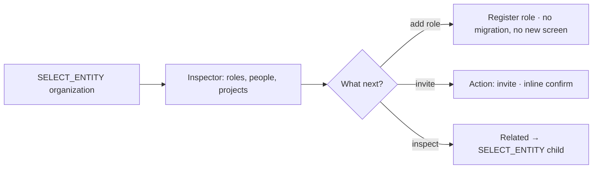

## B-7 · Viewing an entity
```mermaid
flowchart LR
  A[Click / ⌘K / AI mention / related row] --> B[SELECT_ENTITY]
  B --> C[Panel: Inspector]
  B --> D[Map: highlight + optional focus]
  B --> E[Timeline: entity lane]
  C --> F[Back stack ⌘ '[' returns to previous entity]
```

## B-8 · Uploading a CV
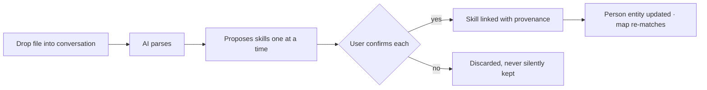

## B-9 · AI recommendations
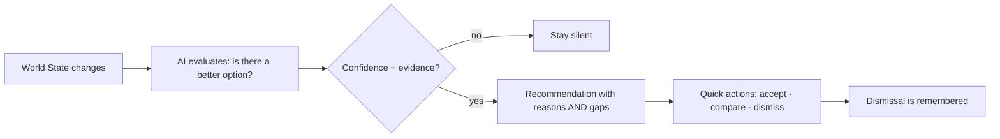

## B-10 · AI conversation
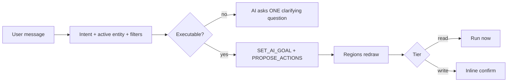

## B-11 · Documents
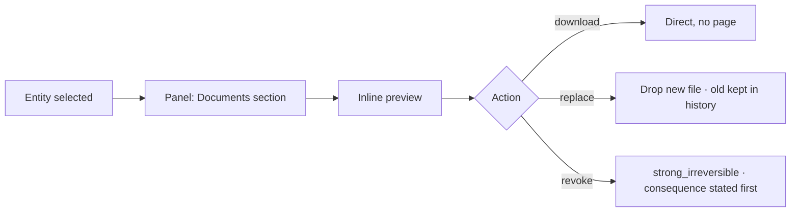

## B-12 · Notifications
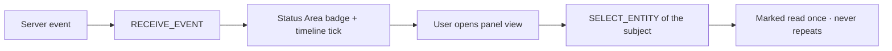

## B-13 · Timeline
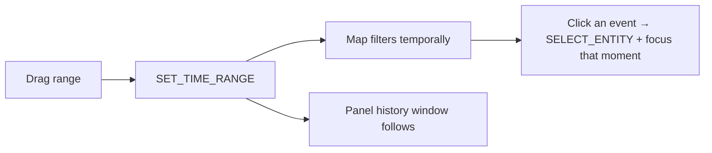

---

# PART C — STATE TRANSITION DIAGRAMS (6)

## C-1 · World State
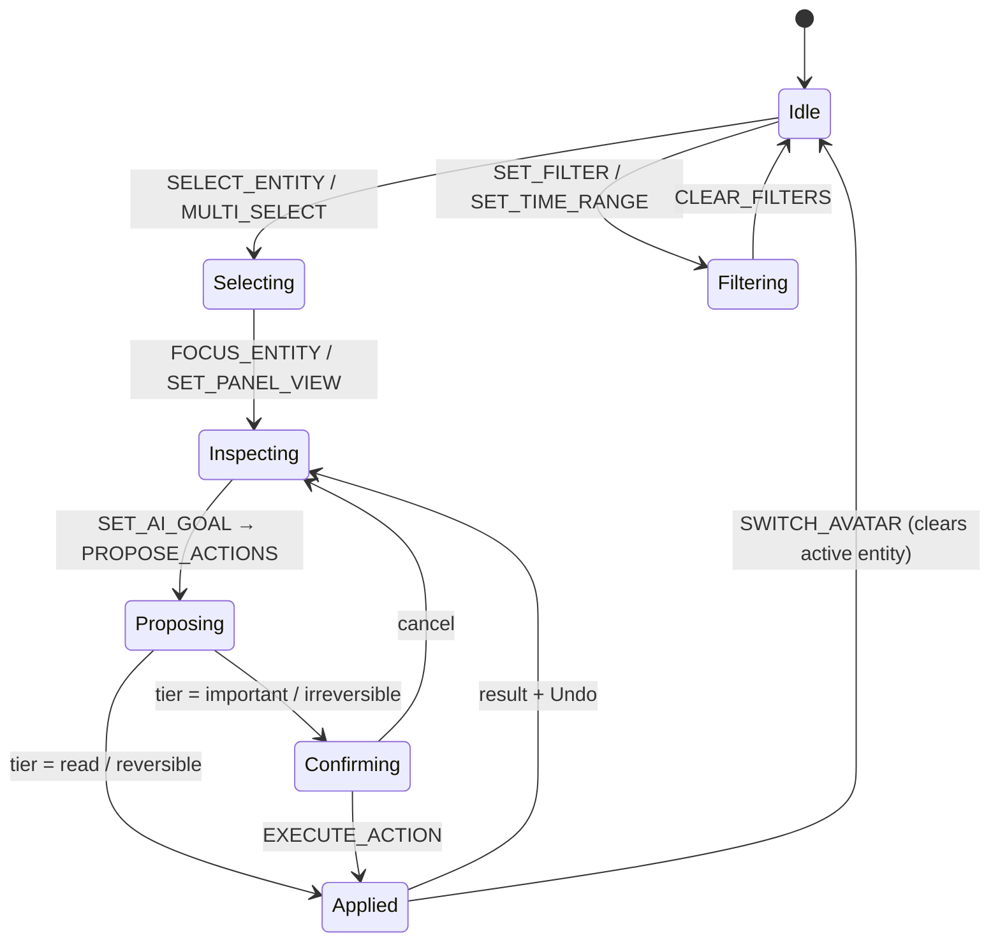

## C-2 · Entity
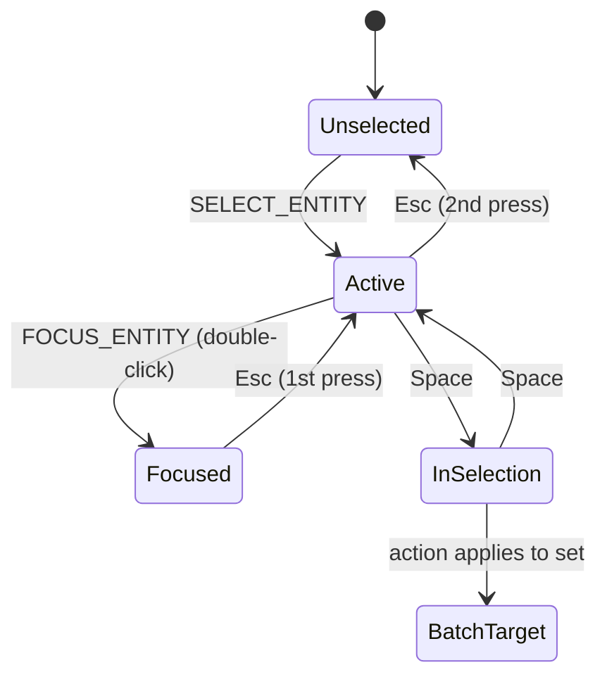

## C-3 · Conversation
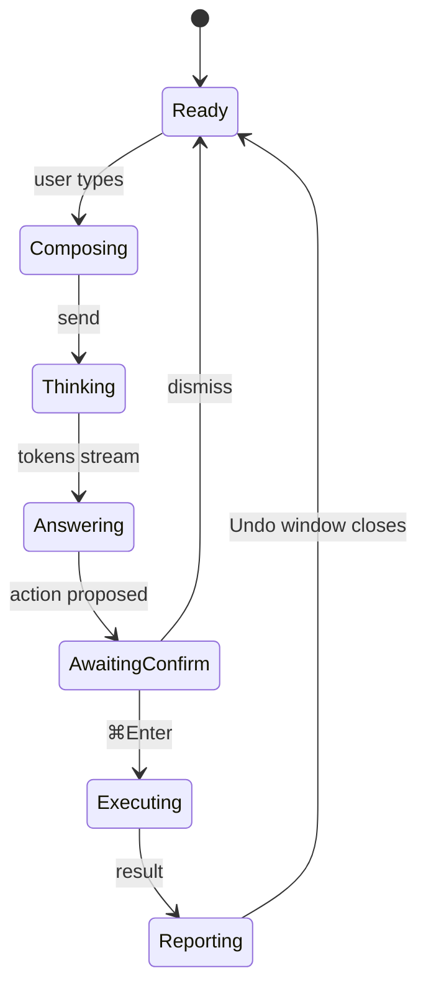

## C-4 · Context Panel
```mermaid
stateDiagram-v2
    [*] --> Hidden
    Hidden --> Default: SELECT_ENTITY (auto-open)
    Default --> Expanded: FOCUS_ENTITY / drag
    Expanded --> Default: drag / ']'
    Default --> Hidden: ']' with nothing selected
    Default --> ViewSwitched: SET_PANEL_VIEW (tab)
    ViewSwitched --> Default: back
    Default --> Previous: entity back-stack ⌘'['
```

## C-5 · Map
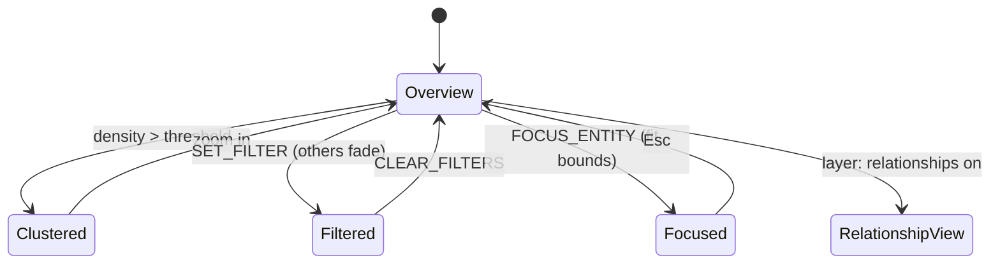

## C-6 · Timeline
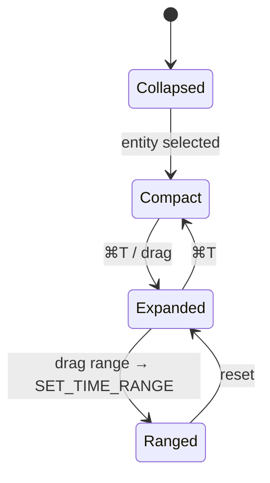

---

# PART D — INTERACTION RULES

Ten input modes × every region. **Blank = deliberately does nothing.**

| Input | Conversation | Map | Context Panel | Timeline | Quick Action |
|---|---|---|---|---|---|
| **Click** | select entity chip → `SELECT_ENTITY` | `SELECT_ENTITY` | select row → `SELECT_ENTITY`; tab → `SET_PANEL_VIEW` | click event → focus that moment | execute (tier applies) |
| **Double-click** | open entity focused | `FOCUS_ENTITY` + zoom-to-fit | expand panel to max | zoom range to that event | — (never double-fires) |
| **Right-click** | copy message text | context menu of **behaviors only** (never navigation) | same behavior menu | — | — |
| **Hover** | preview entity on map | preview card + highlight edges | preview target | scrub preview (no write) | tooltip: what it will do + tier |
| **Drag** | drag file → upload | pan; lasso with modifier | resize; reorder pinned | drag range | — |
| **Drop** | file → AI parses in-thread | entity → entity = propose a relationship | file → attach to active entity | — | — |
| **Keyboard** | `⌘/` focus · `⌘Enter` confirm | arrows move · `Enter` select · `Space` multi | `Tab` cycles tabs · `⌘[` back | `⌘T` toggle · arrows nudge range | `Enter` execute |
| **Touch** | tap chip · swipe history | tap select · long-press multi · pinch zoom | swipe detents · swipe tabs | pinch range | tap (≥44px) |
| **Voice** | dictate into composer; same pipeline as text | — | — | — | confirmation is **never** voice-only for irreversible tiers |
| **AI-initiated** | adds turn · proposes | highlights, focuses, filters | switches view, sets entity | sets range | proposes — **never executes** an untiered write |

**Universal rules:** hover never writes state · right-click never contains navigation · nothing is
double-click-only · every pointer action has a keyboard equivalent · touch targets ≥44px.

---

# PART E — DESIGN TOKENS

## E-1 Spacing (4px base — the only steps)
| Token | px | Use |
|---|---|---|
| `space-1` | 4 | icon↔label |
| `space-2` | 8 | item rhythm |
| `space-3` | 12 | control padding |
| `space-4` | 16 | section padding, region gutter |
| `space-6` | 24 | between sections |
| `space-8` | 32 | region inset |
| `space-12` | 48 | header height, empty-state breathing |

## E-2 Typography
| Role | Size / line | Weight | Use |
|---|---|---|---|
| `display` | 28 / 34 | 600 | entity name in expanded inspector |
| `title` | 20 / 26 | 600 | entity name, view titles |
| `subtitle` | 16 / 22 | 500 | section headers |
| `body` | 14 / 20 | 400 | conversation, rows |
| `meta` | 13 / 18 | 400 | type · location · owner |
| `caption` | 12 / 16 | 500 | chips, counts, timestamps |
| `mono` | 13 / 18 | 400 | ids, evidence, provenance |

One family (`--font-sans`); mono only for identifiers.

## E-3 Icon sizes
`14` inline in text · `16` default in rows and chips · `20` region headers and tabs ·
`24` map glyph at default zoom · `32` entity avatar in inspector. No other sizes.

## E-4 Radius
`4` chips/badges · `8` controls, cards, rows · `12` panels and sheets · `999` avatars, live dots.

## E-5 Elevation
| Level | Use | Note |
|---|---|---|
| `e0` | regions | flat — regions are structure, not objects |
| `e1` | cards, rows | hairline border, no shadow |
| `e2` | map preview card, ⌘K overlay | soft shadow |
| `e3` | MobileSheet | the **only** e3 in the product |
| — | modals | **does not exist** |

## E-6 Motion (existing tokens)
| Token | Duration | Use |
|---|---|---|
| `--motion-instant` | 0ms | data appearing; all durations under reduced-motion |
| `--motion-fast` | 120ms | state echo: selection, filter, chip |
| `--motion-base` | 240ms | region resize/collapse, panel view change |
| `--motion-slow` | 400ms | map fit, timeline range settle |

Easing `--motion-ease-out` for entering, `--motion-ease-spring` for affordances **only** — never for
spatial data.

## E-7 Breakpoints (existing usage)
`sm` 640 · `md` 768 · `lg` 1024 · `xl` 1440 · `2xl` 1920. Behaviour per §3.3 of the canonical spec.

## E-8 Minimum touch targets
44×44 everywhere, including map nodes at default zoom (glyph 24 + 10 padding each side) and timeline events
(visual 8, hit area 44).

---

# PART F — COMPONENT INVENTORY

`WS` = World State slots read. `Entity` = entity attributes read. Primitives read **neither** — a primitive
that imports World State is a defect.

## F-1 Regions
| Component | Purpose | Inputs | Outputs | WS | Entity | A11y | Responsive |
|---|---|---|---|---|---|---|---|
| `Workspace` | the single shell | — | layout | all | — | 4 landmarks | 3-col → 2-col → modes |
| `ConversationRegion` | AI I/O | thread | intents | `conversation_state`, `ai_goal` | — | `aria-live=polite`, `<aside>` | rail ≥md, mode <md |
| `MapRegion` | spatial view | entities, filters | selection | `map_state`, `selected_entities`, `active_filters` | position, type, status | roving tabindex, text alt | fills; full-bleed <md |
| `ContextPanelRegion` | entity + work | active entity | actions | `context_panel`, `active_entity` | all | `<aside>`, focus restore | sheet <md |
| `TimelineRegion` | time | events, range | range | `map_state.timeRange` | timeline, history | slider semantics | strip <md |
| `StatusArea` | what is happening | ai state, conn | — | `ai_goal` | — | `aria-live=polite` | always |

## F-2 Views
| Component | Purpose | Inputs | Outputs | WS | Entity | A11y | Responsive |
|---|---|---|---|---|---|---|---|
| `Inspector` | the one entity view | entityId | action intents | `active_entity` | all 19 attrs | headings hierarchy | sections stack |
| `AgendaView` | what needs doing | queue | action intents | `active_actions` | status, timeline | list semantics | same |
| `JournalView` | human history | entries | entry intents | `active_entity` | history | article roles | same |
| `ConversationView` | threads about entity | threads | message | `conversation_state` | relationships | log role | same |
| `InsightsView` | AI observations | insights | dismiss | `active_entity` | — | read-only region | same |
| `ReportsView` | rendered history | range | export | `map_state.timeRange` | history | table semantics | horizontal scroll |
| `SettingsView` | account, privacy | — | prefs | — | — | form semantics | same |
| `NotificationsView` | events | events | select | `conversation_state.unread` | — | list + unread state | same |

## F-3 Composites
| Component | Purpose | Inputs | Outputs | WS | Entity | A11y | Responsive |
|---|---|---|---|---|---|---|---|
| `EntityHeader` | identity line | entity | select owner | — | name, type, status, location, owner | h2 + status text | wraps |
| `ActionChipRow` | quick actions | actions[] | execute | `active_actions` | — | buttons, disabled reason exposed | overflow menu |
| `RelationshipList` | related entities | relationships | select | — | relationships | grouped list | collapses per group |
| `TimelineStrip` | compact time | events, range | range | `map_state.timeRange` | timeline | slider | shortens |
| `DocumentList` | attachments | documents | preview/act | — | documents, media | list + file type | grid ≥lg |
| `EntityChip` | entity reference | entity | select | — | name, type, status | button + text alt | inline |
| `ConfirmRow` | the ONE confirm | action, tier | confirm/cancel | `active_actions` | — | describes consequence | full width |
| `EmptyState` | honest emptiness | reason, action | act | `active_filters` | — | explains cause | same |
| `SkeletonBlock` | loading in place | shape | — | — | — | `aria-busy` | matches final geometry |
| `ErrorInline` | failure at the site | error, retry | retry | — | — | `role=alert` | same |

## F-4 Primitives (exist today — reused, not rebuilt)
`Button` · `Input` · `Select` · `Badge` · `Card` · `Avatar` · `LiveDot` · `Label` · `Stat` · `Sparkline` ·
`MobileSheet` · `ThemeToggle` · `Placeholder`.

**Deprecated by this spec:** `Dialog`/`Modal` wrappers · `header-search` overlay (becomes ⌘K) ·
`notification-panel` popover (becomes a view) · every `window.confirm` call site.

---

# PART G — DESIGN REVIEW

Seven questions, every screen, answered honestly.

| Screen | AI-first? | One screen? | → Context Panel? | → World State? | Popup removed? | Navigation removed? | Clicks saved |
|---|---|---|---|---|---|---|---|
| A-1 Home | ✅ AI speaks first | ✅ | — | agenda = `active_actions` | — | replaces 4-tab nav | 2 → 0 |
| A-2 Conversation expanded | ✅ | ✅ | results select into panel | `SELECT_ENTITY` | — | replaces list pages | 3 → 1 |
| A-3 Collapsed | ✅ AI still present | ✅ | — | layout only | — | — | — |
| A-4 Map focus | ✅ AI filters by voice/text | ✅ | — | filters in state | — | replaces 7 discovery pages | 4 → 1 |
| A-5 Panel expanded | ✅ | ✅ | **is** the panel | `context_panel.view` | replaces 2 modals | replaces 24 pages | 3 → 1 |
| A-6 Inspector | ✅ AI can act on it | ✅ | ✅ | `active_entity` | — | replaces detail routes | 2 → 1 |
| A-7 Person | ✅ | ✅ | ✅ | ✅ | — | merges profile+cv+player-card | 3 → 1 |
| A-8 Organization | ✅ | ✅ | ✅ | ✅ | — | merges company+agency | 3 → 1 |
| A-9 Job | ✅ AI explains fit | ✅ | ✅ | ✅ | — | merges listings+services | 3 → 1 |
| A-10 Project | ✅ | ✅ | ✅ | ✅ | — | kills the 5-level chain | 5 → 1 |
| A-11 Timeline | ✅ AI actions attributable | ✅ | strip lives in panel | `timeRange` | — | replaces reports/evidence | 3 → 1 |
| A-12 Document | ✅ | ✅ | ✅ | ✅ | replaces preview modal | replaces documents page | 3 → 1 |
| A-13 Search | ✅ returns entities+actions | ✅ | selects into panel | `SELECT_ENTITY`/`SET_FILTER` | replaces search overlay | replaces all list pages | 4 → 1 |
| A-14 Recommendation | ✅ **this is the product** | ✅ | acts on panel entity | `ai_goal` | — | replaces matching pages | 5 → 1 |
| A-15 Notifications | ✅ never interrupts | ✅ | ✅ view | `unread` | replaces popover | replaces inbox pages | 3 → 1 |
| A-16–18 Mobile | ✅ chat is default | ✅ 3 modes | ✅ sheet | shared state | replaces all mobile modals | replaces bottom-tab routing | 4 → 1 |
| A-19 Tablet | ✅ | ✅ | ✅ toggled | ✅ | — | — | — |
| A-20 Large desktop | ✅ | ✅ | ✅ | ✅ | — | density, not more regions | — |

**Review verdict:** every screen passes AI-first; **zero** screens require a popup; **zero** require
navigation; the median interaction drops from **3–5 clicks to 1**.

**Where the honest answer is "not yet":** A-4, A-11 and every map-dependent view depend on the map platform
(`E.7`/`B.6`, phase W5). Until it lands those screens are specified but not buildable at full fidelity — which
is exactly what the transitional waiver in the locks stack covers, and why it expires automatically when W5
ships.

---

*Visual specification only. No code was written, no UI was modified, no PR was created, nothing was implemented.*
